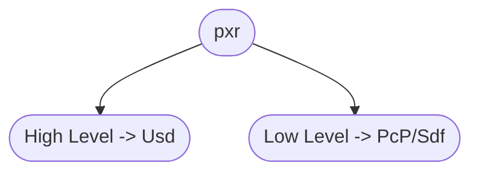

# API Overview
Before we dive into the nitty gritty details, let's first have a look at how the USD API is structured.

Overall there are two different API "levels":



Most tutorials focus primarily on the high level API, as it is a bit more convenient when starting out. The more you work in Usd though, the more you'll start using the lower level API. Therefore this guide will often have examples for both levels.

~~~admonish tip
We'd actually recommend starting out with the lower level API as soon as you can, as it will force you to write performant code from the start.
~~~

## TL;DR - API Overview In-A-Nutshell
Here is the TL;DR version. Usd is made up of two main APIs:
- High level API:
    - [Usd Core API](https://openusd.org/release/api/usd_page_front.html)
- Low level API:
    - [Sdf - Scene Description Foundations](https://openusd.org/release/api/sdf_page_front.html)
    - [Pcp - PrimCache Population (Composition)](https://openusd.org/release/api/pcp_page_front.html)

Individual components of Usd are loaded via a [plugin based system](https://openusd.org/release/api/plug_page_front.html), for example Hydra, kinds, file plugins (Vdbs, abc) etc.

Here is a simple comparison:
~~~admonish info title=""
```python
{{#include ../../../code/core/elements.py:apiHighVsLowLevel}}
```
~~~

## What should I use it for?
~~~admonish tip
You'll be using these two API levels all the time when working with Usd.
The high level API is often used with read ops, the low level with write ops or inspecting the underlying caches of the high level API.
~~~

## Resources
Check out a API overview here: [API Overview](./resources.md)

## When should I use what?
As a rule of thumb, you use the high level API when:

~~~admonish info title=""
- Reading data of a stage
- Using Usd Schema Classes (E.g.  [UsdGeomMesh](https://openusd.org/dev/api/class_usd_geom_mesh.html), [UsdClipsAPI](https://openusd.org/release/api/class_usd_clips_a_p_i.html), [UsdGeomPrimvarsAPI](https://openusd.org/release/api/class_usd_geom_primvars_a_p_i.html)) 
~~~

And the low level API when:

~~~admonish info title=""
- Creating/Copying/Moving data of a layer
- Performance is critical (When is it ever not?)
~~~

## High Level API
The Usd Core API docs page is a great place to get an overview over the high level API:

- [Usd Core API](https://openusd.org/release/api/usd_page_front.html)

Basically everything in the pxr.Usd namespace nicely wraps things in the pxr.Sdf/pxr.Pcp namespace with getters/setters, convenience classes and functions.

Therefore it is a bit more OOP oriented and follows C++ code design patterns.

~~~admonish important
This level always operates on the composed state of the stage. This means as soon as you are working stages, you'll be using the higher level API. It also takes care of validation data/setting common data, whereas the lower level API often leaves parts up to the user.
~~~


## Low Level API
Great entry points for the lower level API:

- [Sdf - Scene Description Foundations](https://openusd.org/release/api/sdf_page_front.html)

- [Pcp - PrimCache Population (Composition)](https://openusd.org/release/api/pcp_page_front.html)

This level always operates individual layers. You won't have access to the stage aka composed view of layers.

## Workflows
The typical workflow is to do all read/query operations in the high level API by creating/accessing a stage and then to do all the write operations in the low level API.

In DCCs, the data creation is done by the software, after that it is your job to massage the data to its final form based on what your pipeline needs:

In the daily business, you'll be doing this 90% of the time:

- Rename/Remove prims
- Create additional properties/attributes/relationships
- Add metadata

~~~admonish danger title=""
Sounds simple, right? Ehm right??
~~~

Well yes and no. This guide tries to give you good pointers of common pitfalls you might run into.

So let's get started with specifics!


