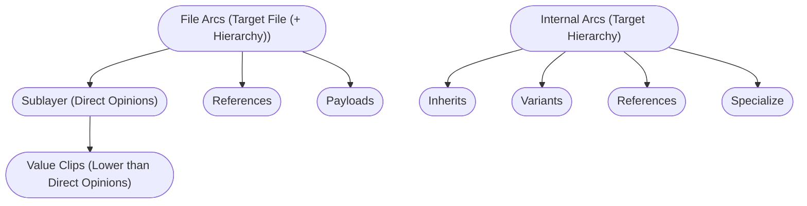
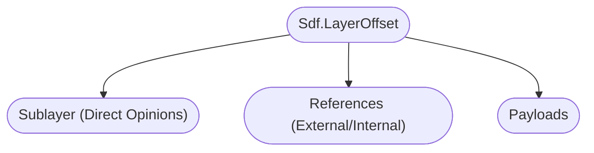
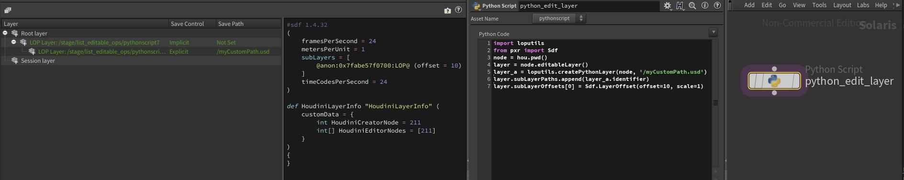

# Composition Arcs
In this section we'll cover how to create composition arcs via code. To check our how composition arcs interact with each other, check out our [Composition Strength Ordering (LIVRPS)](./livrps.md) section.

Please read out [fundamentals section](./fundamentals.md) as we often refer to it on this page. 

~~~admonish question title="Still under construction!"
This sub-section is still under development, it is subject to change and needs extra validation.
~~~

# Table of contents
1. [<Topic> In-A-Nutshell](#summary)
1. [What should I use it for?](#usage)
1. [Resources](#resources)
1. [Overview](#overview)
1. [Composition Arcs](#compositionArcs)
    1. [Sublayer / Local Opinion](#compositionArcSublayer)
        1. [Value Clips](#compositionArcValueClips)
    1. [Inherit](#compositionArcInherit)
    1. [Variant](#compositionArcVariant)
    1. [Reference](#compositionArcReference)
        1. [Reference File](#compositionArcReferenceExternal)
        1. [Reference Internal](#compositionArcReferenceInternal)
    1. [Payload](#compositionArcPayload)
    1. [Specialize](#compositionArcSpecialize)

## TL;DR - <Topic> In-A-Nutshell <a name="summary"></a>
- Main points to know

## What should I use it for? <a name="usage"></a>
~~~admonish tip
Summarize actual production relevance.
~~~

## Resources <a name="resources"></a>
- [API Docs]()

## Overview <a name="overview"></a>

Here is a comparison between arcs that can target external layers (files) and arcs that target another part of the hierarchy:


Some arcs can specify a time offset/scale via a`Sdf.LayerOffset`: 


## Composition Arcs
All arcs that make use of [list-editable ops](./fundamentals.md#list-editable-operations-ops), take of of these tokens as an optional `position` keyword argument via the high level API.

- `Usd.ListPositionFrontOfAppendList`: Prepend to append list, the same as `Sdf.<Type>ListOp`.appendedItems.insert(0, item)
- `Usd.ListPositionBackOfAppendList`: Append to append list, the same as `Sdf.<Type>ListOp`.appendedItems.append(item)
- `Usd.ListPositionFrontOfPrependList`: Prepend to prepend list, the same as `Sdf.<Type>ListOp`.appendedItems.insert(0, item)
- `Usd.ListPositionBackOfPrependList`: Append to prepend list, the same as `Sdf.<Type>ListOp`.appendedItems.append(item)

As we can see, all arc APIs, except for variants and sublayers, in the high level API, are thin wrappers around the [list editable op](./fundamentals.md#list-editable-operations-ops) of the arc.


### Sublayer / Local Opinion <a name="compositionArcSublayer"></a>

~~~admonish tip title=""
```python
{{#include ../../../../code/core/composition.py:compositionArcSublayer}}
```
~~~

When working in Houdini, we can't directly sublayer onto the root layer as with native USD, due to Houdini's layer caching mechanism, that makes node based stage editing possible. Layering on the active layer works as usual though.

~~~admonish tip title=""
```python
{{#include ../../../../code/core/composition.py:compositionArcSublayerHoudini}}
```
~~~

Here is the result:



#### Value Clips <a name="compositionArcValueClips"></a>
We cover value clips in our [animation section](../elements/animation.md). Their opinion strength is lower than direct (sublayer) opinions, but higher than anything else.

The write them via metadata entries as covered here in our [value clips](../elements/animation.md#value-clips-loading-time-samples-from-multiple-files) section.

### Inherit <a name="compositionArcInherit"></a>

~~~admonish tip title=""
```python
{{#include ../../../../code/core/composition.py:compositionArcInherit}}
```
~~~

### Variant <a name="compositionArcVariant"></a>

### Reference <a name="compositionArcReference"></a>


#### Reference File <a name="compositionArcReferenceExternal"></a>

~~~admonish tip title=""
```python
{{#include ../../../../code/core/composition.py:compositionArcReferenceExternal}}
```
~~~


#### Reference Internal <a name="compositionArcReferenceInternal"></a>

~~~admonish tip title=""
```python
{{#include ../../../../code/core/composition.py:compositionArcReferenceInternal}}
```
~~~

### Payload <a name="compositionArcPayload"></a>
~~~admonish tip title=""
```python
{{#include ../../../../code/core/composition.py:compositionArcPayload}}
```
~~~

### Specialize <a name="compositionArcSpecialize"></a>
~~~admonish tip title=""
```python
{{#include ../../../../code/core/composition.py:compositionArcSpecialize}}
```
~~~