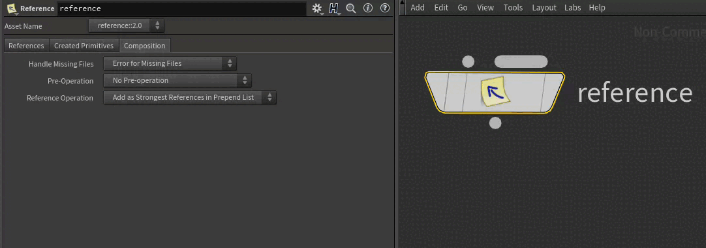

# Composition Fundamentals
~~~admonish question title="Still under construction!"
As composition is USD's most complicated topic, this section will be enhanced with more examples in the future.
If you detect an error or have useful production examples, please [submit a ticket](https://github.com/LucaScheller/VFX-UsdSurvivalGuide/issues/new), so we can improve the guide!

In the near future, we'll add examples for:
- Pixar Glossary Examples
- Pixar FAQ Examples
- Production Examples
~~~

# Table of contents
1. [Composition Fundamentals In-A-Nutshell](#summary)
1. [Why should I understand the editing fundamentals?](#usage)
1. [Resources](#resources)
1. [Overview](#overview)
1. [Terminology](#terminology)
1. [Composition Editing Principles - What do we need to know before we start?](#compositionFundamentals)
    1. [List-Editable Operations](#compositionFundamentalsListEditableOps)
    1. [Encapsulation](#compositionFundamentalsEncapsulation)
    1. [Layer Stack](#compositionFundamentalsLayerStack)

## TL;DR - Composition Fundamentals In-A-Nutshell <a name="summary"></a>
- Composition editing works in the active [layer stack](#compositionFundamentalsLayerStack) via [list editable ops](#compositionFundamentalsListEditableOps). 
- When loading a layer (stack) from disk via `Reference` and `Payload` arcs, the contained composition structure is immutable (USD speak [encapsulated](#compositionFundamentalsEncapsulation)). The arcs themselves still target the "live" composed stage and therefore still reflect changes from the encapsulated arcs.

## Why should I understand the editing fundamentals? <a name="usage"></a>
~~~admonish tip
This section houses terminology essentials and a detailed explanation of how the underlying mechanism of editing/composing arcs works.
Some may consider it a deep dive topic, we'd recommend starting out with it first though, as it saves time later on when you don't understand why something might not work.
~~~

## Resources <a name="resources"></a>
- [USD Glossary]():
    - [Layer Stack](https://openusd.org/release/glossary.html#usdglossary-layerstack)
    - [Root Layer Stack](https://openusd.org/release/glossary.html#usdglossary-rootlayerstack)
    - [Prim Index](https://openusd.org/release/glossary.html#usdglossary-index)
    - [List Editing](https://openusd.org/release/glossary.html#list-editing)
    - [LIVRPS](https://openusd.org/release/glossary.html#livrps-strength-ordering)
    - [Path Translation](https://openusd.org/release/glossary.html#usdglossary-pathtranslation)
    - [References](https://openusd.org/release/glossary.html#usdglossary-references)
- [USD FAQ - When can you delete a reference?](https://openusd.org/release/usdfaq.html#when-can-you-delete-a-reference-or-other-deletable-thing)

## Overview <a name="overview"></a>
Before we start looking at the actual composition arcs and their strength ordering rules, let's first look at how composition editing works.

## Terminology <a name="terminology"></a>
USD's mechanism of linking different USD files with each other is called `composition`. Let's first clarify some terminology before we start, so that we are all on the same page:
- **Opinion**: A written value in a layer for a metadata field or property.
- **Layer**: A layer is an USD file on disk with [prims](../elements/prim.md) & [properties](../elements/property.md). (Technically it can also be in memory, but for simplicity on this page, let's think of it as a file on disk). More info in our [layer section](../elements/layer.md).
- **Layer Stack**: A stack of layers (Hehe 😉). We'll explain it more in detail below, just remember it is talking about all the loaded layers that use the `sublayer` composition arc.
- **Composition Arc**: A method of linking (pointing to) another layer or another part of the scene hierarchy. USD has different kinds of composition arcs, each with a specific behavior.
- **Prim Index**: Once USD has processed all of our composition arcs, it builds a `prim index` that tracks where values can come from. We can think of the `prim index` as something that outputs an ordered list of `[(<layer (stack)>, <hierarchy path>), (<layer (stack)>, <hierarchy path>)]` ordered by the composition rules.
- **Composed Value**: When looking up a value of a property, USD then checks each location of the `prim index` for a value and moves on to the next one if it can't find one. If no value was found, it uses a schema fallback (if the property came from a schema), other wise it falls back to not having a value (USD speak: not being `authored`).

Composition is "easy" to explain in theory, but hard to master in production. It also a topic that keeps on giving and makes you question if you really understand USD. So don't worry if you don't fully understand the concepts of this page, they can take a long time to master. To be honest, it's one of those topics that you have to read yourself back into every time you plan on making larger changes to your pipeline.

We recommend really playing through as much scenarios as possible before you start using USD in production. Houdini is one of the best tools on the market that let's you easily concept and play around with composition. Therefore we will use it in our examples below.

## Composition Editing Fundamentals - What do we need to know before we start? <a name="compositionFundamentals"></a>
Now before we talk about individual `composition arcs`, let's first focus on three different principles composition runs on.
These three principles build on each other, so make sure you work through them in order they are listed below.
- [List-Editable Operations](#list-editable-operations-ops)
- [Encapsulation](#encapsulation)
- [Layer Stack](#layer-stack)

### List-Editable Operations (Ops) <a name="compositionFundamentalsListEditableOps"></a>
USD has the concept of list editable operations. Instead of having a "flat" array (`[Sdf.Path("/cube"), Sdf.Path("/sphere")]`) that stores what files/hierarchy paths we want to point to, we have wrapper array class that stores multiple sub-arrays. When flattening the list op, USD removes duplicates, so that the end result is like an ordered Python `set()`.

To make it even more confusing, composition arc list editable ops run on a different logic than "normal" list editable ops when looking at the final `composed value`.

We take a closer look at "normal" list editable ops in our [List Editable Ops section](./listeditableops.md), on this page we'll stay focused on the composition ones.

Alright, let's have a quick primer on how these work. There are three sub-classes for composition related list editable ops:
- `Sdf.ReferenceListOp`: The list op for the `reference` composition arc, stores `Sdf.Reference` objects.
- `Sdf.PayloadListOp`: The list op for the `payload` composition arc, stores `Sdf.Reference` objects.
- `Sdf.PathListOp`: The list op for `inherit` and `specialize` composition arcs, as these arcs target another part of the hierarchy (hence `path`) and not a layer. It stores `Sdf.Path` objects.

These are 100% identical in terms of list ordering functionality, the only difference is what items they can store (as noted above). Let's start of simple with looking at the basics:

~~~admonish tip title=""
```python
{{#include ../../../../code/core/composition.py:compositionListEditableOpsBasics}}
```
~~~

So far so good? Now let's look at how multiple of these list editable ops are combined. If you remember our [layer](../elements/layer.md) section, each layer stores our prim specs and property specs. The composition list editable ops are stored as metadata on the prim specs. When USD composes the stage, it combines these and then starts building the composition based on the composed result of these metadata fields.

Let's mock how USD does this without layers:

~~~admonish tip title=""
```python
{{#include ../../../../code/core/composition.py:compositionListEditableOpsMerging}}
```
~~~

When working with multiple layers, each layer can have list editable ops data in the composition metadata fields. It then gets merged, as mocked above. The result is a single flattened list, without duplicates, that then gets fed to the composition engine.

Here comes the fun part:

~~~admonish danger title="List-Editable Ops | Getting the composed (combined) value"
When looking at the metadata of a prim via UIs (USD View/Houdini) or getting it via the Usd.Prim.GetMetadata() method, you will only see the list editable op of the last layer that edited the metadata, **NOT** the composed result. 

This is probably the most confusing part of USD in my opinion when first starting out. To inspect the full composition result, we actually have to consult the [PCP cache](pcp.md) or run a `Usd.PrimCompositionQuery`. There is another caveat though too, as you'll see in the next section: Composition is **encapsulated**. This means our edits to list editable ops only work in the active `layer stack`. More info below!
~~~

In Houdini the list editable ops are exposed on the `reference` node. The "Reference Operation" parm sets what sub-array (prepend,append,delete) to use, the "Pre-Operation" sets it to `.Clear()` in `Clear Reference Edits in active layer` mode and to `.ClearAndMakeExplicit()` in "Clear All References" mode.



Here is how Houdini (but also the USD view) displays the references metadata field with different layers, as this is how the stage sees it.


You can see, as soon as we have our reference list editable op on different layers, the metadata only show the top most layer. To inspect all the references that are being loaded, we therefore need to look at the layer stack (the "Scene Graph Layers" panel) or perform a [compsition query](../../production/caches/composition.md).

Also a hint on terminology: In the USD docs/glossary the `Reference` arc often refers to all composition arcs other than `sublayer`, I guess this is a relic, as this was probably the first arc. That's why Houdini uses a similar terminology.

### Encapsulation <a name="compositionFundamentalsEncapsulation"></a>
When you start digging through the API docs, you'll read the word "encapsulation" a few times. (IMHO not enough times 😉). Here is what it means and why it is crucial to understand.

~~~admonish danger title="Encapsulation | Why are layers loaded via references/payloads composition arc locked?"
To make USD composition fast and more understandable, the content of what is loaded from an external file via the **`Reference`** and **`Payload`** composition arcs, is **composition locked** or as USD calls it **encapsulated**. This means that you can't remove any of the composition arcs in the layer stack, that is being loaded, via the list editable ops `deletedItems` list or via the `explicitItems`.
~~~

The only way to get rid of a `payload`/`reference` is by putting it behind a `variant` in the first place and then changing the `variant` selection. This can have some unwanted side effects though. You can find a detailed explanation with an example here: [USD FAQ - When can you delete a reference?](https://openusd.org/release/usdfaq.html#when-can-you-delete-a-reference-or-other-deletable-thing)

~~~admonish important title="Encapsulation | Are my loaded layers then self contained?"
You might be wondering now, if encapsulation forces the content of `Reference`/`Payload` to be self contained, in the sense that the composition arcs within that file do not "look" outside the file. The answer is no: For `Inherits`, `Internal References` and `Specializes` the arcs still evaluate relative to the composed scene. E.g. that means if you have internal reference some where in a referenced in layer stack, that `internal reference` will still be live. So if you edit a property in the active stage, that referenced in the file, it will still propagate all the changes from the internal reference source to all the internal reference targets. The only thing that is "locked" is the composition arcs structure, not the way the composition arc evaluates.
~~~

### Layer Stack <a name="compositionFundamentalsLayerStack"></a>
What is the layer stack, that we keep mentioning, you might ask yourself?
To quote from the [USD Glossary](https://openusd.org/release/glossary.html#usdglossary-layerstack)

~~~admonish quote title=""
The ordered set of layers resulting from the recursive gathering of all SubLayers of a Layer, plus the layer itself as first and strongest.
~~~

So to summarize, all (sub)-layers in the stage that were not loaded by `Reference` and `Payload` arcs.

Now you might be thinking, isn't that the same thing as when we open a Usd file via `Usd.Stage.Open`? Well kind of, yes. When opening a stage, the USD file you open and its sublayers are the layer stack. USD actually calls this the `Root Layer Stack` (it also includes the sessions layers). So one could say, **editing a stage is process of editing a layer stack**. To extend that analogy, we could call a stage, that was written to disk and is being loaded via `Reference` and `Payload` arcs, an encapsulated layer stack.

These are the important things to understand (as also mentioned in the glossary):

~~~admonish important title="Layer Stack | How does it affect composition?"
- Composition arcs target the layer stack, not individual layers. They recursively target the composed result (aka the result of all layers combined via the composition arc rules) of each layer they load in.
- We can only list edit composition arcs via list editable ops in the active layer stack. The active layer stack is usually the active stage (unless when we "hack" around it via edit targets, which you 99% of the time don't do).
~~~

So to make it clear again (as this is very important when we setup our asset/shot composition structure): **We can only update `Reference` and `Payload` arcs in the active layer stack. Once the active layer stack has been loaded via `Reference` and `Payload` arcs into another layer stack, it is encapsulated and we can't change the composition structure.**

This means to keep our pipeline flexible, we usually have "only" three kind of layer stacks:
- **Asset Layer Stack**: When building assets, we build a packaged asset element. The end result is a (nested) layer stack that loads in different aspects of the asset (model/materials/fx/etc.). Here the main "asset.usd" file, that at the end we reference into our shots, is in control of "final" asset layer stack. We usually don't have any encapsulation issue scenarios, as the different assets layers are usually self contained or our asset composition structure is usually developed to sidestep encapsulation problems via variants. 
- **Shot Layer Stack**: The shot layer stack is the one that sublayers in all of your different shot layers that come from different departments. That's right, since we sublayer everything, we still have access to list editable ops on everything that is loaded in via composition arcs that are generated in individual shot layers. This keeps the shot pipeline flexible, as we don't run into the encapsulation problem.
- **Set/Environment/Assembly Layer Stack** (Optional): We can also reference in multiple assets to an assembly type of asset, that then gets referenced into our shots. This is where you might run into encapsulation problems. For example, if we want to remove a reference from the set from our shot stage, we can't as it is baked into the composition structure. The usual way around it is to: 1. Write the assembly with variants, so we can variant away unwanted assets. 2. Deactivate the asset reference 3. Write the asset reference with variants and then switch to a variant that is empty.

