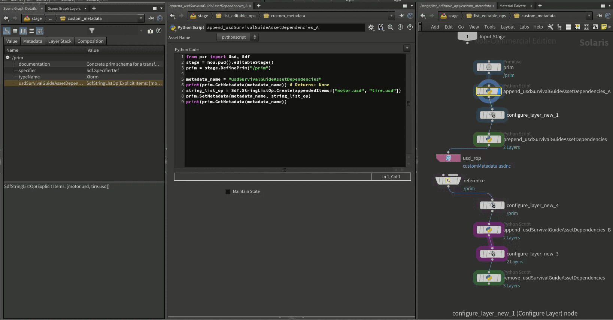

# List Editable Ops (Operations)
On this page we will have a look at list editable ops when not being used in composition arcs.

~~~admonish danger
As mentioned in our [fundamentals](./fundamentals.md#compositionFundamentalsListEditableOps) section, list editable ops play a crucial role to understanding composition. Please read that section before this one, as we build on what was written there.
~~~

# Table of contents
1. [List Editable Ops In-A-Nutshell](#summary)
1. [What should I use it for?](#usage)
1. [Resources](#resources)
1. [Overview](#overview)
1. [Composition Arcs](#listOpCompositionArc)
1. [Relationships](#listOpRelationship)
1. [Metadata](#listOpMetadata)

## TL;DR List Editable Ops - <Topic> In-A-Nutshell <a name="summary"></a>
- List editable ops behave differently based on the type:
    - **Composition**: When using list editable ops to define composition arcs, we can only edit them in the [active layer stack](./fundamentals.md#compositionFundamentalsLayerStack). Once referenced or payloaded, they become [encapsulated](./fundamentals.md#compositionFundamentalsEncapsulation).
    - **Relationships/Metadata**: When making use of list editable ops when defining relationships and metadata, we do not have encapsulation. This means that any layer stack can add/delete/set explicit the list editable type. See the examples below for more info.

## What should I use it for? <a name="usage"></a>
~~~admonish tip
Using list editable ops in non composition arc scenarios is rare, as we often want a more attribute like value resolution behavior. It is good to know though that the mechanism is there. A good production use case is making metadata that tracks asset dependencies list editable, that way all layers can contribute to the sidecar data.
~~~

## Resources <a name="resources"></a>
- [USD Glossary - List Editing](https://openusd.org/release/glossary.html#list-editing)

## Overview <a name="overview"></a>
Let's first go other how list editable ops are edited and applied:

These are the list editable ops that are available to us:
- Composition:
    - `Sdf.PathListOp`
    - `Sdf.PayloadListOp`
    - `Sdf.ReferenceListOp`
- Base Data Types:
    - `Sdf.PathListOp`
    - `Sdf.StringListOp`
    - `Sdf.TokenListOp`
    - `Sdf.IntListOp`
    - `Sdf.Int64ListOp`
    - `Sdf.UIntListOp`
    - `Sdf.UInt64ListOp`

USD has the concept of list editable operations. Instead of having a "flat" array (`[Sdf.Path("/cube"), Sdf.Path("/sphere")]`) that stores data, we have wrapper array class that stores multiple sub-arrays. When flattening the list op, USD removes duplicates, so that the end result is like an ordered Python `set()`.

All list editable ops work the same way, the only difference is what data they can hold.

These are 100% identical in terms of list ordering functionality, the only difference is what items they can store (as noted above). Let's start of simple with looking at the basics:

~~~admonish tip title=""
```python
{{#include ../../../../code/core/composition.py:listEditableOpsLowLevelAPI}}
```
~~~

When working with the high level API, all the function signatures that work on list-editable ops usually take a position kwarg which corresponds to what list to edit and the position (front/back):
- `Usd.ListPositionFrontOfAppendList`: Prepend to append list, the same as `Sdf.<Type>ListOp`.appendedItems.insert(0, item)
- `Usd.ListPositionBackOfAppendList`: Append to append list, the same as `Sdf.<Type>ListOp`.appendedItems.append(item)
- `Usd.ListPositionFrontOfPrependList`: Prepend to prepend list, the same as `Sdf.<Type>ListOp`.appendedItems.insert(0, item)
- `Usd.ListPositionBackOfPrependList`: Append to prepend list, the same as `Sdf.<Type>ListOp`.appendedItems.append(item)


~~~admonish tip title=""
```python
{{#include ../../../../code/core/composition.py:listEditableOpsHighLevelAPI}}
```
~~~

Now let's look at how multiple of these list editable ops are combined. 

~~~admonish important title="Pro Tip | List Editable OPs in Metadata "
Again it is very important, that composition arc related list editable ops get combined with a different rule set. We cover this extensively in our [fundamentals](./fundamentals.md) section.

Non-composition related list editable ops do not make use of [encapsulation](./fundamentals.md#compositionFundamentalsEncapsulation). This means that any layer can contribute to the result, meaning any layer can add/remove/set explicit. When getting the value of the list op for non-composition arc list ops, we get the absolute result, in the form of an explicit list editable item list.

In contrast: When looking at composition list editable ops, we only get the value of the last layer that edited the value, and we have to use composition queries to get the actual result.

This makes non-composition list editable ops a great mechanism to store averaged side car data. Checkout our Houdini example below, to see this in action.
~~~

Let's mock how USD does this (without using `Sdf.Layer`s to keep it simple):

~~~admonish tip title=""
```python
{{#include ../../../../code/core/composition.py:listEditableOpsMerging}}
```
~~~

When working with multiple layers, each layer can have list editable ops data in (composition-) metadata fields and relationship specs. It then gets merged, as mocked above. The result is a single flattened list, without duplicates.

## Composition Arcs <a name="listOpCompositionArc"></a>
For a detailed explanation how list editable ops work in conjunction with composition arcs, please check out our [composition fundamentals](./fundamentals.md) section.

## Relationships <a name="listOpRelationship"></a>
As with list editable metadata, relationships also show us the combined results from multiple layers. Since it is not a composition arc list editable op, we also don't have the restriction of encapsulation. That means, calling `GetTargets`/`GetForwardedTargets` can combine appended items from multiple layers. Most DCCs go for the `.SetTargets` method though, as layering relationship data can be confusing and often not what we want as an artist using the tools.

~~~admonish important title="Pro Tip | List Editable OPs in Collections "
Since [collections](../elements/collection.md) are made up of relationships, we can technically list edit them too. Most DCCs set the collection relationships as an explicit item list though, as layering paths can be confusing. 
~~~

## Metadata <a name="listOpMetadata"></a>
The default metadata fields that ship with USD, are not of the list editable type. We can easily extend this via a metadata plugin though.
 
Here is a showcase from our composition example file that edits a custom string list op field which we registered via a [custom meta plugin](../plugins/metadata.md). 



As you can see the result is dynamic, even across encapsulated arcs and it always returns an explicit list op with the combined results.

This can be used to combine metadata non destructively from multiple layers.