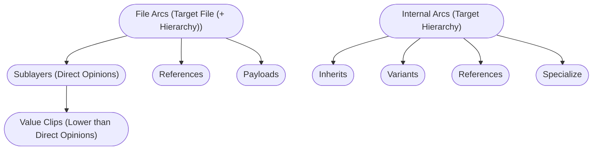
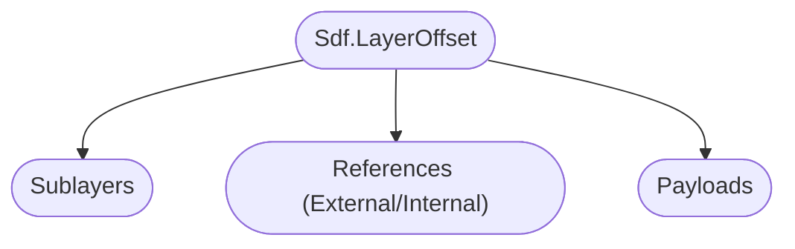

# Overview of Composition Arcs (LIVRPS)
In this section we'll cover how composition arcs work. We cover how to write compositon arcs via code in our [composition arcs](./arcs.md) section. 

# Table of contents
1. [Composition Arcs In-A-Nutshell](#summary)
1. [What should I use it for?](#usage)
1. [Resources](#resources)
1. [Overview](#overview)
1. [Composition Arcs](#compositionArcs)
    1. [Sublayers / Local Opinions](#compositionArcSublayer)
        1. [Value Clips](#compositionArcValueClips)
    1. [Inherits](#compositionArcInherit)
    1. [Variants](#compositionArcVariant)
    1. [References](#compositionArcReference)
        1. [References File](#compositionArcReferenceExternal)
        1. [References Internal](#compositionArcReferenceInternal)
    1. [Payloads](#compositionArcPayload)
    1. [Specializes](#compositionArcSpecialize)

## TL;DR - Composition Arcs In-A-Nutshell 
- ToDo

## What should I use it for? 
~~~admonish tip
We'll be using composition arcs to load data from different files and hierarchy locations. This is the core mechanism that makes USD powerful, as we can layer/combine our layers in meaning ful ways.
~~~

## Resources 
- [Sdf.Layer](https://openusd.org/dev/api/class_sdf_layer.html)

## Overview 
Here is a comparison between arcs that can target external layers (files) and arcs that target another part of the hierarchy:

Some arcs can specify a time offset/scale via a`Sdf.LayerOffset`: 

## Composition Arcs
ToDo
