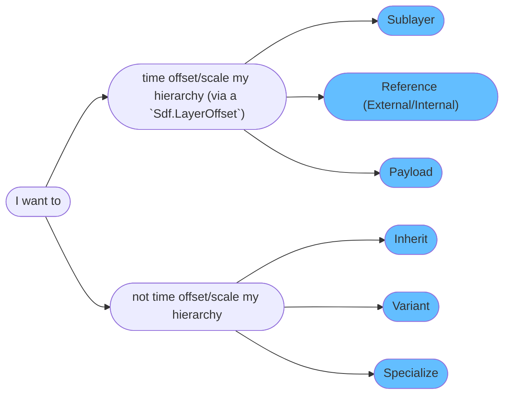
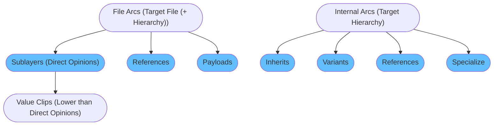

# Composition Strength Ordering (LIVRPS)
In this section we'll cover how composition arcs work and interact with each other. We cover how to create composition arcs via code in our [composition arcs](./arcs.md) section. This section will also have code examples, but with the focus on practical usage instead of API structure.

~~~admonish tip
We have a supplementary Houdini scene, that you can follow along with, available in this [site's repository](https://github.com/LucaScheller/VFX-UsdSurvivalGuide/tree/main/files/composition). All the examples below will walk through this file as it easier to prototype and showcase arcs in Houdini via nodes, than writing it all in code.
~~~

# Table of contents
1. [Composition Strength Ordering In-A-Nutshell](#summary)
1. [What should I use it for?](#usage)
1. [Resources](#resources)
1. [Overview](#overview)
1. [Composition Strength Ordering](#compositionStrengthOrdering)
1. [Composition Arc Categories](#compositionArcCategory)
    1. [Composition Arc By Use Case](#compositionArcCategoryByUseCase)
    1. [Composition Arc By Time Offset/Scale Capability](#compositionArcCategoryByTimeOffset)
    1. [Composition Arc By Target Type (File/Hierarchy)](#compositionArcCategoryByTargetType)
1. [Composition Arcs](#compositionArcs)
    1. [Sublayers / Local Opinions](#compositionArcSublayer)
        1. [Value Clips](#compositionArcValueClips)
    1. [Inherits](#compositionArcInherit)
    1. [Variants](#compositionArcVariant)
    1. [References](#compositionArcReference)
        1. [References File](#compositionArcReferenceExternal)
        1. [References Internal](#compositionArcReferenceInternal)
    1. [Payloads](#compositionArcPayload)
    1. [Specializes](#compositionArcSpecialize)
1. [Instancing in USD](#compositionInstance)

## TL;DR - Composition Arcs In-A-Nutshell <a name="summary"></a>
- ToDo

## What should I use it for? <a name="usage"></a>
~~~admonish tip
We'll be using composition arcs to load data from different files and hierarchy locations. This is the core mechanism that makes USD powerful, as we can layer/combine our layers in meaningful ways.

For USD to be able to scale well, we can also "lock" the composition on prims with the same arcs, so that they can use the same data source. This allows us to create instances, which keep our memory footprint low.
~~~

## Resources <a name="resources"></a>
- [Example]()

## Overview <a name="overview"></a>
USD's composition arcs each fulfill a different purpose. As we can attach attach all arcs (except sublayers) to any part of the hierarchy other than the pseudo root prim. When loading our data, we have a pre-defined load order of how arcs prioritize against each other. Each prim (and property) in our hierarchy then gets resolved (see our [Inspecting Compositon](./pcp.md) section) based on this order rule set and the outcome is a (or multiple) value sources, that answer data queries into our hierarchy.

All arcs, except the `sublayer` arc, target (load) a specific prim of a layer (stack). This allows us to rename the prim, where the arc is created on, to something different, than what the arc's source hierarchy prim is named. An essential task that USD performs for us, is mapping paths from the target layer to the source layer (stack).

## Composition Strength Ordering <a name="compositionStrengthOrdering"></a>
To prioritize how different arcs evaluate against each other, we have `composition strength ordering`. This is a fancy word for "what layer (file) provides the actual value for my prim/property/metadata based on all available composition arcs". (I think we'll stick to using `composition strength ordering` 😉).

All arcs, except sublayers, make use of list editing, see our [fundamentals](./fundamentals.md#compositionFundamentalsListEditableOps) for a detailed explanation. We highly recommend reading it first before continuing.

Let's look at the order:


~~~admonish quote title="Credits"
All credits for this info graphic go to [Remedy-Entertainment - Book Of USD](https://remedy-entertainment.github.io/USDBook/terminology/LIVRPS.html). Check out their site, it is another great value source for USD.
~~~

USD refers to this with the acronym `L(V)IVRPS(F)`:
- **L**ocal: Search for [direct opinions](https://openusd.org/release/glossary.html#direct-opinion) in the active root layer stack. 
    - **V**alue Clips: Search for [direct opinions](https://openusd.org/release/glossary.html#direct-opinion) from value clips. These are weaker than direct opinions on layers.
- **I**nherits: Search for inherits affecting the path. This searches in the (nested) layer stack by recursively applying *LIVRP* (No specializes) evaluation.
- **V**ariant Sets: Search for variants affecting the path. This searches in the (nested) layer stack by recursively applying *LIVRP* (No specializes) evaluation.
- **R**eferences: Search for references affecting the path. This searches in the (nested) layer stack by recursively applying *LIVRP* (No specializes) evaluation.
- **P**ayloads: Search for payloads affecting the path. This searches in the (nested) layer stack by recursively applying *LIVRP* (No specializes) evaluation.
- **S**pecializes: Search for payloads affecting the path. This searches in the (nested) layer stack by recursively applying full *LIVRPS* evaluation. This causes the specialize opinions to always be last.
- **(F)** allback value: Look for [schema](../elements/schemas.md) fallbacks.

Now if you just didn't understand any of that, don't worry! We'll have a look where what arc is typically used in the examples below.

~~~admonish important title="Important | Nested Composition Arc Resolve Order"
When resolving nested composition arcs and value clips, the arc/value clip metadata, that is authored on the closest ancestor parent prim or the prim itself, wins. In short to quote from the USD glossary `“ancestral arcs” are weaker than “direct arcs”`. To make our lives easier, we recommend having predefined locations where you author composition arcs. A typical location is your asset root prim and a set/assembly root prim.
~~~

## Composition Arc Categories <a name="compositionArcCategory"></a>
Let's try looking at arcs from a use case perspective. Depending on what we want to achieve, we usually end up with a specific arc designed to fill our needs.

### Composition Arc By Use Case <a name="compositionArcCategoryByUseCase"></a>
Here is a comparison between arcs by use case. Note that this is only a very "rough" overview, there are a few more things to pay attention to when picking the correct arc. It does help to first understand what the different arcs try to achieve though.

~~~admonish tip title=""

~~~

### Composition Arc By Time Offset/Scale Capability <a name="compositionArcCategoryByTimeOffset"></a>
Some arcs can specify a time offset/scale via a`Sdf.LayerOffset`.
~~~admonish tip title=""

~~~

### Composition Arc By Target Type (File/Hierarchy) <a name="compositionArcCategoryByTargetType"></a>
Here is a comparison between arcs that can target external layers (files) and arcs that target another part of the hierarchy.

~~~admonish tip title=""

~~~


## Composition Arcs <a name="compositionArcs"></a>
Let's gets practical! Below will go through every arc individually and highlight what is important.

~~~admonish tip
We have a supplementary Houdini scene, that you can follow along with, available in this [site's repository](https://github.com/LucaScheller/VFX-UsdSurvivalGuide/tree/main/files/composition). All the examples below will walk through this file as it easier to prototype and showcase arcs in Houdini via nodes, than writing it all in code.
~~~

### Sublayers / Local Opinions <a name="compositionArcSublayer"></a>
The sublayer arc is used to build up your stage [root layer stack](./fundamentals.md#compositionFundamentalsLayerStack). They can be time offset/scaled via a `Sdf.LayerOffset`, see our [code examples](./arcs.md#compositionArcSublayer).

~~~admonish tip title="Pro Tip | What do we use sublayers for?"
Typically we'll be using sublayers for mainly these things:
- As a mechanism to separate data when working in your DCCs. On file write we usually flatten layers to a single flattened output(s)(if you have multiple save paths set). Why not put everything on the same layer? We can use the layer order as a form of control to A. allow/block edits (or rather seeing them have an effect because of weaker opinion strength) B. Sort data from temporary data. 
- To load in references and payloads. That way all the heavy lifting is not done (and should not be done) by the sublayer arc.
- In shot workflows to load different shot layers. Why don't we do this via references or payloads you might be asking yourself? As covered in our [fundamentals](./fundamentals.md#compositionFundamentalsEncapsulation) section, anything your reference or payload in will be encapsulated. In shot workflows we want to keep having access to list editable ops. For example if we have a layout and a lighting layer, the lighting layer should still be able to remove a reference, that was created in the layout layer.
~~~

Let's look at how sublayers are used in native USD:

When creating a stage we have two layers by default:
- **Session Layer**: This is a temp layer than doesn't get applied on disk save. Here we usually put things like viewport overrides.
- **Root Layer**: This is the base layer all edits target by default. We can add sublayers based on what we need to it. When calling `stage.Save()`, all sublayers that are dirty and not anonymous, will be saved. 

How are sublayers setup in Houdini?

In Houdini every node always edits the top most root layer sublayer (in USD speak the layer to edit is called the **edit target**). This way we don't have to worry about what our layer, we want to write to, is.

To summarize how Houdini makes node editing a layer based system possible (at least from what we can gather from reverse engineering): 

Every node stashes a copy of the top most layer (Houdini calls it the **active layer**), that way, when we switch from node to node, it transfers back the content as soon as it needs to be displayed/cooked. This does have a performance hit (as covered in our [Houdini performance](../../dcc/houdini/performance/overview.md)) section. It also spawns a new stage per node when necessary, for example when a python LOP node or python parm expression accesses the previous node's stage. This mechanism gives the user the control to spawn new layers when needed. By default your network is color coded by what the active layer is.


Houdini writes all your scene graph panel viewport overrides into session layer sublayers. By default these are not shown in the UI, you can view them by looking at the layer content though.


Instead of using layers non-anonymous save paths (layer identifiers) directly, all layers created in your session are anonymous layers (with Houdini specific metadata that tracks the save path). We're guessing that this is because all layers without a save path get merged into the next available layer with a save path on file save. If no layer has a save path, all content gets flattened into the layer file path you put on the USD rop.


#### Value Clips <a name="compositionArcValueClips"></a>
We cover value clips in our [animation section](../elements/animation.md). Value clips are USD's mechanism for loading per frame (or per chunk) files, so that we don't have a single gigantic file for large caches.

Their opinion strength is lower than direct (sublayer) opinions, but higher than anything else. This of course is only relevant if we author time samples and value clips in the same layer. If we have multiple layers, then it behaves as expected, so the highest layers wins.

The write them via metadata entries as covered here in our [value clips](../elements/animation.md#value-clips-loading-time-samples-from-multiple-files) section.

Here is a comparison between a layer with value clip metadata and time samples vs separate layers with each.
Houdini's "Load Layer For Editing", simply does a `active_layer.TransferContent(Sdf.Layer.FindOrOpen("/Disk/Layer.usd"))`, in case you are wondering, so it fakes it as if we created the value clip metadata in the active layer.


### Inherits <a name="compositionArcInherit"></a>
The inherit arc is used to add overrides to an existing prim hierarchy, that is made up of weaker arcs.
It does **not** support adding a time offset via `Sdf.LayerOffset`.


~~~admonish tip title="Pro Tip | What do we use inherits for?"
Typically we'll be using inherits for:
- As a mechanism to separate data when working in your DCCs. On file write we usually flatten layers to a single flattened output(s)(if you have multiple save paths set). Why not put everything on the same layer? We can use the layer order as a form of control to A. allow/block edits (or rather seeing them have an effect because of weaker opinion strength) B. Sort data from temporary data. 
- To load in references and payloads. That way all the heavy lifting is not done (and should not be done) by the sublayer arc.
- In shot workflows to load different shot layers. Why don't we do this via references or payloads you might be asking yourself? As covered in our [fundamentals](./fundamentals.md#compositionFundamentalsEncapsulation) section, anything your reference or payload in will be encapsulated. In shot workflows we want to keep having access to list editable ops. For example if we have a layout and a lighting layer, the lighting layer should still be able to remove a reference, that was created in the layout layer.
~~~

~~~admonish tip title=""
```python
{{#include ../../../../code/core/composition.py:compositionArcInherit}}
```
~~~

### Variants <a name="compositionArcVariant"></a>
Variant sets (the variant set->variant name mapping) are also managed via list editable ops.
The actual variant set data is not though. It is written "in-line" into the prim spec via the `Sdf.VariantSetSpec`/`Sdf.VariantSpec` specs, so that's why we have dedicated specs.

This means we can add variant data, but hide it by not adding the variant set name to the `variantSets`metadata.

For example here we added it:

```python
def Xform "car" (
    variants = {
        string color = "colorA"
    }
    prepend variantSets = "color"
)
{
    variantSet "color" = {
        "colorA" {
            def Cube "cube"
            {
            }
        }
        "colorB" {
            def Sphere "sphere"
            {
            }
        }
    }
}
```
Here we skipped it, by commenting out the:
`car_prim_spec.SetInfo("variantSetNames", Sdf.StringListOp.Create(prependedItems=["color"]))` line in the below code.
This will make it not appear in UIs for variant selections.

```python
def Xform "car" (
    variants = {
        string color = "colorA"
    }
)
{
    variantSet "color" = {
        "colorA" {
            def Cube "cube"
            {
            }
        }
        "colorB" {
            def Sphere "sphere"
            {
            }
        }
    }
}
```

~~~admonish tip title=""
```python
{{#include ../../../../code/core/composition.py:compositionArcVariant}}
```
~~~

<a name="compositionArcVariantCopySpec"></a>
~~~admonish tip title="Pro Tip | Copying layer content into a variant"
When editing variants, we can also move layer content into a variant very easily via the `Sdf.CopySpec` command. This is a very powerful feature!

```python
{{#include ../../../../code/core/composition.py:compositionArcVariantCopySpec}}
```
~~~

### References <a name="compositionArcReference"></a>

The `Sdf.Reference` class creates a read-only reference description object:
~~~admonish tip title=""
```python
{{#include ../../../../code/core/composition.py:compositionArcReferenceClass}}
```
~~~

#### References File <a name="compositionArcReferenceExternal"></a>
Here is how we add external references (references that load data from other files):
~~~admonish tip title=""
```python
{{#include ../../../../code/core/composition.py:compositionArcReferenceExternal}}
```
~~~


#### References Internal <a name="compositionArcReferenceInternal"></a>
Here is how we add internal references (references that load data from another part of the hierarchy) :
~~~admonish tip title=""
```python
{{#include ../../../../code/core/composition.py:compositionArcReferenceInternal}}
```
~~~

### Payloads <a name="compositionArcPayload"></a>
The `Sdf.Payload` class creates a read-only payload description object:
~~~admonish tip title=""
```python
{{#include ../../../../code/core/composition.py:compositionArcPayloadClass}}
```
~~~

Here is how we add payloads. Payloads always load data from other files:
~~~admonish tip title=""
```python
{{#include ../../../../code/core/composition.py:compositionArcPayload}}
```
~~~

### Specializes <a name="compositionArcSpecialize"></a>
Specializes, like inherits, don't have a object representation, they directly edit the list-editable op list.

~~~admonish tip title=""
```python
{{#include ../../../../code/core/composition.py:compositionArcSpecialize}}
```
~~~


## Instancing in USD <a name="compositionInstance"></a>
You might be wondering: "Huh, why are we talking about instancing in the section about composition?". The answer is: The two are actually related.

Let's first define what instancing is:
~~~admonish tip title=""
Instancing is the multi re-use of a part of the hierarchy, so that we don't have to load it into memory multiple times. In USD speak the term for the "base" copy, all instances refer to, is **Prototype**.
~~~

~~~admonish danger title=""
Instancing is what keeps things fast as your stage content grows. It should be one of the main factors of how you design your composition setup.
~~~

USD has two ways of handling data instancing:
- **Explicit**: Explicit data instancing via [`UsdGeom.PointInstancer`](https://openusd.org/dev/api/class_usd_geom_point_instancer.html) prims. The idea is simple: Given a set of array attributes made up of positions, orientations, scales (and velocity) data, copy a `Prototype` to each point. In this case prototype refers to any prim (and its sub-hierarchy) in your stage. We usually group them under the point instancer prims for readability. 
- **Implicit**: Implicit instances are instances that are marked with the `instanceable` metadata. Now we can't just mark any hierarchy prim with this data. (Well we can but it would have no effect.) This metadata has to be set on prims that have composition arcs written. Our usual case is an asset that was brought in via a reference. What USD then does is "lock" the composition and create on the fly `/__Prototype_<index>` prim as the base copy. Any prim in your hierarchy that has the exact same let's call it **composition hash** (exact same composition arcs), will then re-use this base copy. This also means that we can't edit any prim beneath the `instanceable` marked prim.

~~~admonish danger title="Pro Tip | Prototype Count"
We should always keep an eye on the prototype count, as it is a good performance indicator of if our composition structure is well setup.

We can also access the implicit prototypes via Python. They are not editable and on the fly re-spawned every time you edit your stage, so don't count on their naming/path/content to be the same. 

We often do use them though to find the prims they are the prototype of. That way we can add arcs (for example an inherit) and still keep the prototype count the same, as the overall unique compositions structures stay the same.
```python
print("Prototype Count", len(stage.GetPrototypes()))
```
~~~

In Houdini we can show the implicit prototypes by enabling the "Show Implicit Prototype Primitives" option in the sunglasses menu in our scene graph tree panel.

