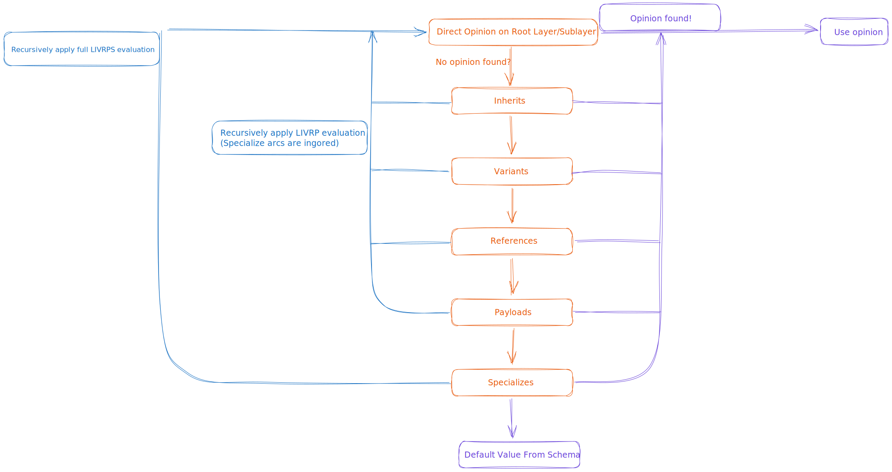
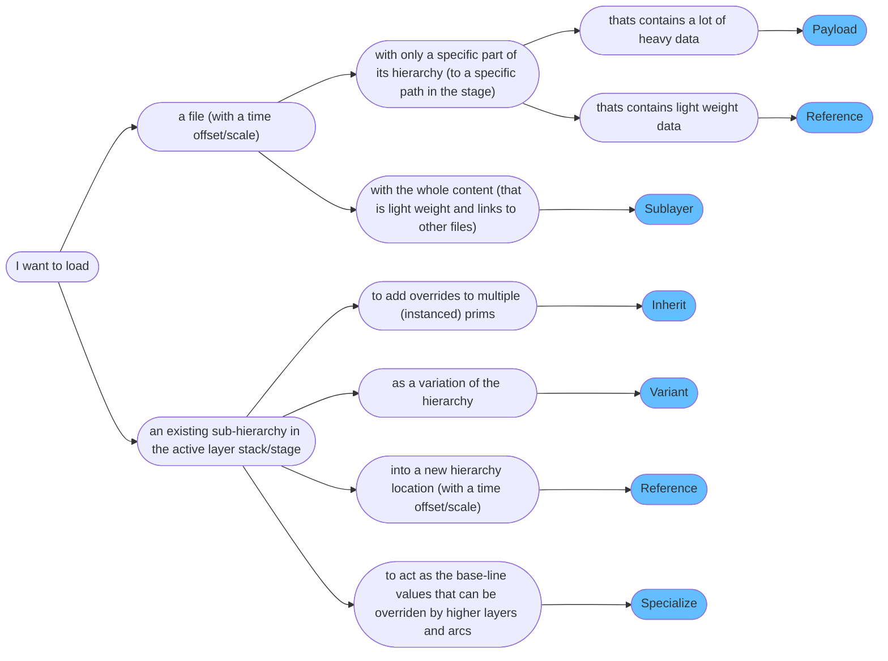
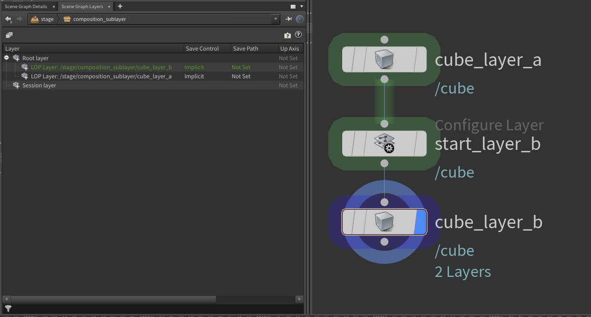
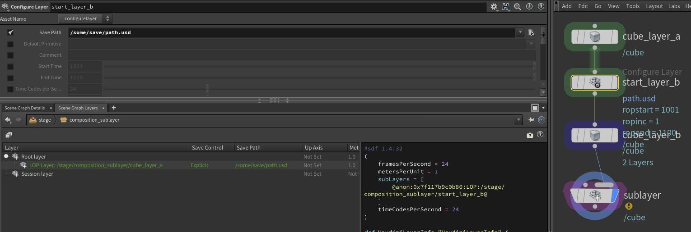
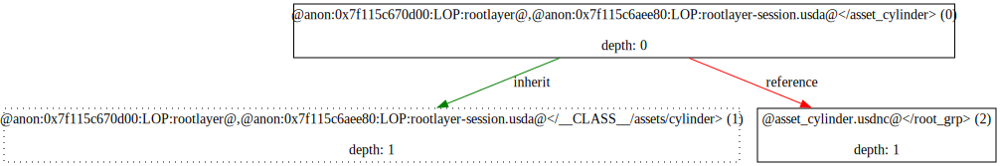
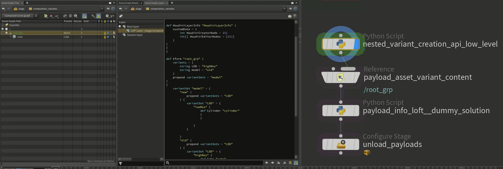
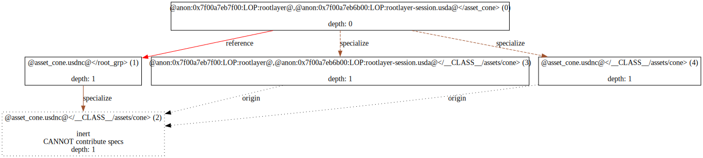
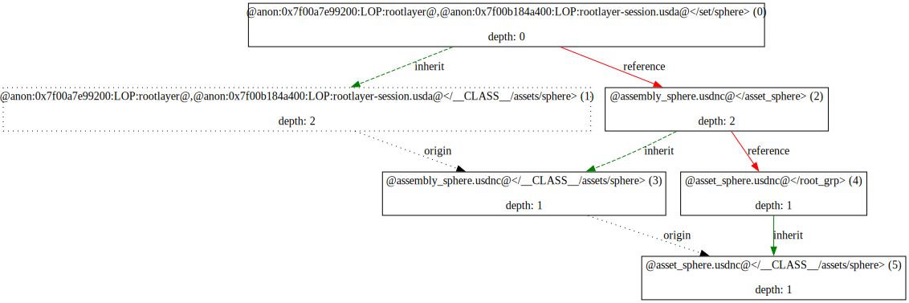
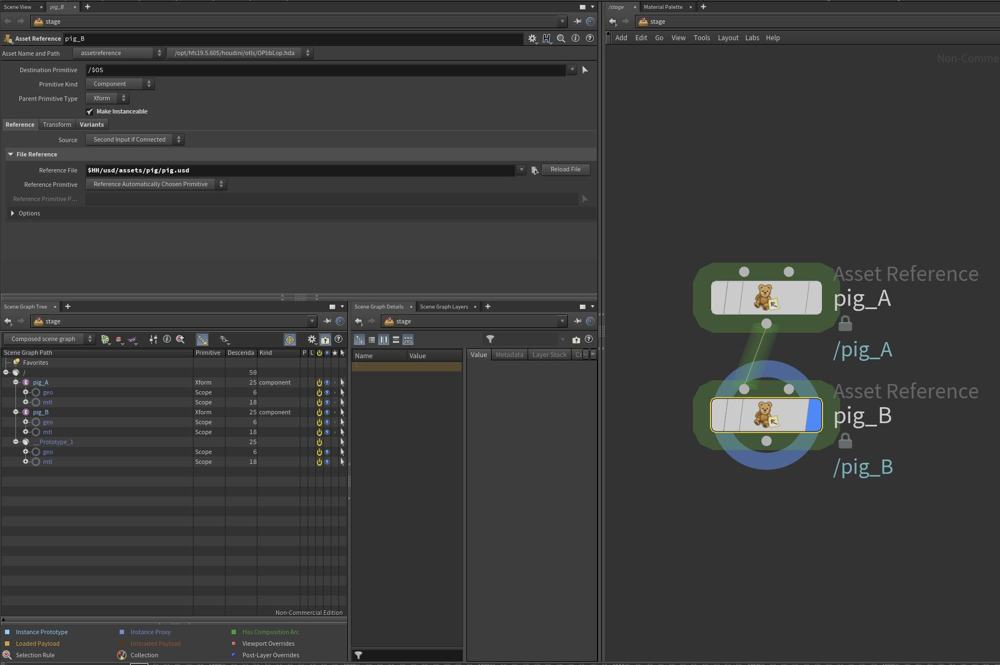

# Composition Strength Ordering (LIVRPS)
In this section we'll cover how composition arcs work and interact with each other. We cover how to create composition arcs via code in our [composition arcs](./arcs.md) section. This section will also have code examples, but with the focus on practical usage instead of API structure.

~~~admonish tip
We have a supplementary Houdini scene, that you can follow along with, available in this [site's repository](https://github.com/LucaScheller/VFX-UsdSurvivalGuide/tree/main/files/composition). All the examples below will walk through this file as it easier to prototype and showcase arcs in Houdini via nodes, than writing it all in code.
~~~

# Table of contents
1. [Composition Strength Ordering In-A-Nutshell](#summary)
1. [What should I use it for?](#usage)
1. [Resources](#resources)
1. [Overview](#overview)
1. [Composition Strength Ordering](#compositionStrengthOrdering)
1. [Composition Arc Categories](#compositionArcCategory)
    1. [Composition Arc By Use Case](#compositionArcCategoryByUseCase)
    1. [Composition Arc By Time Offset/Scale Capability](#compositionArcCategoryByTimeOffset)
    1. [Composition Arc By Target Type (File/Hierarchy)](#compositionArcCategoryByTargetType)
1. [Composition Arcs](#compositionArcs)
    1. [Sublayers / Local Direct Opinions](#compositionArcSublayer)
        1. [Value Clips](#compositionArcValueClips)
    1. [Inherits](#compositionArcInherit)
    1. [Variants](#compositionArcVariant)
        1. [Nested Variants](#compositionArcVariantNested)
        1. [Variant Data Lofting](#compositionArcVariantLofting)
        1. [Sharing data among variants](#compositionArcVariantSharing)
        1. [Efficiently re-writing existing data as variants](#compositionArcVariantReauthor)
    1. [References](#compositionArcReference)
        1. [Composition encapsulation for references (and payloads)](#compositionArcReferencePayloadEncapsulation)
        1. [Nested composition and list editable op order](#compositionArcReferenceStrongWeakerListOrder)
    1. [Payloads](#compositionArcPayload)
        1. [Workflows for loading payloads over references in shots](#compositionArcPayloadLoadWorkflow)
    1. [Specializes](#compositionArcSpecialize)
1. [Instancing in USD](#compositionInstance)

## TL;DR - Composition Arcs In-A-Nutshell <a name="summary"></a>
Here are the arcs in their composition strength order and their main intent:
- **L**ocal Opinions/Sublayers**: The sublayer arc is used to build up your stage root layer stack. They can be time offset/scaled via a Sdf.LayerOffset, see our code examples.
- **I**nherits: The inherit arc is used to add overrides to existing (instanceable) prims. The typical use case is to apply an edit to a bunch of referenced in assets that were loaded as instanceable without losing instance-ability and without increasing the prototype count. It does not support adding a time offset via Sdf.LayerOffset.
- **V**ariants: The variant arc is used to allow users to switch through different variations of sub-hierarchies. It does not support adding any time offsets via Sdf.LayerOffsets.
- **R**eferences: The reference arc is one of the most used arcs. Its main purpose is to aggregate scene description data from other files or sub-hierarchies. It is the only arc that has both file loading and internal hierarchy linking/loading possibilities. It does support adding time offsets via Sdf.LayerOffsets.
- **P**ayloads: The payload arc is also one of the most used arcs. Its main purpose is to load heavy data. This means it is the arc that you'll use when loading any type of renderable geometry. It does support adding time offsets via Sdf.LayerOffsets.
- **S**pecializes: The specialize arc is used to supply "template" like values to your prim hierarchy. Any other arc can then overrides these. If we update the "template", all overrides from other arcs are kept. It does not support adding a time offset via Sdf.LayerOffset.
- **(F)** allback value: If no value is found, [schemas](../elements/schemas.md) can provide fallback values.

This is a very nuanced topic, therefore we recommend working through this section to fully understand it.

## What should I use it for? <a name="usage"></a>
~~~admonish tip
We'll be using composition arcs to load data from different files and hierarchy locations. This is the core mechanism that makes USD powerful, as we can layer/combine our layers in meaningful ways.

For USD to be able to scale well, we can also "lock" the composition on prims with the same arcs, so that they can use the same data source. This allows us to create instances, which keep our memory footprint low.
~~~

## Resources <a name="resources"></a>
- [USD Glossary - LIVRPS Composition Strength Ordering](https://openusd.org/release/glossary.html#livrps-strength-ordering)
- [USD Glossary - Direct Opinions](https://openusd.org/release/glossary.html#direct-opinion)
- [USD Glossary - Inherits](https://openusd.org/release/glossary.html#usdglossary-inherits)
- [USD Glossary - Variants](https://openusd.org/release/glossary.html#usdglossary-variant)
- [USD Glossary - References](https://openusd.org/release/glossary.html#usdglossary-references)
- [USD Glossary - Payloads](https://openusd.org/release/glossary.html#usdglossary-payload)
- [USD Glossary - Specializes](https://openusd.org/release/glossary.html#usdglossary-specializes)
- [USD Instancing](https://openusd.org/release/api/_usd__page__scenegraph_instancing.html)

## Overview <a name="overview"></a>
USD's composition arcs each fulfill a different purpose. As we can attach attach all arcs (except sublayers) to any part of the hierarchy other than the pseudo root prim. When loading our data, we have a pre-defined load order of how arcs prioritize against each other. Each prim (and property) in our hierarchy then gets resolved (see our [Inspecting Compositon](./pcp.md) section) based on this order rule set and the outcome is a (or multiple) value sources, that answer data queries into our hierarchy.

All arcs, except the `sublayer` arc, target (load) a specific prim of a layer stack (**NOT layer**). This allows us to rename the prim, where the arc is created on, to something different, than what the arc's source hierarchy prim is named. An essential task that USD performs for us, is mapping paths from the target layer to the source layer (stack).

~~~admonish important title="Important | Good-To-Knows"
- Composition arcs target layer stacks, not individual layers. This just means that they recursively load what is in a layer.
- When arcs target a non root prim, they do **not** receive parent data that usually "flows" down the hierarchy. This means that primvars, material bindings or transforms from ancestor prims do not get "inherited" (we don't mean the inherited arc here). They **do** see the composition result though. So for example if your file reference targets a prim inside a variant, it can't change the variant as the variant is not in the stage it was referenced into to.
- Internal composition arcs (inherit/internal references/specialize) cannot target ancestor or child arcs. We can only target sibling prims or prims that are at/under a different "/" stage root prim.
- Composition arcs only look in the active layer stack and in "higher" layer stacks (layer stacks that reference/payload the active layer stack).
~~~

## Composition Strength Ordering <a name="compositionStrengthOrdering"></a>
To prioritize how different arcs evaluate against each other, we have `composition strength ordering`. This is a fancy word for "what layer (file) provides the actual value for my prim/property/metadata based on all available composition arcs". (I think we'll stick to using `composition strength ordering` 😉).

All arcs, except sublayers, make use of list editing, see our [fundamentals](./fundamentals.md#compositionFundamentalsListEditableOps) for a detailed explanation. We highly recommend reading it first before continuing.

Let's look at the order:


~~~admonish quote title="Credits"
All credits for this info graphic go to [Remedy-Entertainment - Book Of USD](https://remedy-entertainment.github.io/USDBook/terminology/LIVRPS.html). Check out their site, it is another great value source for USD.
~~~

USD refers to this with the acronym `L(V)IVRPS(F)`:
- **L**ocal: Search for [direct opinions](https://openusd.org/release/glossary.html#direct-opinion) in the active root layer stack. 
    - **V**alue Clips: Search for [direct opinions](https://openusd.org/release/glossary.html#direct-opinion) from value clips. These are weaker than direct opinions on layers.
- **I**nherits: Search for inherits affecting the path. This searches in the (nested) layer stack by recursively applying *LIVRP* (No specializes) evaluation.
- **V**ariant Sets: Search for variants affecting the path. This searches in the (nested) layer stack by recursively applying *LIVRP* (No specializes) evaluation.
- **R**eferences: Search for references affecting the path. This searches in the (nested) layer stack by recursively applying *LIVRP* (No specializes) evaluation.
- **P**ayloads: Search for payloads affecting the path. This searches in the (nested) layer stack by recursively applying *LIVRP* (No specializes) evaluation.
- **S**pecializes: Search for payloads affecting the path. This searches in the (nested) layer stack by recursively applying full *LIVRPS* evaluation. This causes the specialize opinions to always be last.
- **(F)** allback value: Look for [schema](../elements/schemas.md) fallbacks.

Now if you just didn't understand any of that, don't worry! We'll have a look where what arc is typically used in the examples below.

~~~admonish important title="Important | Nested Composition Arc Resolve Order"
When resolving nested composition arcs and value clips, the arc/value clip metadata, that is authored on the closest ancestor parent prim or the prim itself, wins. In short to quote from the USD glossary `“ancestral arcs” are weaker than “direct arcs”`. To make our lives easier, we recommend having predefined locations where you author composition arcs. A typical location is your asset root prim and a set/assembly root prim.
~~~

## Composition Arc Categories <a name="compositionArcCategory"></a>
Let's try looking at arcs from a use case perspective. Depending on what we want to achieve, we usually end up with a specific arc designed to fill our needs.

### Composition Arc By Use Case <a name="compositionArcCategoryByUseCase"></a>
Here is a comparison between arcs by use case. Note that this is only a very "rough" overview, there are a few more things to pay attention to when picking the correct arc. It does help to first understand what the different arcs try to achieve though.

~~~admonish tip title=""

~~~

### Composition Arc By Time Offset/Scale Capability <a name="compositionArcCategoryByTimeOffset"></a>
Some arcs can specify a time offset/scale via a`Sdf.LayerOffset`.
~~~admonish tip title=""

~~~

### Composition Arc By Target Type (File/Hierarchy) <a name="compositionArcCategoryByTargetType"></a>
Here is a comparison between arcs that can target external layers (files) and arcs that target another part of the hierarchy.

~~~admonish tip title=""

~~~


## Composition Arcs <a name="compositionArcs"></a>
Let's gets practical! Below will go through every arc individually and highlight what is important.

~~~admonish tip
We have a supplementary Houdini scene, that you can follow along with, available in this [site's repository](https://github.com/LucaScheller/VFX-UsdSurvivalGuide/tree/main/files/composition). All the examples below will walk through this file as it easier to prototype and showcase arcs in Houdini via nodes, than writing it all in code.
~~~

### Sublayers / Local Direct Opinions <a name="compositionArcSublayer"></a>
The sublayer arc is used to build up your stage [root layer stack](./fundamentals.md#compositionFundamentalsLayerStack). They can be time offset/scaled via a `Sdf.LayerOffset`, see our [code examples](./arcs.md#compositionArcSublayer).

~~~admonish tip title="Pro Tip | What do we use sublayers for?"
Typically we'll be using sublayers for mainly these things:
- As a mechanism to separate data when working in your DCCs. On file write we usually flatten layers to a single flattened output(s)(if you have multiple save paths set). Why not put everything on the same layer? We can use the layer order as a form of control to A. allow/block edits (or rather seeing them have an effect because of weaker opinion strength) B. Sort data from temporary data. 
- To load in references and payloads. That way all the heavy lifting is not done (and should not be done) by the sublayer arc.
- In shot workflows to load different shot layers. Why don't we do this via references or payloads you might be asking yourself? As covered in our [fundamentals](./fundamentals.md#compositionFundamentalsEncapsulation) section, anything your reference or payload in will be encapsulated. In shot workflows we want to keep having access to list editable ops. For example if we have a layout and a lighting layer, the lighting layer should still be able to remove a reference, that was created in the layout layer.
~~~

~~~admonish tip title="Pro Tip | Editing sublayer arcs via the USD API"
If you want to create/edit sublayer arcs via code, see our [Composition Arc - Code API](./arcs.md#compositionArcSublayer) section.
~~~

Let's look at how sublayers are used in native USD:

When creating a stage we have two layers by default:
- **Session Layer**: This is a temp layer than doesn't get applied on disk save. Here we usually put things like viewport overrides.
- **Root Layer**: This is the base layer all edits target by default. We can add sublayers based on what we need to it. When calling `stage.Save()`, all sublayers that are dirty and not anonymous, will be saved. 

How are sublayers setup in Houdini?

In Houdini every node always edits the top most root layer sublayer (in USD speak the layer to edit is called the **edit target**). This way we don't have to worry about what our layer, we want to write to, is. In the scene graph panel the session layer is displayed under the root layer, it is actually over (higher) than the root layer.

To summarize how Houdini makes node editing a layer based system possible (at least from what we can gather from reverse engineering): 

Every node stashes a copy of the top most layer (Houdini calls it the **active layer**), that way, when we switch from node to node, it transfers back the content as soon as it needs to be displayed/cooked. This does have a performance hit (as covered in our [Houdini performance](../../dcc/houdini/performance/overview.md)) section. It also spawns a new stage per node when necessary, for example when a python LOP node or python parm expression accesses the previous node's stage. This mechanism gives the user the control to spawn new layers when needed. By default your network is color coded by what the active layer is.



Houdini writes all your scene graph panel viewport overrides into session layer sublayers. By default these are not shown in the UI, you can view them by looking at the layer content though.


Instead of using layers non-anonymous save paths (layer identifiers) directly, all layers created in your session are anonymous layers (with Houdini specific metadata that tracks the save path). We're guessing that this is because all layers without a save path get merged into the next available layer with a save path on file save. If no layer has a save path, all content gets flattened into the layer file path you put on the USD rop.



#### Value Clips <a name="compositionArcValueClips"></a>
We cover value clips in our [animation section](../elements/animation.md). Value clips are USD's mechanism for loading per frame (or per chunk) files, so that we don't have a single gigantic file for large caches.

Their opinion strength is lower than direct (sublayer) opinions, but higher than anything else. This of course is only relevant if we author time samples and value clips in the same layer. If we have multiple layers, then it behaves as expected, so the highest layers wins.

~~~admonish tip title="Pro Tip | Editing value clips via the USD API"
Value clips are written via metadata entries on prims. If you want to create/edit value clips via code, see our [value clips](../elements/animation.md#value-clips-loading-time-samples-from-multiple-files) section.
~~~

Here is a comparison between a layer with value clip metadata and time samples vs separate layers with each.
Houdini's "Load Layer For Editing", simply does a `active_layer.TransferContent(Sdf.Layer.FindOrOpen("/Disk/Layer.usd"))`, in case you are wondering, so it fakes it as if we created the value clip metadata in the active layer.


~~~admonish tip title="Pro Tip | How do we load value clipped files?"
We cover a production based example of how to load value clips in our [Composition for production](../../production/composition.md) section. Here are some import things to keep in mind:
- When making prims instanceable, the value clip metadata has to be under the instanceable prim, as the value clip metadata can't be read from outside of the instance (as it would then mean each instance could load different clips, which would defeat the purpose of instanceable prims).
- Value clip metadata can't be inherited/internally referenced/specialized in. It must reside on the prim as a direct opinion.

See the production examples for how to best load value clips.
~~~

### Inherits <a name="compositionArcInherit"></a>
The inherit arc is used to add overrides to existing (instanceable) prims. The typical use case is to apply an edit to a bunch of referenced in assets that were loaded as instanceable without losing instance-ability and without increasing the prototype count. It does **not** support adding a time offset via `Sdf.LayerOffset`.

~~~admonish tip title="Pro Tip | What do we use inherits for?"
- We use inherit arcs as a "broadcast" operator for overrides: When we want to apply an edit to our hierarchy in multiple places, we typically create a class prim, whose child prims contain the properties we want to modify. After that we create an inherit arc on all prims that should receive the edit. As it is the second highest arc behind direct opinions, it will always have the highest composition strength, when applied to instanceable prims, as instanceable prims can't have direct opinions.
- The inherit arc lookup is never [encapsulated](./fundamentals.md#compositionFundamentalsEncapsulation), the inherit arc list-editable op is. This means that any layer stack, that re-creates the prims that that the inherit targets, gets used by the inherit. This does come at a performance cost, as the composition engine needs to check all layer stacks from where the arc was authored and higher for the hierarchy that the inherit targets.
- The inherit arc commonly gets used together with the [class prim specifier](../elements/prim.md#primSpecifier). The class prim specifier is specifically there to get ignored by default traversals and to provide template hierarchies that can then get inherited (or internally referenced/specialized) to have a "single source to multiple targets" effect.  
- Depending on if we are working on shots or assets are common practices:
    - **Assets**: When creating assets, we can author a `/__CLASS__/<assetName>` inherit. When we use the asset in shots, we can then easily add overrides to all assets of this type, by creating prims and properties under that specific class prim hierarchy. While this sounds great in theory, artists often want to only selectively apply an override to an asset. Therefore having the additional performance cost of this arc in assets is something might not worth doing. See the next bullet point.
    - **Shots**: This is where inherits shine! We usually create inherits to:
        - Batch apply render geometry settings to (instanceable) prims. This is a great way of having a single control point to editing render settings per different areas of interest in your scene.
        - Batch apply activation/visibility to instanceable prims. This way we don't increase the prototype count.
~~~

~~~admonish tip title="Pro Tip | Editing inherit arcs via the USD API"
If you want to create/edit inherit arcs via code, see our [Composition Arc - Code API](./arcs.md#compositionArcInherit) section.
~~~

In the accompanying [Houdini file](https://github.com/LucaScheller/VFX-UsdSurvivalGuide/tree/main/files/composition) you can find the inherit example from the [USD Glossary - Inherit](https://openusd.org/release/glossary.html#usdglossary-inherits) section.

~~~admonish tip title="Pro Tip | Add inherits to instanceable prims"
Here is a typical code pattern we'll use when creating inherits:
```python
from pxr import Sdf
...
# Inspect prototype and collect what to override
prototype = prim.GetPrototype()
...
# Create overrides
class_prim = stage.CreateClassPrim(Sdf.Path("/__CLASS__/myCoolIdentifier"))
edit_prim = stage.DefinePrim(class_prim.GetPath().AppendChild("leaf_prim"))
edit_prim.CreateAttribute("size", Sdf.ValueTypeNames.Float).Set(5)
...
# Add inherits
instance_prims = prototype.GetInstances()
for instance_prim in instance_prims:
    inherits_api = instance_prim.GetInherits()
    inherits_api.AddInherit(class_prim.GetPath(), position=Usd.ListPositionFrontOfAppendList)    
```
~~~

Let's look at some more examples.

~~~admonish danger title="Pro Tip | Inherit Performance Cost"
As mentioned above, an inherit "only" searches the active layer stack and layer stacks the reference/payload the active layer stack. That means if we create an inherit in a "final" stage (A stage that never gets referenced or payloaded), there is little performance cost to using inherits.
~~~


Here is the composition result for the left node stream. (For how to log this, see our [Inspecting composition](./pcp.md) section).


Vs the right node stream:



If we actually switch to an reference arc for the "shot style" inherit stream, we won't see a difference. So why use inherits here? As inherits are higher than variants, you should prefer inherits, for these kind of "broadcast" operations. As inherits also don't support time offsetting, they are the "simplest" arc in this scenario that does the job 100% of the time.


~~~admonish tip title="Pro Tip | Advanced Inherits - Making USD simple again!"
When you've worked a while in USD, you sometimes wonder why we need all these different layering rules. Why can't life be simple for once? 

Head over to our [Composition in production](../../production/composition.md) section for a more production related view on composition. There we discuss how to get the best out of each arc, without making it overly complicated.
~~~

### Variants <a name="compositionArcVariant"></a>
The variant arc is used to allow users to switch through different variations of sub-hierarchies. It does **not** support adding any time offsets via `Sdf.LayerOffset`s.

~~~admonish tip title="Pro Tip | What do we use variants for?"
- We use it as a mechanism to swap between (wait for it ...) variations of a hierarchy. The main applications are:
    - **Assets**: Instead of having multiple assets with variations based of off a single base asset, we can store one asset and add variants. That way it is cleaner to track throughout the pipeline.
    - **Shots**: Variants in shots are typically used when a sequence based hierarchy needs to be replaced by a per shot variation. While you could also solve this by just deactivating the prims your need per shot or via sublayer ordering (if you overwrite the same prims), variants offer a cleaner workflow. This way we can keep the hierarchy at the same place and all our lighting department needs to do is target the same hierarchy, when picking what to render. Since variants swap out a whole sub section of a hierarchy, we also ensure that the geometry is not getting any unwanted attributes from other layers.
- We can have any number of nested variants. A typical example is having multiple model variants, which each in return have different LOD (level of detail) variants.
- We can also use it as a mechanism to share mesh data. For example if we have a car asset, we can write the car without a variant and then add all car accessories (which don't overlap hierarchy-wise with the car meshes) as variants. That way the artists can swap through what they need on top of the "base" model.
- We don't need to have a variant selection. If we block or unset the selection, no variant will be selected/loaded, which results in an empty hierarchy. Fallbacks for variant set selections can be configured via the USD API or a USD plugin ([API Docs](https://openusd.org/dev/api/class_usd_stage.html), search for 'Variant Management')
- How are variants structured? Variants are written "inline", unlike the inherit/reference/payload/specialize arcs, they do not point to another hierarchy path. Instead they are more similar to child prims (specs). We usually then write other arcs, like payloads, into the variants, that do the actual heavy data loading.
- We can also use variants as the mechanism to "variant away" arcs that have been encapsulated. More info in our [fundamentals section](./fundamentals.md#compositionFundamentalsEncapsulation).
~~~

~~~admonish tip title="Pro Tip | Editing variant arcs via the USD API"
If you want to create/edit variant arcs via code, see our [Composition Arc - Code API](./arcs.md#compositionArcVariant) section.
~~~

Let's talk about technical details:
Variant sets (the variant set to variant name mapping) is managed via list editable ops.
The actual variant data is not though. It is written "in-line" into the prim spec via the `Sdf.VariantSetSpec`/`Sdf.VariantSpec` specs, so that's why we have dedicated specs. This means we can add variant data, but hide it by not adding the variant set name to the `variantSets` metadata.

Let's first look at a simple variant.

~~~admonish tip title=""
```python
def Xform "car" (
    variants = {
        string color = "colorA"
    }
    prepend variantSets = "color"
)
{
    variantSet "color" = {
        "colorA" {
            def Cube "cube"
            {
            }
        }
        "colorB" {
            def Sphere "sphere"
            {
            }
        }
    }
}
```
~~~

We can also block a selection, so that nothing gets loaded:
~~~admonish tip title=""
```python
def Xform "car" (
    variants = {
        string color = ""
    }
    prepend variantSets = "color"
)
{
    variantSet "color" = {
        "colorA" {
            def Cube "cube"
            {
            }
        }
        "colorB" {
            def Sphere "sphere"
            {
            }
        }
    }
}
```
~~~

See our [variant composition arc authoring](./arcs.md#compositionArcVariant) section on how to create this via code. 

#### Nested Variants <a name="compositionArcVariantNested"></a>
When we write nested variants, we can also write the selections into the nested variants. Here is an example, have a look at the `variants = {string LOD = "lowRes"}` dict.

~~~admonish danger title="Pro Tip | Nested Variant Selections"
When we have nested variants the selection is still driven through the highest layer that has a variant selection value (USD speak `opinion`) for each variant selection set. If we don't provide a selection, it will fallback to using the (nested) selection, if one is written. In the example below, if we remove the `string LOD = "lowRes"` entry on the bicycle prim, the selection will fallback to "highRes" as it will get the selection from the nested variant selection.
```python
def Xform "bicycle" (
    variants = {
        string LOD = "lowRes"
        string model = "old"
    }
    prepend variantSets = "model"
)
{
    variantSet "model" = {
        "new" (
            variants = {
                string LOD = "lowRes"
            }
            prepend variantSets = "LOD"
        ) {
            variantSet "LOD" = {
                "lowRes" {
                    def Cylinder "cube"
                    {
                    }

                }
            }

        }
        "old" (
            variants = {
                string LOD = "highRes"
            }
            prepend variantSets = "LOD"
        ) {
            variantSet "LOD" = {
                "highRes" {
                    def Cube "cube"
                    {
                    }

                }
                "lowRes" {
                    def Sphere "sphere"
                    {
                    }

                }
            }

        }
    }
}
```
~~~

~~~admonish tip title="Pro Tip | Nested Variant Naming Conventions"
When working with nested variants in production, we recommend locking down the naming convention for the variant set names as well as the nested order. We also recommend **not** creating nested variants that only exists for a specific parent variant. This way, variant sets don't "randomly" come into existence based on other nested variant selections.

That way all your code knows where to look when authoring variants and authoring variants can be automated.
~~~

#### Variant Data Lofting <a name="compositionArcVariantLofting"></a>
In production we usually create variants in our asset layer stack. The common practice is to put your whole asset content behind a single payload (or to load individual asset layers behind a payload) that contain the variants. When unloading payloads, we still want to be able to make variant selections (or at least see what is available). In order for us to do this, we can "loft" the payload structure to the asset prim. Lofting in this case means, re-creating all variants, but without content. That way UIs can still pick up on the variant composition, but not load any of the data.

One key problem of lofting the info is, that we have to dive into any nested variant to actually see the nested content. Since this is a one-off operation that can be done on publish, it is fine.

~~~admonish question title="Still under construction!"
It is on our to do list to build a code example for this.
~~~

~~~admonish danger title=""
```python
def Xform "root_grp" (
    prepend payload = @asset_data@</root_grp>
    variants = {
        string LOD = "highRes"
        string model = "old"
    }
    prepend variantSets = "model"
)
{
    variantSet "model" = {
        "new" (
            prepend variantSets = "LOD"
        ) {
            variantSet "LOD" = {
                "lowRes" {

                }
            }

        }
        "old" (
            prepend variantSets = "LOD"
        ) {
            variantSet "LOD" = {
                "highRes" {

                }
                "lowRes" {

                }
            }

        }
    }
}
```
~~~

Here is a comparison in Houdini with unloaded/loaded payloads with lofted variant data.




#### Sharing data among variants <a name="compositionArcVariantSharing"></a>
To share data among variants, we can either payload/reference the same data into each variant. We can also write our data that should be shared outside of the variant and then only add hierarchy overrides/additions via the variants.

Here is how it can be setup in Houdini:


#### Efficiently re-writing existing data as variants <a name="compositionArcVariantReauthor"></a>
Via the low level API we can also copy or move content on a layer into a variant. This is super powerful to easily create variants from caches.

Here is how it can be setup in Houdini:

<video width="100%" height="100%" controls autoplay muted loop>
  <source src="./houdiniCompositionVariantCopyMove.mp4" type="video/mp4" alt="Houdini Composition Variant Copy/Move">
</video>

Here is the code for moving variants:
~~~admonish tip title=""
```python
{{#include ../../../../code/core/composition.py:compositionArcVariantMoveHoudini}}
```
~~~

And for copying:
~~~admonish tip title=""
```python
{{#include ../../../../code/core/composition.py:compositionArcVariantCopyHoudini}}
```
~~~

### References <a name="compositionArcReference"></a>
The reference arc is one of the most used arcs. Its main purpose is to aggregate scene description data from other files or sub-hierarchies. It is the only arc that has both file loading and internal hierarchy linking/loading possibilities. It does support adding time offsets via `Sdf.LayerOffset`s.

~~~admonish tip title="Pro Tip | What do we use references for?"
- The reference arc is one of the most used arcs in USD: Its main use case is to combine smaller pieces of scene description into larger aggregates. Its main applications are:
	- **Assets**: For assets we mainly stick to payloading in the individual layers (model/fx/materials) or we create a single payload that then references all the individual layers. So depending on how you build your asset structure, you might end up not using references, except for when building assembly type assets. Assemblies are USD files that reference other USD files for a logical grouping of assets, for example a film set or city.
	- **Shots**: This is the most common place of usage for references. We use references to bring in our assets or assemblies. We also use it to time offset assets or existing hierarchies, as the reference arc can point to another prim path in the active layer stack. This makes it a powerful tool to drive (time) variations of assets in shots.
- As written in the previous bullet point, the reference arc should aggregate data. That means the files it is loading should not be heavy, but contain only (lofted) metadata and references/payloads to other files.
- The reference arc targets a specific prim in the hierarchy. When using references to load a file, we either point to a specific prim we want to load from that file or we don't specify a prim and then the value of the "defaultPrim" layer metadata gets used. The default prim has to be a direct child prim of the pseudo root prim "/".
- The reference arc (as the payload arc) uses the principle of encapsulation. This means once a file is referenced in, the composition arcs in the file can't be list-edited any more.
~~~

~~~admonish tip title="Pro Tip | Editing reference arcs via the USD API"
If you want to create/edit reference arcs via code, see our [Composition Arc - Code API](./arcs.md#compositionArcReference) section.
~~~

#### Composition encapsulation for references (and payloads) <a name="compositionArcReferencePayloadEncapsulation"></a>
Let's have a look at encapsulation of the list-editable ops of composition arcs:

<video width="100%" height="100%" controls autoplay muted loop>
  <source src="houdiniCompositionReferenceEncapsulate.webm" type="video/mp4" alt="Houdini Reference Encapsulation">
</video>

As you can see, once we start loading another written USD file, we can't remove any composition arcs.

Let's compare this to other list-editable ops, like relationships:

<video width="100%" height="100%" controls autoplay muted loop>
  <source src="houdiniCompositionListEditableRelationship.mp4" type="video/mp4" alt="Houdini Relationship Encapsulation">
</video>

As you can see they don't have the same restrictions as composition arc list-editable ops.

Encapsulation also affects what referenced (payload) content "sees". Inherits and specialized do not have this restriction, only their arc structure is encapsulated/"locked", but they remain live in the sense that they still look at the live composed prims that they target.

As mentioned in our [fundamentals section](./fundamentals.md), encapsulation affects the list-editable op. It also affects what payloads/references "see" when they load their content. Inherit and specialize arcs are kept "live", they always look at the current layer stack for what to load. Internal references do not, they only look at the active layer stack. As soon as the internally referenced content is loaded via a payload/reference into another layer stack, it only sees the layer stack where it came from. Let's look at an example:

<video width="100%" height="100%" controls autoplay muted loop>
  <source src="houdiniCompositionReferenceInheritSpecializeEncapsulate.mp4" type="video/mp4" alt="Houdini Reference/Inherit/Specialize Encapsulation">
</video>

As you can see in the live layer stack, the edit to the radius has the same result on all internal arcs. As soon as we reference it though (same with if we payload it), "only" the inherit and specialize arc are kept live.


#### Nested composition and list editable op order <a name="compositionArcReferenceStrongWeakerListOrder"></a>
Remember how with list editable ops we can specify if we want to pre-/append to the list op? Let's take a look how that works, when working with nested references, for example in assemblies:

<video width="100%" height="100%" controls autoplay muted loop>
  <source src="houdiniCompositionReferenceStrongWeaker.mp4" type="video/mp4" alt="Houdini Relationship Encapsulation">
</video>

As you can see, as soon as the encapsulated assembly ref is brought it, it doesn't matter if our asset scaled box ref is weaker or stronger. Why? In this case it is actually due to being the closer arc to the "box" prim. The closer (ancestor-wise) a composition arc is authored to a prim, the higher its strength will be when we have nested arcs.


### Payloads <a name="compositionArcPayload"></a>
The payload arc is also one of the most used arcs. Its main purpose is to load heavy data. This means it is the arc that you'll use when loading any type of renderable geometry. It does support adding time offsets via `Sdf.LayerOffset`s.

~~~admonish tip title="Pro Tip | What do we use payloads for?"
- You might be wondering why we should use payloads when we have references? The answer is USD's hierarchy loading mechanisms. Payloads are special, in that we can tell USD to not load any payloads or only specific hierarchies with payloads when working with stages. We cover it in more detail in our [Loading Mechanisms](../elements/loading_mechanisms.md) section. This makes payload's main purpose loading heavy data.
- The payload arc is therefore also one of the most used arcs in USD, its main applications are:
	- **Assets**: Any layer in your asset, that contains geometry/renderable data, should be behind a payload. We can also first aggregate different files via references and then load this aggregated file via a payload. The important thing is that when we load the asset into the shot, we can opt-out of having to load the heavy data directly.
	- **Shots**: In shots we use payloads to bring in shot relevant caches, most importantly animation and FX caches. Now you might have noticed that payloads are lower than references. This means if we want to load an fx cache over an asset that was brought in as a reference, we either have to first import the payload somewhere else and then link to it via an inherit or variant, or we don't load it as a payload and bring it in as a reference. More on how this affects performance below.
- The payload arc targets a specific prim in the hierarchy. When using payloads to load a file, we either point to a specific prim we want to load from that file or we don't specify a prim and then the value of the "defaultPrim" layer metadata gets used. The default prim has to be a direct child prim of the pseudo root prim "/".
- The payload arc (as the reference arc) uses the principle of encapsulation. This means once a file is payloaded in, the composition arcs in the file can't be list-edited any more. See the reference section above for more info. Now with payloads this isn't an issue that much, because typically we use payloads to point to a cache file that carries the raw data and not other cache files.
- Payloads can also be time offset via an `Sdf.LayerOffset`.
~~~

~~~admonish tip title="Pro Tip | Editing payload arcs via the USD API"
If you want to create/edit payload arcs via code, see our [Composition Arc - Code API](./arcs.md#compositionArcPayload) section.
~~~

#### Workflows for loading payloads over references in shots <a name="compositionArcPayloadLoadWorkflow"></a>
Let's take a look at how we can bring in payloads in shots:

<video width="100%" height="100%" controls autoplay muted loop>
  <source src="houdiniCompositionPayloadOverReference.mp4" type="video/mp4" alt="Houdini Payload over Reference">
</video>

As you can see, we could bring it in as a reference, when it "collides" with an existing asset reference, so that the shot data wins (the color and updated position in this case). When we unload the asset payload, you'll notice that we still have reference shot data. Remember when we talked about how composition builds a value source index (prim/property index) in our [fundamentals section](./fundamentals.md)? In theory, USD doesn't load the actual values of attributes until a render delegate queries for it. So as long as we don't access the attributes (via UI panels/code), the hierarchy is still loaded, but the heavy data is not pulled yet. Now there are still downsides: USD still has to build the hierarchy, so there is a file read (USD is smart enough to only read the hierarchy structure and not load the full data). It also depends if your hydra delegate is smart enough to filter out prims, that can't be rendered. So in summary: We don't recommend doing this, but the option is there, and it will not impact performance as much as you think in small to midsize hierarchies.

For an production view on composition, check out our [Composition in Production](../../production/composition.md) section, where we look at this in detail.

### Specializes <a name="compositionArcSpecialize"></a>
The specialize arc is used to supply a base set of values to prims. You might be thinking, isn't that similar to what a schema should be doing? Well yes, but a specialize arc targets a whole hierarchy vs schemas only affect a single prim(type) at a time. The specialize arc is usually something we only want to use in assets (mostly materials) or in shots when we create new hierarchies that have nothing to do with any existing hierarchies. You can think of the specialize arc as the counter part to the inherit arc, as it does the same thing but only with the guaranteed lowest value opinion strength vs highest opinion strength. It does **not** support adding a time offset via `Sdf.LayerOffset`.

To quote from the USD glossary:
~~~admonish quote title=""
The specializes behavior is desirable in this context of building up many unique refinements of something whose base properties we may want to continue to update as assets travel down the pipeline, but without changing anything that makes the refinements unique.
~~~

The specializes behavior is desirable in this context of building up many unique refinements of something whose base properties we may want to continue to update as assets travel down the pipeline, but without changing anything that makes the refinements unique.

~~~admonish tip title="Pro Tip | What do we use specializes for?"
- We use specialize arcs as a "broadcast" operator for supplying a template-like hierarchy: When we want to supply a "base" hierarchy to multiple places, we typically create a class prim, whose child prims contain the properties we want to modify. After that we create a specialize arc on all prims that should receive the hierarchy.
- The specialize arc lookup is never [encapsulated](./fundamentals.md#compositionFundamentalsEncapsulation), the specialize arc list-editable op is. This means that any layer stack, that re-creates the prims that that the specialize targets, gets used by the specialize. This does come at a performance cost, as the composition engine needs to check all layer stacks from where the arc was authored and higher for the hierarchy that the specialize targets.
- The specialize arc commonly gets used together with the [class prim specifier](../elements/prim.md#primSpecifier). The class prim specifier is specifically there to get ignored by default traversals and to provide template hierarchies that can then get inherited (or internally referenced/specialized) to have a "single source to multiple targets" effect.  
- Depending on if we are working on shots or assets are common practices:
    - **Assets**: As assets provide the data for our shot content, specializes are more typical here.
        - When creating assets, we can author a `/__CLASS__/<assetName>` specialize. When we use the asset in shots, we can then easily add "underrides" to all assets of this type, by creating prims and properties under that specific class prim hierarchy. Since specializes have the lowest strength, any other composition arc that provides data will win in any higher layer. While this sounds great in theory, artists often want to only selectively apply an override to an asset. Therefore having the additional performance cost of this arc in assets is something might not worth doing.
        - The other common case is to use them for materials: 
            - We put all of our materials under a `/__CLASS__` and then specialize it to the asset materials. This way asset (material) variants can add overrides to the materials. We could also use an internal reference arc to achieve this, depending on how you structure your composition though it would defeat the purpose of even a non direction opinion style authoring. For example if we payload individual asset layers together (e.g. fx_layer.usd, model_layer.usd), then the internal reference would be encapsulated and not live anymore. Whereas a specialize would be.
            - We specialize materials with each other. You can find the example from the USD glossary below that shows how this works. 
    - **Shots**: In shots, specializes are more rare, as the shot layer stack is the "final" layer stack that gets rendered. Some use cases might be:
        - Batch apply render geometry settings to (instanceable) prims. This is a great way of having a single control point to editing render settings per different areas of interest in your scene. This has the same intent as inherits, the difference is that existing overrides are kept in place, as with inherits they are not (unless they are direct opinions on sublayers).
        - Building a template hierarchy for new content hierarchies that don't 'over' over any existing prims.
~~~

~~~admonish tip title="Pro Tip | Editing specialize arcs via the USD API"
If you want to create/edit specialize arcs via code, see our [Composition Arc - Code API](./arcs.md#compositionArcSpecialize) section.
~~~

In the accompanying [Houdini file](https://github.com/LucaScheller/VFX-UsdSurvivalGuide/tree/main/files/composition) you can find the specialize example from the [USD Glossary - Specializes](https://openusd.org/release/glossary.html#usdglossary-specializes) section.


Let's look at some more examples.

~~~admonish danger title="Pro Tip | Specialize Performance Cost"
As with inherits, an specialize "only" searches the active layer stack and layer stacks the reference/payload the active layer stack. That means if we create a specialize in a "final" stage (A stage that never gets referenced or payloaded), there is little performance cost to using specializes.
~~~


Here is the composition result (For how to log this, see our [Inspecting composition](./pcp.md) section).



Let's compare it to the inherit visualization:


You might have expected it to look the exact same way, so why does it not? The answer lies in the composition calculation as described by our diagram in the [Composition Strength Ordering](#compositionStrengthOrdering) section. (At least that's how we read the graph, if this is wrong, please correct us!) Specializes are special (hehe) in that, since they are the lowest arc, they can just directly look at the layer stacks of where they should specialize from as to "following" the composition arc structure. (It still follows, but builds a list of flattened sources in full LIVRPS mode (because it always has to follow all arcs because it is the weakest arc) as to recursively following the source by looking into files in LIVRP mode (no "S") and stopping on first source hit).

If we look at the right hand node output graph, this becomes more clear.


Vs inherits:



Let's have a look at the example from the [USD Glossary - Specializes](https://openusd.org/release/glossary.html#usdglossary-specializes) section:

<video width="100%" height="100%" controls autoplay muted loop>
  <source src="houdiniCompositionInheritVsInternalReferenceVsSpecialize.mp4" type="video/mp4" alt="Houdini Inherit vs Internal Reference vs Specialize">
</video>

This shows the individual arcs in action and also again the effect of encapsulation when using internal references.


## Instancing in USD <a name="compositionInstance"></a>
You might be wondering: "Huh, why are we talking about instancing in the section about composition?". The answer is: The two are actually related.

Let's first define what instancing is:
~~~admonish tip title=""
Instancing is the multi re-use of a part of the hierarchy, so that we don't have to load it into memory multiple times. In USD speak the term for the "base" copy, all instances refer to, is **Prototype**.
~~~

~~~admonish danger title=""
Instancing is what keeps things fast as your stage content grows. It should be one of the main factors of how you design your composition setup.
~~~

USD has two ways of handling data instancing:
- **Explicit**: Explicit data instancing via [`UsdGeom.PointInstancer`](https://openusd.org/dev/api/class_usd_geom_point_instancer.html) prims. The idea is simple: Given a set of array attributes made up of positions, orientations, scales (and velocity) data, copy a `Prototype` to each point. In this case prototype refers to any prim (and its sub-hierarchy) in your stage. We usually group them under the point instancer prims for readability. 
- **Implicit**: Implicit instances are instances that are marked with the `instanceable` metadata. Now we can't just mark any hierarchy prim with this data. (Well we can but it would have no effect.) This metadata has to be set on prims that have composition arcs written. Our usual case is an asset that was brought in via a reference. What USD then does is "lock" the composition and create on the fly `/__Prototype_<index>` prim as the base copy. Any prim in your hierarchy that has the exact same let's call it **composition hash** (exact same composition arcs), will then re-use this base copy. This also means that we can't edit any prim beneath the `instanceable` marked prim.

See the official docs [here](https://openusd.org/release/api/_usd__page__scenegraph_instancing.html) for a lengthy explanation.

~~~admonish danger title="Pro Tip | Prototype Count"
We should always keep an eye on the prototype count, as it is a good performance indicator of if our composition structure is well setup.

We can also access the implicit prototypes via Python. They are not editable and on the fly re-spawned every time you edit your stage, so don't count on their naming/path/content to be the same. 

We often do use them though to find the prims they are the prototype of. That way we can add arcs (for example an inherit) and still keep the prototype count the same, as the overall unique compositions structures stay the same.
```python
print("Prototype Count", len(stage.GetPrototypes()))
```
~~~

In Houdini we can show the implicit prototypes by enabling the "Show Implicit Prototype Primitives" option in the sunglasses menu in our scene graph tree panel.



Here is how we can check if a prim is inside an instance or inside a prototype:
~~~admonish tip title=""
```python
{{#include ../../../../code/core/composition.py:compositionInstanceable}}
```
~~~

Here is an example of how we can't edit the content within an instanceable prim. Instead we have to create a hierarchy (in this case a `/__CLASS__` hierarchy) where we inherit from. As you can see the prototype count changes depending on if we apply the inherit to only a single reference or all. (Houdini shows the `/__class__` prim in the righ click menu, this is because the Houdini test assets where setup with an inherit by default that always runs on all assets. Since we only want to selectively broadcast our edit, we have to create a different class hierarchy.)

<video width="100%" height="100%" controls autoplay muted loop>
  <source src="./houdiniCompositionInstanceableInherit.mp4" type="video/mp4" alt="Houdini Composition Variant Copy/Move">
</video>

