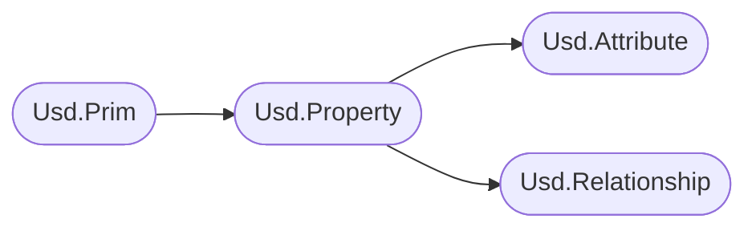
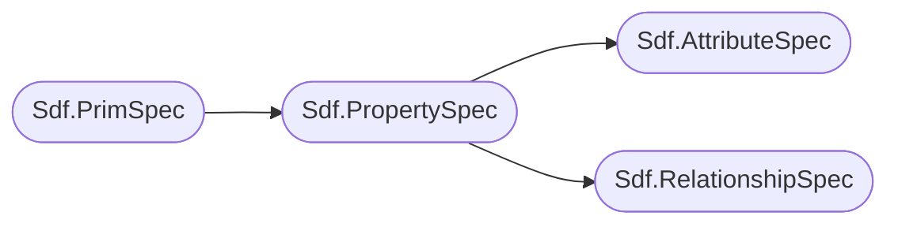

# Data Containers (Prims & Properties)
For Usd to store data at the paths, we need a data container.
To fill this need, Usd has the concept of `prims`. 
Prims can own properties, which can either be `attributes` or `relationships`. These store all the data that can be consumed by clients. Prims are added to layers which are then written to on disk Usd files.

In the high level API it looks as follows:

In the low level API:

### Structure
Large parts of the (high level and parts of the low level) API follow this pattern:

- \<ContainerType\>.Has\<Name\>()
- \<ContainerType\>.Get\<Name\>()
- \<ContainerType\>.Set\<Name\>()
- \<ContainerType\>.Clear\<Name\>() or .Remove\<Name\>()

The high level API also has the extra destinction of \<ContainerType\>.HasAuthored\<Name\>() vs .Has\<Name\>().
`HasAuthored` only returns explicitly defined values, where `Has` is allowed to return schema fallbacks.

The low level API only has the explicitly defined values, as does not operate on the composed state and is therefore not aware of schemas (at least when it comes to looking up values). 

Let's do a little thought experiment:
- If we were to compare Usd to .json files, each layer would be a .json file, where the nested key hierarchy is the Sdf.Path. Each path would then have custom properties (a `attributes` key & a `relationships` key) as well as standard keys like `typeName`/`specifier`.
- If we would then write an API for the .json files, our low level API would directly edit the keys. This is what the Sdf API does via `Sdf.PrimSpec`/`Sdf.PropertySpec`/`Sdf.AttributeSpec`/`Sdf.RelationshipSpec` classes. These are very small wrappers that set the keys more or less directly (They are still wrappers though.).
- To make our lives easier, we would also create a high level API, that would call into the low level API. The high level API would then be a public API, so that if we decide to change the low-level API, the high level API still works. Usd does this via the `Usd.Prim`/`Usd.Property`/`Usd.Attribute`/`Usd.Relationship` classes. These classes provide OOP patterns like Getter/Setters as well as common methods to manipulate the underlying data.

This is in very simplified terms how the Usd API works in terms of data storage.

# Table of contents
1. [API Overview In-A-Nutshell](#summary)
2. [What should I use it for?](#usage)
3. [Resources](#resources)
4. [Overview](#overview)

## TL;DR - Data Containers (Prims/Properties/Attributes/Relationships) In-A-Nutshell 
- In order to store data at our `Sdf.Path`s, we need data containers. Usd therefore has the concept of `Usd.Prim`s, which can hold `Usd.Property`ies
- To distinguish between data and data relations, `Usd.Property`ies are separated in:
    - `Usd.Attribute`s: These store data of different types (float/ints/arrays/etc.)
        - `UsdGeom.Primvar`s: These are the same as attributes with extra features:
            - They are created the same way as attributes, except they use the `primvars.\<myAttributeName\>` namespace.
            - They get inherited down the hierarchy if they are of constant interpolation (They don't vary per point/vertex/prim).
            - They are exported to Hydra (Usd's render scene description abstraction API), so you can use them for materials/render settings/etc.
    - `Usd.Relationship`s: These store mapping from prim to prim(s) or attribute to attribute.

## What should I use it for? 
~~~admonish tip
In production, these are the classes you'll have the most contact with. They handle data creation/storage/modification. They are the heart of what makes Usd be Usd.
~~~

## Resources 
- [Usd.Object](https://openusd.org/dev/api/class_usd_object.html)
- [Sdf.Spec](https://openusd.org/dev/api/class_sdf_spec.html)

## Overview 
