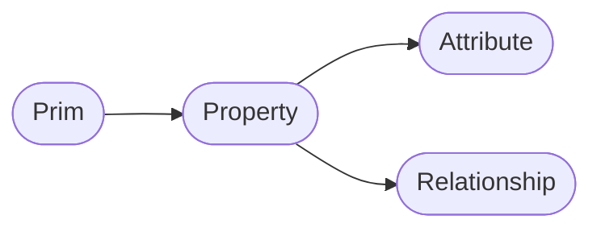

# Prims/Properties/Attributes/Relationships




### Structure
Large parts of the (high level and parts of the low level) API follow this pattern:
.Has<Name>()
.Get<Name>()
.Set<Name>()
.Clear<Name>() or .Remove<Name>()

The high level API also has the extra destinction of:
.HasAuthored<Name>() vs .Has<Name>()
`HasAuthored` only returns explicitly defined values, where `Has` is allowed to return schema fallbacks.

The low level API only has the explicitly defined values, as does not operate on the composed state.


# Table of contents
1. [API Overview In-A-Nutshell](#summary)
2. [What should I use it for?](#usage)
3. [Resources](#resources)
4. [Overview](#overview)

## TL;DR - Data Containers (Prims/Properties/Attributes/Relationships) In-A-Nutshell <a name="summary"></a>
- Metadata attaches additional non-animatable data to prims/properties/layers via a dictionary
- Composition arcs and core data (specifiers/type names) is added via metadata
- 'assetInfo' and 'customData' are predefined keys for prim metadata you can track asset/custom data with
- To write to other keys, they must be registered via schemas.

## What should I use it for? <a name="usage"></a>
~~~admonish tip
In production, you'll use the 'assetInfo'/'customData' prim metadata fields to track any production related data.

```python
{{#include ../../../../code/core/elements.py:metadataSummary}}
```
~~~

## Resources <a name="resources"></a>
- [Metadata API Docs](https://openusd.org/release/api/_usd__page__object_model.html#Usd_OM_Metadata)
- [Usd.Object](https://openusd.org/dev/api/class_usd_object.html)
- [Sdf.Spec](https://openusd.org/dev/api/class_sdf_spec.html)

## Overview <a name="overview"></a>

## Prim High Level API

from pxr import Usd, Sdf
stage = Usd.Stage.CreateInMemory()
prim_path = Sdf.Path("/root_grp/cube")
prim = stage.DefinePrim(prim_path)


## Prim Spec Low Level API

### Path based Ops
```
from pxr import Sdf
layer = Sdf.Layer.CreateAnonymous()
prim_path = Sdf.Path("/root_grp/cube")
prim_spec = Sdf.CreatePrimInLayer(layer, prim_path)
print(prim_spec.path) # Returns: Sdf.Path("/root_grp/cube")
print(prim_spec.name) # Returns: Sdf.Path("cube")
# To rename a prim, you can simply set the name attribute to something else.
# If you want to batch-rename, you should use the Sdf.BatchNamespaceEdit class, see our explanation [here]()
prim_spec.name = "coolCube"
print(prim_spec.nameParent) # Returns: Sdf.Path("/root_grp/coolCube")
print(prim_spec.nameParent.nameChildren) # Returns: {'coolCube': Sdf.Find('anon:0x7f6e5a0e3c00:LOP:/stage/pythonscript3', '/root_grp/coolCube')}
print(prim_spec.layer) # Returns: The active layer object the spec is on.
```

### Composition
We discuss handeling composition in our [Composition] seciton as it follows some different rules and is a bigger topic to tackle.
# Inherits:
- 'inheritPathList' 
# Variants
-- 'variantSelections', 'BlockVariantSelection', 'GetVariantNames'
-- 'variantSets', 'variantSetNameList',
# References
- 'hasReferences', 'referenceList', 'ClearReferenceList'
# Payloads
- 'hasPayloads', 'payloadList', 'ClearPayloadList'
# Specialize
- 'specializesList',

### Schemas
To set applied API schemas via the low level API, we just need to set the `apiSchemas` key to a Token Listeditable Op.
```
from pxr import Sdf
layer = Sdf.Layer.CreateAnonymous()
prim_path = Sdf.Path("/cube")
prim_spec = Sdf.CreatePrimInLayer(layer, prim_path)
prim_spec.SetInfo = Sdf.SpecifierDef
schemas = pxr.Sdf.TokenListOp.Create(
    prependedItems=["SkelBindingAPI"]
)
prim_spec.SetInfo("apiSchemas", schemas)
```

### Debugging 
You can also print a spec as its ascii representation (as it would be written to .usda files):
```
from pxr import Sdf
layer = Sdf.Layer.CreateAnonymous()
prim_path = Sdf.Path("/cube")
prim_spec = Sdf.CreatePrimInLayer(layer, prim_path)
prim_spec.specifier = Sdf.SpecifierDef
prim_spec.SetInfo(prim_spec.KindKey, "group")
attr_spec = Sdf.AttributeSpec(prim_spec, "size", Sdf.ValueTypeNames.Float)
# Running this
print(prim_spec.GetAsText())
# Returns:
"""
def "cube" (
    kind = "group"
)
{
    float size
}
"""
```

### Tokens
Prim, property, attribute and relationship specs also have the tokens they can set as their metadata as class attributes ending with 'Key'.
These 'Key' attributes are the token names that can be set on the spec via `SetInfo`, for example prim_spec.SetInfo(prim_spec.KindKey, "group")
```
from pxr import Sdf
layer = Sdf.Layer.CreateAnonymous()
prim_path = Sdf.Path("/cube")
prim_spec = Sdf.CreatePrimInLayer(layer, prim_path)
prim_spec.SetInfo(prim_spec.KindKey, "group")
```

### Properties/Attributes/Relationships
To access the prim_specs properties we can call the `properties`, `attributes`, `relationships` methods. These return a dict with the {'name': spec} data.
Here is an example of what is returned when you create cube with a size attribute:
```
from pxr import Sdf
layer = Sdf.Layer.CreateAnonymous()
prim_path = Sdf.Path("/cube")
prim_spec = Sdf.CreatePrimInLayer(layer, prim_path)
attr_spec = Sdf.AttributeSpec(prim_spec, "size", Sdf.ValueTypeNames.Float)
print(prim_spec.attributes) # Returns: {'size': Sdf.Find('anon:0x7f6efe199480:LOP:/stage/python', '/cube.size')}
```
Since the lower level API doesn't see the schema properties, these commands will only return what is actually in the layer, in Usd speak `authored`.
With the high level API you can get the same/similar result by calling prim.GetAuthoredAttributes(), this will return all authored attributes though
(not just the one in you active layer).

As mentioned in the `properties`,`attributes`, `relationships` section, properties is the base class, so the `properties` method will give you
the merged dict of the `attributes` and `relationship` dicts.

To remove a property you can run:
```
from pxr import Sdf
layer = Sdf.Layer.CreateAnonymous()
prim_path = Sdf.Path("/cube")
prim_spec = Sdf.CreatePrimInLayer(layer, prim_path)
attr_spec = Sdf.AttributeSpec(prim_spec, "size", Sdf.ValueTypeNames.Float)
prim_spec.RemoveProperty(attr_spec)
```

### Standard core metadata on prim specs

#### Core Metadata (Low Level API)
The Python lower level Sdf.PrimSpec offers quick access to setting common core metadata via standard class attributes:
```
from pxr import Sdf
layer = Sdf.Layer.CreateAnonymous()
prim_path = Sdf.Path("/cube")
prim_spec = Sdf.CreatePrimInLayer(layer, prim_path) # Here defining the prim uses a `Sdf.SpecifierOver` define op by default.
# The specifier and type name is something you'll usually always set.
prim_spec.specifier = Sdf.SpecifierDef # Or Sdf.SpecifierOver/Sdf.SpecifierClass
prim_spec.typeName = "Cube"
prim_spec.active = True # There is also a prim_spec.ClearActive() shortcut for removing active metadata
prim_spec.kind = "group"    # There is also a prim_spec.ClearKind() shortcut for removing kind metadata
prim_spec.instanceable = False # There is also a prim_spec.ClearInstanceable() shortcut for removing instanceable metadata.
prim_spec.hidden = False # A hint for UI apps to hide the spec for viewers
```

You can also set them via the standard metadata commands:
```
from pxr import Sdf
layer = Sdf.Layer.CreateAnonymous()
prim_path = Sdf.Path("/cube")
prim_spec = Sdf.CreatePrimInLayer(layer, prim_path)
# The specifier and type name is something you'll usually always set.
prim_spec.SetInfo(prim_spec.SpecifierKey, Sdf.SpecifierDef) # Or Sdf.SpecifierOver/Sdf.SpecifierClass
prim_spec.SetInfo(prim_spec.TypeNameKey, "Cube")
# These are some other common specsz:
prim_spec.SetInfo(prim_spec.ActiveKey, True)
prim_spec.SetInfo(prim_spec.KindKey, "group")
prim_spec.SetInfo("instanceable", False) 
prim_spec.SetInfo(prim_spec.HiddenKey, False)
```

#### Core Metadata (High Level API))
Setting core metadata via the high level is not all exposed on the prim iteself via getters/setters, instead
the getters/setters come in part from schemas or schema APIs.

```python
# Has: 'HasDefiningSpecifier', 'HasAuthoredTypeName', 'HasAuthoredDocumentation'
# Get: 'GetSpecifier', 'GetTypeName', 'GetDocumentation', 'GetDescription'
# Set: 'SetSpecifier', 'SetTypeName', 'SetDocumentation', 'SetDescription'
# Clear: 'ClearTypeName', 'ClearDocumentation'

from pxr import Sdf, Usd
stage = Usd.Stage.CreateInMemory()
prim_path = Sdf.Path("/cube")
prim = stage.DefinePrim(prim_path, "Xform") # Here defining the prim uses a `Sdf.SpecifierDef` define op by default.
# The specifier and type name is something you'll usually always set.
prim.SetSpecifier(Sdf.SpecifierOver)
prim.SetTypeName("Cube")
# The other core specs are set via schema APIs, for example:
model_API = Usd.ModelAPI(prim)
if not model_API.GetKind():
    model_API.SetKind(Kind.Tokens.group)
```

We are also a few "shortcuts" that check specifiers/kinds. (Personal opinion: We rarely use these in production, it feels more like an older API feature.)
Shortcuts: 'IsAbstract', 'IsDefined', 'IsGroup', 'IsModel'
```
from pxr import Kind, Sdf, Usd
stage = Usd.Stage.CreateInMemory()
prim_path = Sdf.Path("/cube")
prim = stage.DefinePrim(prim_path, "Xform")
prim.SetSpecifier(Sdf.SpecifierOver)
prim.SetTypeName("Cube")
model_API = Usd.ModelAPI(prim)
model_API.SetKind(component)
# Here are the API counterparts
kind = model_API.GetKind()
print(prim.GetSpecifier() == Sdf.SpecifierClass, prim.IsAbstract()) # IsAbstract also checks parents to be of "Class" specifier type. 
print(prim.GetSpecifier() == Sdf.SpecifierSdf, prim.IsDefined()) # IsAbstract also checks parents to be of "Defined" specifier type. 
print((pxr.Kind.Registry.GetBaseKind(kind) or kind)_ == Kind.Token.model, prim.IsModel())
print((pxr.Kind.Registry.GetBaseKind(kind) or kind ) == Kind.Token.group, prim.IsGroup())
```

## Population
We cover this in detail in our [Population]() section.
# Has: 'HasAuthoredActive', 'HasAuthoredHidden'
# Get: 'IsActive', 'IsLoaded', 'IsHidden'
# Set: 'SetActive', 'SetHidden' 
# Clear: 'ClearActive', 'ClearHidden'
# Loading: 'Load', 'Unload'

The `active` and `hidden` (UI hidden) is metadata, the loading state is actually tracked via the stage and just exposed here as convenience.
```
<Add example of actual stage call> 
```


## Composition (High Level API)
We

# Has: 'HasAuthoredInherits', 'HasVariantSets', 'HasAuthoredReferences', 'HasPayload', 'HasAuthoredPayloads'
# Get: 'GetInherits', 'GetTypeName', 'GetReferences', 'GetPayloads'
# Set: 'SetPayload', 'SetTypeName', 'GetSpecializes', 'HasAuthoredSpecializes'
# Clear: 'ClearPayload', 'ClearDocumentation'


## Schemas
We explain in more detail what schemas are in our [schemas]() section.
In short: They are the "base classes" of Usd. Applied schemas are schemas that don't 
define the prim type and instead just "apply" (provide values) for specific metadata/properties

``` Important
The 'IsA' check is a very valueable check to see if something is an instance of a (base) class. It is similar to Python's isinstance method.
```

```
# Has: 'IsA', 'HasAPI', 'CanApplyAPI'
# Get: 'GetAppliedSchemas'
# Set: 'ApplyAPI',
# Clear: 'RemoveAPI', 'RemoveAppliedSchema'

```

We can also get data about the prim definition:
'GetPrimDefinition', 'GetPrimTypeInfo',


#### Composition Instancing/Instanceable prims
We cover instancing in our [Instancing] section.
##### Instanceable Prims
# Has: IsInstanceable', HasAuthoredInstanceable',
# Get: 'GetInstances'
# Set: 'SetInstanceable'
# Clear: 'ClearInstanceable'

To check if our prim in a prototype (Usd speak for 'hiearchy that gets duplicated')

##### Prototypes
# Has: 'IsInPrototype', 'IsPathInPrototype',  'IsPrototype',  'IsInstance',  'IsInstanceProxy', 'IsPrototypePath'
# Get: 'GetPrimInPrototype', 'GetPrototype'
 
 


#### Composition Internals
To query data about composition, we have to go through the high level Usd API first, as the Sdf low level API is not aware of composition related data.
The high level Usd API then queries into the low level Pcp (Prim cache population) API, which tracks all composition related data and builds a value resolution index, 
in simple terms: A stack of layers per spec (prim/property) that knows about all the value sources (layers) a value can come from. Once a value is requested, the highest layer in the stack wins and returns the value.
We cover more about this topic in our [Pcp]() section and our query cache sections.


```python
from pxr import Sdf, Usd
# Create stage with two different layers
stage = Usd.Stage.CreateInMemory()
root_layer = stage.GetRootLayer()
layer_top = Sdf.Layer.CreateAnonymous("exampleTopLayer")
layer_bottom = Sdf.Layer.CreateAnonymous("exampleBottomLayer")
root_layer.subLayerPaths.append(layer_top.identifier)
root_layer.subLayerPaths.append(layer_bottom.identifier)
# Define specs in two different layers
prim_path = Sdf.Path("/cube")
stage.SetEditTarget(layer_top)
prim = stage.DefinePrim(prim_path, "Xform")
prim.SetTypeName("Cube")
stage.SetEditTarget(layer_bottom)
prim = stage.DefinePrim(prim_path, "Xform")
prim.SetTypeName("Cube")
# Print the stack (set of layers that contribute data to this prim)
print(prim.GetPrimStack()) # Returns: [Sdf.Find('anon:0x7f6e590dc300:exampleTopLayer', '/cube'), Sdf.Find('anon:0x7f6e590dc580:exampleBottomLayer', '/cube')]
print(prim.GetPrimIndex()) # More on this in our [Pcp section]()
print(prim.ComputeExpandedPrimIndex()) # More on this in our [Pcp section](). you'll always want to use the expanded version, otherwise you might miss some data sources!
```


### Metadata
We go into more detail about metadta in our [Metadata] section. As you can see most of the data in this section is actually done via metadta, except path, composition and property related functions/attributes.


## Path related
 'IsPseudoRoot' 'GetParent', 'GetPath', 'GetName',  'GetAllChildren', 'GetAllChildrenNames',  'GetChildren', 'GetChildrenNames', 'GetChild', 'GetFilteredChildren', 'GetFilteredChildrenNames', 
'GetStage',
## Properties
'HasProperty','RemoveProperty',    'GetProperties' 'GetProperty', 'GetPropertiesInNamespace', 'GetPropertyNames', 'GetAuthoredProperties', 'GetAuthoredPropertiesInNamespace', 'GetAuthoredPropertyNames',
'HasAttribute', 'GetAttribute', 'CreateAttribute', 'GetAttributes', 'GetAuthoredAttributes',
'CreateRelationship', 'GetRelationships', 'GetAuthoredRelationships', 'GetRelationship'  'HasRelationship',

 'FindAllAttributeConnectionPaths', 'FindAllRelationshipTargetPaths',


