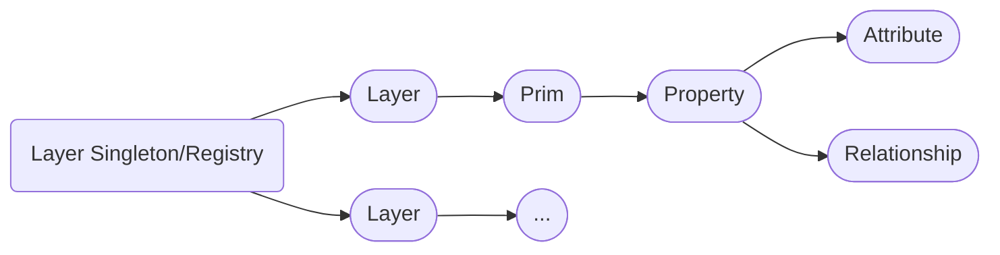

# Layers & Stages
Layers and stages are the main entry point to accessing our data stored in USD.

~~~admonish question title="Still under construction!"
This sub-section is still under development, it is subject to change and needs extra validation.
~~~

# Table of contents
1. [Layers & Stages In-A-Nutshell](#summary)
1. [What should I use it for?](#usage)
1. [Resources](#resources)
1. [Overview](#overview)
1. [Layers](#exampleA)
    1. [Subexample A](#subexampleA)
1. [Stages](#exampleA)
    1. [Stages](#subexampleA)

## TL;DR - <Topic> In-A-Nutshell <a name="summary"></a>
- Main points to know

## What should I use it for? <a name="usage"></a>
~~~admonish tip
Summarize actual production relevance.
~~~

## Resources <a name="resources"></a>
- [API Docs]()

## Overview <a name="overview"></a>


## Layers <a name="layerOverview"></a>


~~~admonish tip title="Tip | Layers"
- Layers are managed via a singleton pattern: Each layer is only opened once in memory and is identified by the layer identifier.
- Layers identifiers can have two different formattings:
    - Standard identifiers: `Sdf.Layer.CreateNew("/file/path/or/URI/identifier.<ext(.usd/.usdc/.usda)>")`
    - Anonymous identifiers: `Sdf.Find('anon:<someHash(MemoryLocation)>:<customName>'` 
- Layers store our prim and property specs, they are the data container for all USD data that gets persistently written to file. When we want to edit layers directly, we have to use the low-level API, the high level API edits the stage, which in return forwards the edits to the layer that is set by the active edit target.
- The `Sdf.FileFormat` plugin interface allows us to implement plugins that convert the content of (custom) file format's to the USD's prim/property/metadata data model. This is how USD manages the [USD crate (binary)](https://openusd.org/release/glossary.html#crate-file-format), alembic and vdb formats.
- USD's [crate (binary)](https://openusd.org/release/glossary.html#crate-file-format) format allows layers to be lazily read and written to. Calling `layer.Save()` multiple times, flushes the in-memory content to disk by appending it to the .usd file, which allows us to efficiently write large layer files. This format can also read in hierarchy data without loading property value data. This way we have low IO when opening files, as the property data gets lazy loaded on demand. This is similar to how we can parse image metadata without reading the image content.
~~~


### Layer singleton <a name="layerSingleton"></a>

### (Anonymous) Layer Identifiers <a name="layerIdentifier"></a>
Layer identifiers come in two styles:
- Standard identifiers: `Sdf.Layer.CreateNew("URI.<ext(.usd/.usdc/.usda)>")`
- Anonymous identifiers: `Sdf.Find('anon:<someHash(MemoryLocation)>:<customName>'` 
We can optionally add file format args: `Sdf.Layer.CreateNew("URI.<ext>:SDF_FORMAT_ARGS:<ArgNameA>=<ArgValueA>&<ArgNameB>=<ArgValueB>")` 

Anonymous layers have these special features:
- They are in-memory layers that have no real path or asset information fields.
- We can additionally give a custom name suffix, so that we can identify the layer better visually
- The identifier is not run through the asset resolver (Edit: I have to verify this again, but I'm fairly certain)
- They cannot be saved via `layer.Save()`, it will return an error
- We can convert them to "normal" layers, by assigning a non-anonymous identifier (`layer.identifier="/file/path/myIdentifier.usd"`), this also removes the save permission lock.

When using standard identifiers, we use the URI not the absolute resolved path. The URI is then resolved by our [asset resolver](../plugins/assetresolver.md).

~~~admonish danger
The layer identifier includes the optional args. This is on purpose, because different args can potentially mean a different file.
~~~

The layer identifier can also store additional args, we should therefore always split them, when accessing the identifier via code.
If we write our own [file format plugin](https://openusd.org/dev/api/_sdf__page__file_format_plugin.html), we can also pass in these args via attributes, but only non animated.

~~~admonish tip title=""
```python
{{#include ../../../../code/core/elements.py:layerIdentifier}}
```
~~~

### Layers
'Find','FindOrOpen',  'FindOrOpenRelativeToLayer', 'FindRelativeToLayer', 'New', 'OpenAsAnonymous', 'CreateNew', 
 
### Layer Creation and Export 
'Import', 'ImportFromString',
'Export', 'ExportToString', 'Save',
'TransferContent',
'Clear', 'Reload', 'ReloadLayers', 
'CreateAnonymous', 

### Dependencies
'GetCompositionAssetDependencies', 'GetExternalAssetDependencies', 'GetExternalReferences',  
'GetLoadedLayers',  , 'UpdateCompositionAssetDependency',  'UpdateExternalReference',   'externalReferences',
'DumpLayerInfo',  'GetAssetInfo', 'UpdateAssetInfo', 'GetAssetName',

### Layer Metrics <a name="layerMetrics"></a>
We can also set animation/time related metrics, these are stored via metadata entries on the layer itself.
~~~admonish info title=""
```python
(
    timeCodesPerSecond = 24
    framesPerSecond = 24
    startTimeCode = 1
    endTimeCode = 240
    metersPerUnit = 0.01
    upAxis = "Z"
)
```
~~~

As this is handled via metadata, we cover it in detail our [Animation (Time related metrics)](./animation.md#animationMetadata), [Scene Unit Scale/UpAxis - FAQ](../../production/faq.md) and [Metadata](./metadata.md#metadataMetricsLayer) sections.

The `metersPerUnit` and `upAxis` are only intent hints, it is up to the application/end user to correctly interpret the data and change it accordingly.

The time related metrics should be written into all layers, as we can then use them t quickly inspect the file without having to fully parse it.

### Permissions <a name="layerPermissions"></a>
We can lock a layer to not have editing or save permissions. Depending on the DCC, this is automatically done for your depending on how you access the stage, some applications leave this up to the user though.

Anonymous layers can't be saved to disk, therefore for them `layer.permissionToSave` is always `False`.

~~~admonish tip title=""
```python
{{#include ../../../../code/core/elements.py:layerPermissions}}
```
~~~

### Muting
Muting layers can be done globally on the layer itself or per stage via `stage.MuteLayer(layer.identifier)`/`stage.UnmuteLayer(layer.identifier)`.
When doing it globally on the layer, it affects all stages that use the layer. This is also why the mute method is not exposed on a layer instance, instead we call it on the `Sdf.Layer` class, as we modify muting on the singleton.

More info on this topic in our [loading data](./loading_mechanisms.md) section.

~~~admonish tip title=""
```python
{{#include ../../../../code/core/elements.py:layerMuting}}
```
~~~

### Composition <a name="layerCompositionArcs"></a>
All composition arcs, excepts sublayers, are created on prim(specs). Here is how we edit sublayers (and their `Sdf.LayerOffsets`) on `Sdf.Layer`s:

~~~admonish tip title=""
```python
{{#include ../../../../code/core/composition.py:compositionArcSublayer}}
```
~~~

For more info on composition arcs (especially the sublayer arc) see our [Composition](../composition/arcs.md#compositionArcSublayer) section.


#### Default Prim
As discussed in more detail in our [composition](../composition/overview.md) section, the default prim specifies the default root prim to import via reference and payload arcs. If it is not specified, the first prim in the layer is used, that is not [abstract](./prim.md#primSpecifier) (not a prim with a class specifier) and that is [defined](./prim.md#primSpecifier) (has a `Sdf.SpecifierDef` define specifier), unless we specify them explicitly. We cannot specify nested prim paths, the path must be in the root (`Sdf.Path("/example").IsRootPrimPath()` must return `True`), setting an invalid path will not error, but it will not working when referencing/payloading the file.

We typically use this in asset layers to specify the root prim that is the asset.

~~~admonish info title=""
```python
{{#include ../../../../code/core/elements.py:layerDefaultPrim}}
```
~~~


### Traversal and Prim/Property Access <a name="layerPermissions"></a>
'empty', 'pseudoRoot', 'rootPrims', 'Traverse', 'expired'  
'GetObjectAtPath', 'GetPrimAtPath', 'GetPropertyAtPath', 'GetAttributeAtPath', 'GetRelationshipAtPath',
'RemoveInertSceneDescription'

### Time Samples <a name="layerTimeSamples"></a>
In the high level API, reading and writing time samples is handled via the `attribute.Get()/Set()` methods. In the lower level API, we use the methods exposed on the layer.

~~~admonish info title=""
```python
{{#include ../../../../code/core/elements.py:layerTimeSamples}}
```
~~~

See our [animation section](./animation.md) for more info about how to deal with time samples.


### Metadata
Layers, like prims and properties, can store metadata. Apart from the above mentioned layer metrics, we can store custom metadata in the `customLayerData` key or create custom metadata root keys as discussed in our [metadata plugin](../plugins/metadata.md) section. This can be used to track important pipeline related data without storing it on a prim.

~~~admonish info title=""
```python
{{#include ../../../../code/core/elements.py:metadataLayer}}
```
~~~

See our [Metadata](./metadata.md#metadataLayerStage) section for detailed examples for layer and stage metadata.


## Stages
Stages in its simplest form are views on layers.


- traversals (purpose/specifier), also with respect to cache stage queries (bbox etc.)


