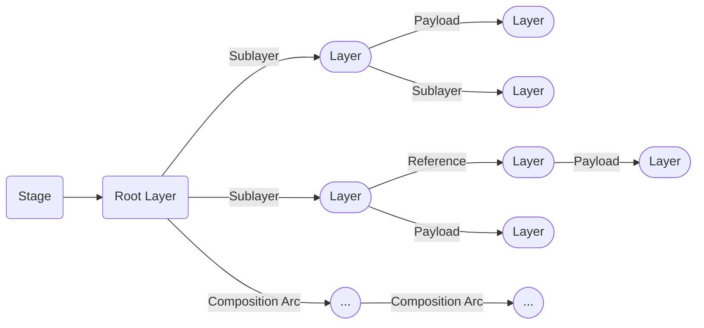

# Layers & Stages
Layers and stages are the main entry point to accessing our data stored in USD.

# Table of contents
1. [Layers & Stages In-A-Nutshell](#summary)
1. [What should I use it for?](#usage)
1. [Resources](#resources)
1. [Overview](#overview)
1. [Layers](#layerOverview)
    1. [Layer Singleton](#layerSingleton)
    1. [(Anonymous) Layer Identifiers](#layerIdentifier) 
    1. [Layers Creation/Import/Export](#layerImportExport)
    1. [Dependencies](#layerDependencies)
    1. [Layer Metrics](#layerMetrics)
    1. [Permissions](#layerPermissions)
    1. [Muting](#layerMuting)
    1. [Composition](#layerCompositionArcs)
    1. [Traversal and Prim/Property Access](#layerTraversal)
    1. [Time Samples](#layerTimeSamples)
    1. [Metadata](#layerMetadata)
1. [Stages](#exampleA)
    1. [Configuration](#stageConfiguration)
        1. [Asset Resolver](#stageAssetResolver)
        1. [Stage Metrics](#stageMetrics)
        1. [Stage Time Sample Interpolation](#stageTimeSampleInterpolation)
        1. [Variant/Prim Type Fallbacks](#stageFallbacks)
        1. [Color Management](#stageColormanagement)
        1. [Metadata](#stageMetadata)
    1. [Composition](#stageComposition)
    1. [Loading mechanisms ](#stageLoadingMechanisms)
    1. [Stage Layer Management (Creation/Save/Export)](#stageLayerManagement)
    1. [Traversal and Prim/Property Access](#stageTraversal)

## TL;DR - Layers & Stages In-A-Nutshell <a name="summary"></a>
**Layers**
- Layers are managed via a singleton pattern: Each layer is only opened once in memory and is identified by the layer identifier. When stages load a layer, they point to the same data in memory.
- Layers identifiers can have two different formats:
    - Standard identifiers: `Sdf.Layer.CreateNew("/file/path/or/URI/identifier.<ext(.usd/.usdc/.usda)>")`, these layers are backed by a file on disk
    - Anonymous identifiers: `Sdf.Find('anon:<someHash(MemoryLocation)>:<customName>'`, these are in-memory only layers

**Shots**
- A stage is a view of a set of composed layers. You can think of it as the viewer in a view--model design. Each layer that the stage opens is a data source to the data model. When "asking" the stage for data, we ask the view for the combined (composed) data, which then queries into the layers based on the value source found by our composition rules.
- When creating a stage we have two layers by default:
    - **Session Layer**: This is a temp layer than doesn't get applied on disk save. Here we usually put things like viewport overrides.
    - **Root Layer**: This is the base layer all edits target by default. We can add sublayers based on what we need to it. When calling `stage.Save()`, all sublayers that are dirty and not anonymous, will be saved. 

## What should I use it for? <a name="usage"></a>
~~~admonish tip
Stages and layers are what make USD work, it is our entry point to accessing our hierarchies.
~~~

## Resources <a name="resources"></a>
- [Sdf.Layer](https://openusd.org/dev/api/class_sdf_layer.html)
- [Usd.Stage](https://openusd.org/release/api/class_usd_stage.html)
- [Usd.EditTarget](https://openusd.org/release/api/class_usd_edit_target.html)

## Overview <a name="overview"></a>
This section will focus on what the `Sdf.Layer` and `Usd.Stage` classes have to offer. For an explanation of how layers work together, please see our [compsition section](../composition/overview.md).

~~~admonish tip title="Pro Tip | Advanced Concepts and Utility Functions for Layers/Stages"
There are also utility methods available, that are not in the `Sdf.Layer`/`Usd.Stage` namespace.
We cover these in our [advanced concepts in production](../../production/concepts.md) section.
~~~

## Layers <a name="layerOverview"></a>


Layers are the data container for our prim specs and properties, they are the part of USD that actually holds and import/exports the data.

~~~admonish tip title="Layers - In-A-Nutshell"
- Layers are managed via a singleton pattern: Each layer is only opened once in memory and is identified by the layer identifier.
- Layers identifiers can have two different formats:
    - Standard identifiers: `Sdf.Layer.CreateNew("/file/path/or/URI/identifier.<ext(.usd/.usdc/.usda)>")`
    - Anonymous identifiers: `Sdf.Find('anon:<someHash(MemoryLocation)>:<customName>'` 
- Layers store our prim and property specs, they are the data container for all USD data that gets persistently written to file. When we want to edit layers directly, we have to use the low-level API, the high level API edits the stage, which in return forwards the edits to the layer that is set by the active edit target.
- The `Sdf.FileFormat` plugin interface allows us to implement plugins that convert the content of (custom) file format's to the USD's prim/property/metadata data model. This is how USD manages the [USD crate (binary)](https://openusd.org/release/glossary.html#crate-file-format), alembic and vdb formats.
- USD's [crate (binary)](https://openusd.org/release/glossary.html#crate-file-format) format allows layers to be lazily read and written to. Calling `layer.Save()` multiple times, flushes the in-memory content to disk by appending it to the .usd file, which allows us to efficiently write large layer files. This format can also read in hierarchy data without loading property value data. This way we have low IO when opening files, as the property data gets lazy loaded on demand. This is similar to how we can parse image metadata without reading the image content.
~~~

### Layer Singleton <a name="layerSingleton"></a>
Layers in USD are managed by a singleton design pattern. This means that each layer, identified by its layer identifier, can only be opened once. Each stage that makes use of a layer, uses the same layer. That means if we make an edit on a layer in one stage, all other stages will get changed notifications and update accordingly.

We get all opened layers via the `Sdf.Layer.GetLoadedLayers()` method.
~~~admonish tip title=""
```python
for layer in Sdf.Layer.GetLoadedLayers():
    print(layer.identifier)
# Skip anonymous layers
for layer in Sdf.Layer.GetLoadedLayers():
    if layer.anonymous:
        continue
    print(layer.identifier)
```
~~~

If a layer is not used anymore in a stage and goes out of scope in our code, it will be deleted. Should we still have access the to Python object, we can check if it actually points to a valid layer via the `layer.expired` property.

As also mentioned in the next section, the layer identifier is made up of the URI(Unique Resource Identifier) and optional arguments. The layer identifier includes the optional args. This is on purpose, because different args can potentially mean a different file.

To demonstrate the singleton behavior let's try changing a layers content in Houdini and then view the layer through two different unrelated stages. (In Houdini every LOPs node is a separate stage):

<video width="100%" height="100%" controls autoplay muted loop>
  <source src="layerSingleton.mp4" type="video/mp4" alt="Houdini Layer Singleton">
</video>

The snippet from the video:

~~~admonish tip title=""
```python
from pxr import Sdf
flippy_layer = Sdf.Layer.FindOrOpen("/opt/hfs19.5/houdini/usd/assets/rubbertoy/geo.usdc")
pig_layer = Sdf.Layer.FindOrOpen("/opt/hfs19.5/houdini/usd/assets/pig/geo.usdc")
flippy_layer.TransferContent(pig_layer)
```
~~~

"No flippyyyy, where did you go?" Luckily all of our edits were just in memory, so if we just call layer.Reload() or refresh the layer via the reference node, all is good again. 

Should you ever use this in production as a way to broadcast an edit of a nested layer? We wouldn't recommend it, as it breaks the WYSIWYG paradigm. A better approach would be to rebuild the layer stack (this is what Houdini's "Edit Target Layer" node does) or we remap it via our asset resolver. In Houdini you should never use this method, as it can cause very strange stage caching issues.

### (Anonymous) Layer Identifiers <a name="layerIdentifier"></a>
Layer identifiers come in two styles:
- Standard identifiers: `Sdf.Layer.CreateNew("URI.<ext(.usd/.usdc/.usda)>")`
- Anonymous identifiers: `Sdf.Find('anon:<someHash(MemoryLocation)>:<customName>'` 

We can optionally add file format args: `Sdf.Layer.CreateNew("URI.<ext>:SDF_FORMAT_ARGS:<ArgNameA>=<ArgValueA>&<ArgNameB>=<ArgValueB>")` 

Anonymous layers have these special features:
- They are in-memory layers that have no real path or asset information fields.
- We can additionally give a custom name suffix, so that we can identify the layer better visually
- The identifier is not run through the asset resolver (Edit: I have to verify this again, but I'm fairly certain)
- They cannot be saved via `layer.Save()`, it will return an error
- We can convert them to "normal" layers, by assigning a non-anonymous identifier (`layer.identifier="/file/path/myIdentifier.usd"`), this also removes the save permission lock.

When using standard identifiers, we use the URI not the absolute resolved path. The URI is then resolved by our [asset resolver](../plugins/assetresolver.md). We often need to compare the URI, when doing so be sure to call `layer_uri, layer_args = layer.SplitIdentifier(layer.identifier)` to strip out the optional args or compare using the resolve URI `layer.realPath`. 

~~~admonish danger
The layer identifier includes the optional args. This is on purpose, because different args can potentially mean a different file.
~~~

If we write our own [file format plugin](https://openusd.org/dev/api/_sdf__page__file_format_plugin.html), we can also pass in these args via attributes, but only non animated.

~~~admonish tip title=""
```python
{{#include ../../../../code/core/elements.py:layerIdentifier}}
```
~~~

### Layers Creation/Import/Export <a name="layerImportExport"></a>

Here is an overview of how we can create layers:
~~~admonish danger title="Pro Tip  | Saving and Reloading"
- We can call layer.Save() multiple times with the USD binary format (.usd/.usdc). This will then dump the content from memory to disk in "append" mode. This avoids building up huge memory footprints when creating large layers.
- Calling `layer.Reload()` on anonymous layers clears their content (destructively). So make sure you can really dispose of it as there is no undo method.
- To reload all (composition) related layers, we can use `stage.Reload()`. This calls `layer.Reload()` on all used stage layers.
- Calling `layer.Reload()` consults the result of `layer.GetExternalAssetDependencies()`. These return non USD/composition related external files, that influence the layer. This is only relevant when using non USD file formats.
~~~

~~~admonish tip title=""
```python
{{#include ../../../../code/core/elements.py:layerImportExport}}
```
~~~

### Dependencies <a name="layerDependencies"></a>
We can also query the layer dependencies of a layer. 

~~~admonish tip title="Pro Tip | Inspecting dependencies"
The most important methods are:
- `layer.GetCompositionAssetDependencies()`: This gets layer identifiers of sublayer/reference/payload composition arcs. This is only for the active layer, it does not run recursively.
- `layer.UpdateCompositionAssetDependency("oldIdentifier", "newIdentifier")`: The allows us to remap any sublayer/reference/payload identifier in the active layer, without having to edit the list-editable ops ourselves. Calling `layer.UpdateCompositionAssetDependency("oldIdentifier", "")` removes a layer.
~~~

In our example below, we assume that the code is run in Houdini.
~~~admonish tip title=""
```python
{{#include ../../../../code/core/elements.py:layerDependencies}}
```
~~~

### Layer Metrics <a name="layerMetrics"></a>
We can also set animation/time related metrics, these are stored via metadata entries on the layer itself.
~~~admonish info title=""
```python
(
    timeCodesPerSecond = 24
    framesPerSecond = 24
    startTimeCode = 1
    endTimeCode = 240
    metersPerUnit = 0.01
    upAxis = "Z"
)
```
~~~

As this is handled via metadata, we cover it in detail our [Animation (Time related metrics)](./animation.md#animationMetadata), [Scene Unit Scale/UpAxis - FAQ](../../production/faq.md) and [Metadata](./metadata.md#metadataMetricsLayer) sections.

The `metersPerUnit` and `upAxis` are only intent hints, it is up to the application/end user to correctly interpret the data and change it accordingly.

The time related metrics should be written into all layers, as we can then use them to quickly inspect time related data in the file without having to fully parse it.

### Permissions <a name="layerPermissions"></a>
We can lock a layer to not have editing or save permissions. Depending on the DCC, this is automatically done for your depending on how you access the stage, some applications leave this up to the user though.

Anonymous layers can't be saved to disk, therefore for them `layer.permissionToSave` is always `False`.

~~~admonish tip title=""
```python
{{#include ../../../../code/core/elements.py:layerPermissions}}
```
~~~

### Muting <a name="layerMuting"></a>
Muting layers can be done globally on the layer itself or per stage via `stage.MuteLayer(layer.identifier)`/`stage.UnmuteLayer(layer.identifier)`.
When doing it globally on the layer, it affects all stages that use the layer. This is also why the mute method is not exposed on a layer instance, instead we call it on the `Sdf.Layer` class, as we modify muting on the singleton.

More info on this topic in our [loading data](./loading_mechanisms.md) section.

~~~admonish tip title=""
```python
{{#include ../../../../code/core/elements.py:layerMuting}}
```
~~~

### Composition <a name="layerCompositionArcs"></a>
All composition arcs, excepts sublayers, are created on prim(specs). Here is how we edit sublayers (and their `Sdf.LayerOffsets`) on `Sdf.Layer`s:

~~~admonish tip title=""
```python
{{#include ../../../../code/core/composition.py:compositionArcSublayer}}
```
~~~

For more info on composition arcs (especially the sublayer arc) see our [Composition](../composition/arcs.md#compositionArcSublayer) section.


#### Default Prim
As discussed in more detail in our [composition](../composition/overview.md) section, the default prim specifies the default root prim to import via reference and payload arcs. If it is not specified, the first prim in the layer is used, that is not [abstract](./prim.md#primSpecifier) (not a prim with a class specifier) and that is [defined](./prim.md#primSpecifier) (has a `Sdf.SpecifierDef` define specifier), unless we specify them explicitly. We cannot specify nested prim paths, the path must be in the root (`Sdf.Path("/example").IsRootPrimPath()` must return `True`), setting an invalid path will not error, but it will not working when referencing/payloading the file.

We typically use this in asset layers to specify the root prim that is the asset.

~~~admonish info title=""
```python
{{#include ../../../../code/core/elements.py:layerDefaultPrim}}
```
~~~

### Traversal and Prim/Property Access <a name="layerTraversal"></a>
Traversing and accessing prims/properties works a tad different:
- The `layer.Get<SpecType>AtPath` methods return `Sdf.Spec` objects (`Sdf.PrimSpec`, `Sdf.AttributeSpec`, `Sdf.RelationshipSpec`) and not USD high level objects.
- The traverse method doesn't return an iterable range, instead it is "kernel" like. We pass it a function that each path in the layer gets run through.

~~~admonish tip title=""
```python
{{#include ../../../../code/core/elements.py:layerTraversal}}
```
~~~

### Time Samples <a name="layerTimeSamples"></a>
In the high level API, reading and writing time samples is handled via the `attribute.Get()/Set()` methods. In the lower level API, we use the methods exposed on the layer.

~~~admonish info title=""
```python
{{#include ../../../../code/core/elements.py:layerTimeSamples}}
```
~~~

See our [animation section](./animation.md) for more info about how to deal with time samples.


### Metadata <a name="layerMetadata"></a>
Layers, like prims and properties, can store metadata. Apart from the above mentioned layer metrics, we can store custom metadata in the `customLayerData` key or create custom metadata root keys as discussed in our [metadata plugin](../plugins/metadata.md) section. This can be used to track important pipeline related data without storing it on a prim.

~~~admonish info title=""
```python
{{#include ../../../../code/core/elements.py:metadataLayer}}
```
~~~

See our [Metadata](./metadata.md#metadataLayerStage) section for detailed examples for layer and stage metadata.


## Stages
Stages offer a view on a set of composed layers. We cover [composition](../composition/overview.md) in its on section, as it is a complicated topic. 



Unlike layers, stages are not managed via a singleton. There is the [Usd.StageCache](https://openusd.org/dev/api/class_usd_stage_cache.html) class though, that would provide a similar mechanism. We usually don't use this though, as our DCCs manage the lifetime cycle of our stages.

If a stage goes out of scope in our code, it will be deleted. Should we still have access the to Python object, we can check if it actually points to a valid layer via the `stage.expired` property.

When creating a stage we have two layers by default:
- **Session Layer**: This is a temp layer than doesn't get applied on disk save. Here we usually put things like viewport overrides.
- **Root Layer**: This is the base layer all edits target by default. We can add sublayers based on what we need to it. When calling `stage.Save()`, all sublayers that are dirty and not anonymous, will be saved. 


### Configuration <a name="stageConfiguration"></a>
Let's first look at some configuration related options we can set on the stage.

#### Asset Resolver  <a name="stageAssetResolver"></a>
The stage can be opened with a [asset resolver context](../plugins/assetresolver.md#assetResolverContext). The context needs to be passed in on stage open, it can be refreshed afterwards (if implemented in the resolver). The resolver context object itself is bound to the runtime of the the stage though. The asset resolver context is just a very simple class, that our custom asset resolver can attach data to to help with path resolution.
 
In terms of asset resolution there are only two methods exposed on the stage class:
- `stage.GetPathResolverContext()`: Get the resolver context object.
- `stage.ResolveIdentifierToEditTarget()`: Resolve an asset identifier using the stage's resolver context.

We cover how to use these in our [asset resolver](../plugins/assetresolver.md) section, where we also showcase asset resolver reference implementations that ship with this guide.

#### Stage Metrics  <a name="stageMetrics"></a>
As discussed in the above [layer metrics section](#layerMetrics), we can set animation/time related metrics. The stage class also exposes methods to do this, which just set the metadata entries on the root layer of the stage.

The time related metrics should be written into all layers, as we can then use them to quickly inspect time related data in the file without having to fully parse it.

We cover it in detail our [Animation (Time related metrics)](./animation.md#animationMetadata), [Scene Unit Scale/UpAxis - FAQ](../../production/faq.md) and [Metadata](./metadata.md#metadataMetricsLayer) sections.

#### Stage Time Sample Interpolation <a name="stageTimeSampleInterpolation"></a>
We can set how time samples are interplated per stage.

The possible stage interpolation types are:
- Usd.InterpolationTypeLinear: Interpolate linearly (if array length doesn't change and data type allows it))
- Usd.InterpolationTypeHeld: Hold until the next time sample

~~~admonish tip title=""
```python
from pxr import Usd
stage = Usd.Stage.CreateInMemory()
print(stage.GetInterpolationType()) # Returns: Usd.InterpolationTypeLinear
stage.SetInterpolationType(Usd.InterpolationTypeHeld)
```
~~~

Checkout our [animation section](./animation.md) for more info on how animation and time samples are treated in USD.

#### Variant/Prim Type Fallbacks <a name="stageFallbacks"></a>
We can also provide fallback values for:
- [Variant selections](https://openusd.org/release/api/class_usd_stage.html#a34d1d78fe8e31f0ba439d2265d694af5): If no explicit variant selection is written, we can define a default fallback.
- [Concrete typed prims](./schemas.md#summary): If a prim definition is not found, we can provide a fallback to be used instead. See the [official docs](https://openusd.org/release/api/_usd__page__object_model.html#Usd_OM_FallbackPrimTypes) for more info.

#### Color Management <a name="stageColormanagement"></a>
~~~admonish question title="Still under construction!"
This sub-section is still under development, it is subject to change and needs extra validation.
~~~

~~~admonish tip title=""
```python
# Get: 'GetColorConfiguration', 'GetColorManagementSystem', 'GetColorConfigFallbacks'
# Set: 'SetColorConfiguration', 'SetColorManagementSystem', 'SetColorConfigFallbacks'
```
~~~

#### Metadata <a name="stageMetadata"></a>
Setting metadata on the stage, redirects the edits to the root layer.
We discuss this in detail in our [metadata section](./metadata.md).

~~~admonish tip title=""
```python
{{#include ../../../../code/core/elements.py:stageMetadata}}
```
~~~

### Composition <a name="stageComposition"></a>
We cover in detail how to inspect composition in our [composition section](../composition/overview.md).

Stages offer access to the [Prim Cache Population](../composition/pcp.md) cache via `stage._GetPcpCache()`. We almost never interact with it this way, instead we use the methods dicussed in our [inspecting composition](../composition/pcp.md) section.

We also have access to our instanced prototypes, for more info on what these are and how they can be inspected/used see our [composition instanceable prims](../composition/livrps.md#compositionInstance) section. 

Lastly we control the edit target via the stage. The edit target defines, what layer all calls in the high level API should write to.

When starting out with USD, you'll mostly be using it in the form of:

~~~admonish tip title=""
```python
stage.SetEditTarget(layer)
# We can also explicitly create the edit target:
# Or
stage.SetEditTarget(Usd.EditTarget(layer))
# Or
stage.SetEditTarget(stage.GetEditTargetForLocalLayer(layer))
# These all have the same effect.
```
~~~

In Houdini we don't have to manage this, it is always the highest layer in the active layer stack. Houdini gives it to us via `hou.node.activeLayer()` or `node.editableLayer`in python LOP nodes.

More info about edit targets in our [composition fundamentals](../composition/fundamentals.md) section.

### Loading mechanisms <a name="stageLoadingMechanisms"></a>
Stages are the controller of how our [Prim Cache Population (PCP)](../composition/pcp.md) cache loads our composed layers. We cover this in detail in our [Traversing/Loading Data (Purpose/Visibility/Activation/Population)](./loading_mechanisms.md) section. (Technically it just exposes the PCP cache in a nice API, that forwards its requests to the stages's pcp cache `stage._GetPcpCache()`, similar hour all `Usd` ops are wrappers around `Sdf` calls.)

Stages control:
- **Layer Muting**: This controls what layers are allowd to contribute to the composition result.
- **Payload Loading**: This controls what prim paths, that have payloads, to load.
- **Prim Population**: This controls what prim paths to consider for loading at all.

### Stage Layer Management (Creation/Save/Export) <a name="stageLayerManagement"></a>
When creating a stage we have two layers by default:
- **Session Layer**: This is a temp layer than doesn't get applied on disk save. Here we usually put things like viewport overrides.
- **Root Layer**: This is the base layer all edits target by default. We can add sublayers based on what we need to it. When calling `stage.Save()`, all sublayers that are dirty and not anonymous, will be saved. 

Let's first look at layer access, there are two methods of special interest to us:
- `stage.GetLayerStack()`: Get all the layers in the active [layer stack](../composition/fundamentals.md#layerStack)
- `stage.GetUsedLayers(includeClipLayers=True)`: Get all layers that are currently used by the stage. We can optionally exclude value clip layers. This is only a snapshot, as layers might be "varianted" away or in the case of value clips, we only get the active chunk file.

The following example is run in Houdini:
~~~admonish tip title=""
```python
{{#include ../../../../code/core/elements.py:stageLayerStackUsedLayers}}
```
~~~

As you might have noticed, when calling `stage.GetLayerStack()`, we didn't get the pig reference. Let's have a look how we can get all composition arc layers of the active layer stack:

~~~admonish tip title=""
```python
{{#include ../../../../code/core/elements.py:stageLayerStackUsedLayers}}
```
~~~

If you are confused what a layer stack, check out our composition [layer stack](../composition/fundamentals.md#layerStack) section for a detailed breakdown.

Let's have a look at stage creation and export:

~~~admonish tip title=""
```python
{{#include ../../../../code/core/elements.py:stageLayerManagement}}
```
~~~

### Traversal and Prim/Property Access <a name="stageTraversal"></a>
USD stage traversing and accessing prims/properties works via the high level API.
- The `stage.Get<SpecType>AtPath` methods return `Usd.Object` objects (`Usd.Prim`, `Usd.Attribute`, `Usd.Relationship`).
- The traverse method returns an iterable that goes through the prims in the stage.

We cover stage traversals in full detail in our [Traversing/Loading Data (Purpose/Visibility/Activation/Population)
](./loading_mechanims) section.

Here are the basics:

~~~admonish tip title=""
```python
{{#include ../../../../code/core/elements.py:stageTraversal}}
```
~~~