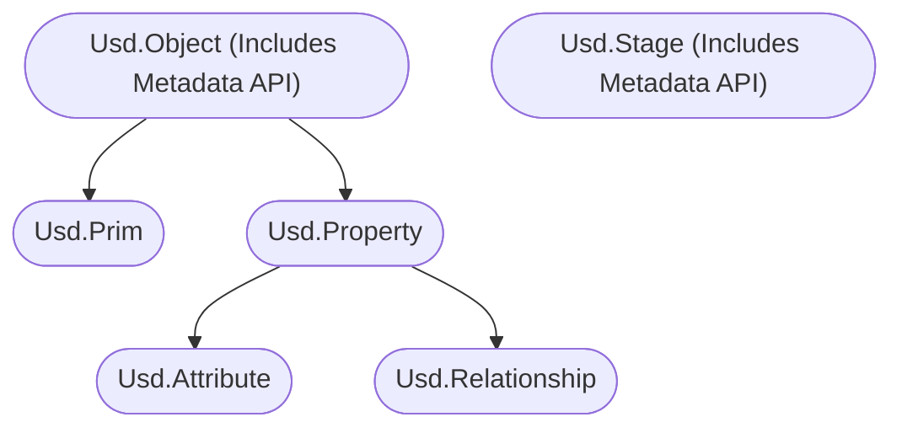
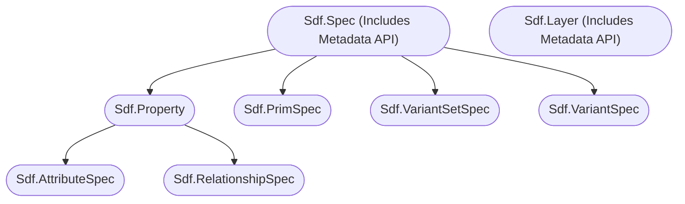

# Metadata
Metadata is the smallest building block in Usd. It is part of the base class from which prims and properties inherit from and possesses a slightly different feature set than other parts of Usd.

# Table of contents
1. [API Overview In-A-Nutshell](#summary)
1. [What should I use it for?](#usage)
1. [Resources](#resources)
1. [Overview](#overview)
1. [Composition/Value resolution](#composition_value_resolution)
1. [Working with metadata in your stages](#practicalExamples)
    1. [Basics (High level API)](#metadataBasics)
    1. [Validation of dict content](#metadataValidateDict)
    1. [Nested key path syntax](#metadataNestedKeyPath)
    1. [Reading metadata documentation strings (High level API)](#metadataDocs)
    1. [Authored vs fallback metadata values (High level API)](#metadataAuthored)
    1. [Reading/writing metadata via prim/property specs(Low level API)](#metadataPrimPropertySpec)
    1. [Special metadata fields for prims](#metadataSpecialPrim)
        1. [Active/Activation](#metadataActive)
        1. [Asset Info](#metadataAssetInfo)
        1. [Custom Data](#metadataCustomData) 
        1. [Comment](#metadataComment)
        1. [Icon (UI)](#metadataIcon)
        1. [Hidden (UI)](#metadataHidden)
    1. [Special metadata fields for properties](#metadataSpecialProperty)
        1. [Support for animation (USD speak **variability**)](#metadataVariability)
        1. [Custom vs schema defined properties](#metadataCustom)
    1. [Special metadata fields for layers and stages](#metadataMetricsLayer)
        1. [Reading/writing stage and layer metrics (FPS/Scene Unit Scale/Up Axis) (High/Low level API)](#metadataMetricsLayer)
        2. [Reading/writing stage and layer customData metadata (High/Low level API)](#metadataCustomDataLayer)


## TL;DR - Metadata In-A-Nutshell <a name="summary"></a>
- Metadata attaches additional non-animatable data to prims/properties/layers via a dictionary
- Composition arcs and core data (specifiers/type names) is added via metadata
- `assetInfo` and `customData` are predefined keys for prim metadata you can track asset/custom data with
- To write to other keys, they must be registered via schemas.

## What should I use it for? <a name="usage"></a>
~~~admonish tip
In production, you'll use the `assetInfo`/`customData` prim metadata fields to track any production related data.
You can also use metadata to edit composition arcs, though the high level API offers nice class wrappers that wrap this for you.
```python
{{#include ../../../../code/core/elements.py:metadataSummary}}
```
~~~

## Resources <a name="resources"></a>
- [Metadata API Docs](https://openusd.org/release/api/_usd__page__object_model.html#Usd_OM_Metadata)
- [Usd.Object](https://openusd.org/dev/api/class_usd_object.html)
- [Sdf.Spec](https://openusd.org/dev/api/class_sdf_spec.html)

## Overview <a name="overview"></a>

Here is the class structure for the different API levels:

High Level API


Low Level API


Metadata is different in that it:
- Is the smallest building block in Usd (There are no subclasses) and its data is stored as a dictionary.
- Is extremely fast to access
- Can't be time varying:
    - Composition arcs are written into metadata fields on prims, so you can't animate composition.
    - Metadata stored in value clip files is ignored
- Is strongly typed via schemas, so you need to register a custom schema if you want custom keys. This way we can ensure fallback values/documentation per key/value and avoid random data flying through your pipelines. For example all your mesh attributes have metadata for exactly what type/role they must match.
- There are two special metadata keys for prims:
    - `assetInfo`: Here you should dump asset related data. This is just a predefined standardized location all vendors/companies should adhere to when writing asset data that should be tracked.
    - `customData`: Here you can dump any data you want, a kind of scratch space, so you don't need to add you own schema. If you catch yourself misusing it too much, you should probably generate your own schema.


~~~admonish tip
We go into more detail over in the [schema](./schemas.md) section on how to create or lookup registered schemas.
~~~

## Composition/Value resolution <a name="composition_value_resolution"></a>
Metadata is slightly different when it comes to value resolution. (As a reminder: `value resolution` is just a fancy word for "what layer has the winning value out of all your layers where the data will be loaded from"):
- Nested dictionaries are combined
- Attribute metadata behaves by the same rules as attribute value resolution
- Core metadata (Metadata that affects composition/prim definitions):
    - Composition metadata is composed via Listeditable-Ops. See our section [here](../composition/listeditableops.md) for more details. Be sure to understand these to save your self a lot of head-aches why composition works the way it does.
    - Specific prim metadata has its own rule set (E.g. prim specifiers).


## Working with metadata in your stages <a name="practicalExamples"></a>
Let's look at some actual code examples on how to modify metadata.

### Basics (High level API) <a name="metadataBasics"></a>
~~~admonish info title=""
```python
{{#include ../../../../code/core/elements.py:metadataBasics}}
```
~~~

### Validation of dict content <a name="metadataBasics"></a>
To create a valid metadata compatible dict, you can validate it:
~~~admonish info title=""
```python
{{#include ../../../../code/core/elements.py:metadataValidateDict}}
```
~~~
This is useful if you expose setting metadata to your user facing UIs. This will auto-cast Python arrays to VtArray and other Usd internal types. You can also skip this step, it might error later on when setting the data then though. 

### Nested key path syntax <a name="metadataBasics"></a>
To access nested dict keys, we use the `:` symbol as the path separator.
~~~admonish info title=""
```python
{{#include ../../../../code/core/elements.py:metadataNestedKeyPath}}
```
~~~

The `Get`/`Set` methods without the `ByKey`/`ByDictKey` allow you to set root dict keys, e.g. `SetMetadata("typeName", "Xform")`
The `ByKey`/`ByDictKey` take a root key and a key path (with `:` if nested), e.g. `SetMetadataByDictKey('assetInfo', "data:version", 1)` which will result in `{"assetInfo": {"data": "version": 1}}`

### Reading metadata documentation strings (High level API) <a name="metadataDocs"></a>
This is quite useful if you need to expose docs in UIs.
~~~admonish info title=""
```python
{{#include ../../../../code/core/elements.py:metadataDocs}}
```
~~~

~~~admonish note title="Click here to view the result" collapsible=true
```python
{{#include ../../../../code/core/elements.py:metadataDocsResult}}
```
~~~

### Authored vs fallback metadata values (High level API) <a name="metadataAuthored"></a>
The getters offer the distinction between retrieving authored or fallback values provided by the schemas that registered the metadata.
~~~admonish info title=""
```python
{{#include ../../../../code/core/elements.py:metadataAuthored}}
```
~~~

### Reading/writing metadata via prim/property specs(Low level API) <a name="metadataPrimPropertySpec"></a>
Same as with the layer customData, the lower level APIs on prim/property specs expose it to Python via lower camel case syntax in combination with direct assignment, instead of offer getter and setters.

~~~admonish info title=""
```python
{{#include ../../../../code/core/elements.py:metadataPrimPropertySpec}}
```
~~~
As you can see the higher level API gives us fallback info via the Get(authored) methods. In the lower level API we have to process this data logic ourselves.


### Special metadata fields for prims <a name="metadataSpecialPrim"></a>
Here are the most common prim metadata keys we'll be working with.


#### Active/Activation <a name="metadataActive"></a>
The `active` metadata controls if the prim and its children are loaded or not.
We only cover here how to set the metadata, for more info checkout our [Loading mechansims](./loading_mechanisms.md) section. Since it is a metadata entry, it can not be animated. For animated pruning we must use [visibility](./property.md#visibility).

~~~admonish info title=""
```python
{{#include ../../../../code/core/elements.py:metadataActive}}
```
~~~

#### Asset Info <a name="metadataAssetInfo"></a>
The `assetInfo` metadata carries asset related data. This is just a predefined standardized location all vendors/companies should adhere to when writing asset data that should be tracked.

There are currently four standardized keys:
- `identifier` (Sdf.AssetPath): The asset identifier (that the [asset resolver](../plugins/assetresolver.md) can resolve)
- `name` (str): The name of the asset.
- `version` (str): The version of the asset.
- `payloadAssetDependencies` (Sdf.AssetPathArray()): This is typically attached to the prim where you attach payloads to that when you unloaded payloads, you can still see what is in the file without traversing the actual layer content. It is up to you
to manage the content of this list to be synced with the actual payload(s) content.

~~~admonish info title=""
```python
{{#include ../../../../code/core/elements.py:metadataAssetInfo}}
```
~~~

#### Custom Data <a name="metadataCustomData"></a>
The `customData` field can be for any data you want, a kind of scratch space, so you don't need to add you own schema. If you catch yourself misusing it too much, you should probably generate your own schema.
~~~admonish info title=""
```python
{{#include ../../../../code/core/elements.py:metadataCustomData}}
```
~~~

#### Comments <a name="metadataComment"></a>
There is also a special key to track user comments:
~~~admonish info title=""
```python
{{#include ../../../../code/core/elements.py:metadataComment}}
```
~~~

#### Icon (UI) <a name="metadataIcon"></a>
You can also write an `icon` key into the `customData` dict, which UI applications can then optionally use to draw the prim icon with.
~~~admonish info title=""
```python
{{#include ../../../../code/core/elements.py:metadataComment}}
```
~~~

#### Hidden (UI) <a name="metadataHidden"></a>
There is also a special key `hidden` key that is a UI hint that can be used by applications to hide the prim in views. It is up to the application to implement.

This also exists for properties, but is not read by most UIs in apps/DCCs.

~~~admonish info title=""
```python
{{#include ../../../../code/core/elements.py:metadataHidden}}
```
~~~

### Special metadata fields for properties <a name="metadataSpecialProperty"></a>
Setting metadata works the same for properties, but they do have a different set of default core metadata.
Here we cover the most important ones.
 
#### Support for animation (USD speak **variability**) <a name="metadataVariability"></a>
The term `variability` in USD just means if a property can have animation ([time samples](./animation.md)) or not. There are two values:
- `Sdf.VariabilityUniform` (No animation/time samples)
- `Sdf.VariabilityVarying` (Supports time samples)

~~~admonish important
The variability actually only declares the intent of time capabilities of the property. You can still write time samples for uniform variability attributes, there are chances though that something else somewhere in the API/Hydra won't work then though. So as a best practice don't write animated attributes to `Sdf.VariabilityUniform` declared schema attributes. Relationships always have the `Sdf.VariabilityUniform` intent as they can't be animated.  
~~~

~~~admonish info title=""
```python
{{#include ../../../../code/core/elements.py:metadataVariability}}
```
~~~

#### Custom vs schema defined properties <a name="metadataCustom"></a>
All properties that are not registered via a [schema](../elements/schemas.md) are marked as `custom`.

This is one of the examples where we can clearly see the benefit of the high level API:
It automatically checks if a property is in the assigned schemas and marks it as `custom` if necessary.

With the lower level API, we have to mark it ourselves.

~~~admonish info title=""
```python
{{#include ../../../../code/core/elements.py:metadataCustom}}
```
~~~

### Special metadata fields for layers and stages <a name="metadataLayerStage"></a>
For stages (root layer/session layer) and layers, we can also write a few special fields as covered below.

#### Reading/writing stage and layer metrics (FPS/Scene Unit Scale/Up Axis) (High/Low level API) <a name="metadataMetricsLayer"></a>

For more info about the FPS, see our [animation](./animation.md#frames-per-second) section.

We can supply an up axis and scene scale hint in the layer metadata, but this does not seem to be used by most DCCs or in fact Hydra itself when rendering the geo. So if you have a mixed values, you'll have to counter correct via transforms yourself.

The default scene `metersPerUnit` value is centimeters (0.01) and the default `upAxis` is `Y`.

See [Scene Up Axis API Docs](https://openusd.org/dev/api/group___usd_geom_up_axis__group.html) and [Scene Unit API Docs](https://openusd.org/dev/api/group___usd_geom_linear_units__group.html) for more info.


~~~admonish info title=""
```python
{{#include ../../../../code/core/elements.py:metadataLayerMetrics}}
```
~~~

#### Reading/writing stage and layer customData metadata (High/Low level API) <a name="metadataCustomDataLayer"></a>
~~~admonish tip
This is often used to track pipeline relevant data in DCCs. For node based DCCs, this is a convenient way to pass general data down through the node network. For layer based DCCs, this can be used to tag layers (for example to anonymous layers that carry specific pipeline data).
~~~

Layer metadata, like some other classes in the low level API, uses the lower camel case syntax in combination with direct assignment, instead of offer getter and setters. Here we can just use the standard Python dict methods. 

~~~admonish info title=""
```python
{{#include ../../../../code/core/elements.py:metadataLayer}}
```
~~~

~~~admonish danger
As we are operating on the layer (lower level API), we do not see any composed metadata and instead only the data in the layer we are looking at. The `Usd.Stage` class also offers the metadata methods, it follows a different logic though:
It writes the metadata to the session or root layer. So you won't see any composed metadata of individual layers, only those of the session or root layer (at least according to the [docs](https://openusd.org/release/api/class_usd_stage.html#ad2d76f736733f3ad51aa1ea1df6f4d44), we couldn't get this to work.)
~~~

~~~admonish info title=""
```python
{{#include ../../../../code/core/elements.py:metadataStage}}
```
~~~
