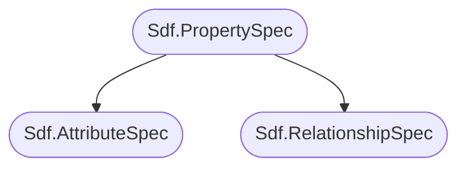

# Properties
For an overview and summary please see the parent [Data Containers](./data_container.md) section.

Here is an overview of the API structure, in the high level API it looks as follows:

In the low level API:


# Table of contents
1. [Properties](#propertyOverview)
2. [Attributes](#attributeOverview)
    1. [Attribute Types (Detail/Prim/Vertex/Point) (USD Speak: **Interpolation**)](#attributeInterpolation)
    2. [Attribute Data Types & Roles](#attributeDataTypeRole)
    3. [Static (Default) Values vs Time Samples vs Value Blocking](#attributeAnimation)
        1. [Re-writing a range of values from a different layer](#attributeReauthor)
        2. [Time freezing (mesh) data](#attributeReauthorTimeSampleToStatic)
    4. [Attribute To Attribute Connections (Node Graph Encoding)](#attributeConnections)
    5. [The **primvars** (primvars:<AttributeName>) namespace](#attributePrimvars)
        1. [Reading inherited primvars](#attributePrimvarsInherited)
        1. [Indexed Primvars](#attributePrimvarsIndexed)
    6. [Common Attributes](#attributeCommon):
        1. [Purpose](#attributePurpose)
        2. [Visibility](#attributeVisibility)
        3. [Extents Hint vs Extent](attributeExtent)
        4. [Xform Ops](attributeXformOps)
        5. [Proxy Prim](#propertyProxyPrim)
3. [Relationships](#primProperties)
    1. [Collections](#relationshipCollections)
    1. [Relationships Forwarding](#relationshipForwarding)
4. [Schemas](#propertySchemas)

## Resources
- [Usd.Property](https://openusd.org/dev/api/class_usd_property.html)
- [Usd.Attribute](https://openusd.org/dev/api/class_usd_attribute.html)
- [Usd.Relationship](https://openusd.org/dev/api/stitch_clips_8h.html#details)
- [Usd.GeomPrimvar](https://openusd.org/release/api/class_usd_geom_primvar.html)
- [Usd.GeomPrimvarsAPI](https://openusd.org/dev/api/class_usd_geom_primvars_a_p_i.html)
- [Usd.GeomImageable](https://openusd.org/release/api/class_usd_geom_imageable.html)

## Properties <a name="propertyOverview"></a>
Let's first have a look at the shared base class `Usd.Property`. This inherits most its functionality from `Usd.Object`, which mainly exposes metadata data editing. We won't cover how metadata editing works for properties here, as it is extensively covered in our [metadata](./metadata.md#metadataSpecialProperty) section.

So let's inspect what else the class offers:
~~~admonish info title=""
```python
{{#include ../../../../code/core/elements.py:propertyOverview}}
```
~~~

As you can see, the `.GetProperty`/`.GetAttribute`/`.GetRelationship` methods return an object instead of just returning `None`. This way we can still check for `.IsDefined()`. We can also use them  as "truthy"/"falsy" objects, e.g. `if not attr` which makes it nicely readable.

For a practical of the `.GetPropertyStack()` method see our [Houdini](../../dcc/houdini/hda/timedependency.md) section, where we use it to debug if time varying data actually exists. We also cover it in more detail in our [composition](../composition/pcp.md) section.

## Attributes <a name="attributeOverview"></a>
Attributes in USD are the main data containers to hold all of you geometry related data. They are the only element in USD that can be [animateable](./animation.md).


### Attribute Types (Detail/Prim/Vertex/Point) (USD Speak: **Interpolation**) <a name="attributeInterpolation"></a>
To determine on what geo prim element an attribute applies to, attributes are marked with `interpolation` metadata.
We'll use Houdini's naming conventions as a frame of reference here:

You can read up more info in the [Usd.GeomPrimvar](https://openusd.org/release/api/class_usd_geom_primvar.html#Usd_InterpolationVals) docs page.

- `UsdGeom.Tokens.constant` (Same as Houdini's `detail`attributes): Global attributes (per prim in the hierarchy).
- `UsdGeom.Tokens.uniform` (Same as Houdini's `prim` attributes): Per prim attributes (e.g. groups of polygons).
- `UsdGeom.Tokens.faceVarying` (Same as Houdini's `vertex` attributes): Per vertex attributes (e.g. UVs).
- `UsdGeom.Tokens.varying` (Same as Houdini's `vertex` attributes): This the same as face varying, except for nurbs surfaces.
- `UsdGeom.Tokens.vertex` (Same as Houdini's `point` attributes): Per point attributes (e.g. point positions).

To summarize:

| Usd Name                  | Houdini Name |
|---------------------------|--------------|
|UsdGeom.Tokens.constant    | detail       |
|UsdGeom.Tokens.uniform     | prim         |
|UsdGeom.Tokens.faceVarying | vertex       |
|UsdGeom.Tokens.vertex      | point        |

~~~admonish info title=""
```python
{{#include ../../../../code/core/elements.py:attributeInterpolation}}
```
~~~

~~~admonish tip
For attributes that don't need to be accessed by Hydra (USD's render abstraction interface), we don't need to set the interpolation. In order for an attribute, that does not derive from a schema, to be accessible for the Hydra, we need to namespace it with `primvars:`, more info below at [primvars](#attributePrimvars). If the attribute element count for non detail (constant) attributes doesn't match the corresponding prim/vertex/point count, it will be ignored by the renderer (or crash it).

When we set schema attributes, we don't need to set the interpolation, as it is provided from the [schema](./schemas.md).
~~~

### Attribute Data Types & Roles <a name="attributeDataTypeRole"></a>
We cover how to work with data classes in detail in our [data types/roles](./data_type.md) section. For array attributes, USD has implemented the buffer protocol, so we can easily convert from numpy arrays to USD Vt arrays and vice versa. This allows us to write high performance attribute modifications directly in Python. See our [Houdini Particles](../../dcc/houdini/fx/particles.md) section for a practical example.

~~~admonish info title=""
```python
{{#include ../../../../code/core/elements.py:attributeDataTypeRole}}
```
~~~

The role specifies the intent of the data, e.g. `points`, `normals`, `color` and will affect how renderers/DCCs handle the attribute. This is not a concept only for USD, it is there in all DCCs. For example a color vector doesn't need to be influenced by transform operations where as normals and points do.

Here is a comparison to when we create an attribute a float3 normal attribute in Houdini.


### Static (Default) Values vs Time Samples vs Value Blocking <a name="attributeAnimation"></a>
We talk about how animation works in our [animation](./animation.md) section.

~~~admonish important
Attributes are the only part of USD than can encode time varying data.
~~~

~~~admonish info title=""
```python
{{#include ../../../../code/core/elements.py:animationOverview}}
```
~~~

We can set an attribute with a static value (USD speak `default`) or with time samples (or both, checkout the animation section on how to handle this edge case). We can also block it, so that USD sees it as if no value was written. For attributes from schemas with default values, this will make it fallback to the default value.

~~~admonish info title=""
```python
{{#include ../../../../code/core/elements.py:animationDefaultTimeSampleBlock}}
```
For more examples (also for the lower level API) check out the [animation](./animation.md) section.
~~~

#### Re-writing a range of values from a different layer <a name="attributeReauthor"></a>

~~~admonish danger
An important thing to note is that when we want to re-write the data of an attribute from a different layer, we have to get all the existing data first and then write the data, as otherwise we are changing the value source. To understand better why this happens, check out our [composition](../composition/overview.md) section.
~~~

Let's demonstrate this:
~~~admonish info title="Change existing values | Click to expand code" collapsible=true
```python
{{#include ../../../../code/core/elements.py:attributeReauthor}}
```
~~~

For heavy data it would be impossible to load everything into memory to offset it. USD's solution for that problem is [Layer Offsets](./animation.md#layer-offset-a-non-animateable-time-offsetscale-for-composition-arcs). 

What if we don't want to offset the values, but instead edit them like in the example above? 

In a production pipeline you usually do this via a DCC that imports the data, edits it and then re-exports it (often per frame and loads it via value clips). So we mitigate the problem by distributing the write to a new file(s) on multiple machines/app instances. Sometimes though we actually have to edit the samples in an existing file, for example when post processing data. In our [point instancer](../../dcc/houdini/fx/pointinstancers.md) section we showcase a practical example of when this is needed.

To edit the time samples directly, we can open the layer as a stage or edit the layer directly. To find the layers you can inspect the layer stack or value clips, but most of the time you know the layers, as you just wrote to them:
~~~admonish info title=""
```python
{{#include ../../../../code/core/elements.py:attributeReauthorPerLayer}}
```
~~~

#### Time freezing (mesh) data <a name="attributeReauthorTimeSampleToStatic"></a>
If we want to time freeze a prim (where the data comes from composed layers), we simply re-write a specific time sample to the default value.

~~~admonish tip title="Pro Tip | Time Freeze | Click to expand code" collapsible=true
```python
{{#include ../../../../code/core/elements.py:attributeReauthorTimeSampleToStatic}}
```
~~~

~~~admonish danger
If you have to do this for a whole hierarchy/scene, this does mean that you are flattening everything into your memory, so be aware! USD currently offers no other mechanism.
~~~

We'll leave "Time freezing" data from the active layer to you as an exercise.

~~~admonish tip title="Hint | Time Freeze | Active Layer | Click to expand" collapsible=true
We just need to write the time sample of your choice to the `attr_spec.default` attribute and clear the time samples ;
~~~

### Attribute To Attribute Connections (Node Graph Encoding)<a name="attributeConnections"></a>
Attributes can also encode relationship-like paths to other attributes. These connections are encoded directly on the attribute. It is up to Usd/Hydra to evaluate these "attribute graphs", if you simply connect two attributes, it will not forward attribute value A to connected attribute B (USD does not have a concept for a mechanism like that (yet)).

~~~admonish important
Attribute connections are encoded from target attribute to source attribute.
The USD file syntax is: `<data type> <attribute name>.connect = </path/to/other/prim.<attribute name>`
~~~

Currently the main use of connections is encoding node graphs for shaders via the [UsdShade.ConnectableAPI](https://openusd.org/dev/api/class_usd_shade_connectable_a_p_i.html).


Here is an example of how a material network is encoded.

~~~admonish important title=""
```python
def Scope "materials"
{
    def Material "karmamtlxsubnet" (
    )
    {
        token outputs:mtlx:surface.connect = </materials/karmamtlxsubnet/mtlxsurface.outputs:out>

        def Shader "mtlxsurface" ()
        {
            uniform token info:id = "ND_surface"
            string inputs:edf.connect = </materials/karmamtlxsubnet/mtlxuniform_edf.outputs:out>
            token outputs:out
        }

        def Shader "mtlxuniform_edf"
        {
            uniform token info:id = "ND_uniform_edf"
            color3f inputs:color.connect = </materials/karmamtlxsubnet/mtlx_constant.outputs:out>
            token outputs:out
        }

        def Shader "mtlx_constant"
        {
            uniform token info:id = "ND_constant_float"
            float outputs:out
        }
    }
}
```
~~~

Connections, like relationships and composition arcs, are encoded via `List Editable Ops`. These are a core USD concept that is crucial to understand (They are like fancy version of a Python list with rules how sub-lists are merged). Checkout our [List Editable Ops](../composition/listeditableops.md) section for more info. 

Here is how connections are managed on the high and low API level. Note as mentioned above this doesn't do anything other than make the connection. USD doesn't drive attribute values through connections. So this example is just to demonstrate the API.

~~~admonish info title=""
```python
{{#include ../../../../code/core/elements.py:attributeConnections}}
```
~~~

### The **primvars** (primvars:<AttributeName>) namespace <a name="attributePrimvars"></a>
Attributes in the `primvars` namespace `:` are USD's way of marking attributes to be exported for rendering. These can then be used by materials and AOVs. Primvars can be written per attribute type (detail/prim/vertex/point), it is up to the render delegate to correctly access them.

Primvars that are written as `detail` (UsdGeom.Tokens.constant interpolation) attributes, get inherited down the hierarchy. This makes them ideal transport mechanism of assigning render geometry properties, like dicing settings or render ray visibility.

~~~admonish important
- An attribute with the `primvars:` can be accessed at render time by your render delegate for things like settings, materials and AOVs
- `detail` (UsdGeom.Tokens.constant interpolation) primvars are inherited down the hierarchy, ideal to apply a constant value per USD prim, e.g. for render geometry settings or instance variation.
~~~
~~~admonish danger
- The term `inherited` in conjunction with `primvars` refers to a constant interpolation primvar being passed down to its children. It is not to be confused with `inherit` composition arcs.
~~~

To deal with primvars, the high level API has the `UsdGeom.PrimvarsAPI` [(API Docs)](https://openusd.org/dev/api/class_usd_geom_primvars_a_p_i.html). In the low level, we need to do everything ourselves. This create `UsdGeom.Primvar` [(API Docs)](https://openusd.org/dev/api/class_usd_geom_primvar.html) objects, that are similar `Usd.Attribute` objects, but with methods to edit primvars. To get the attribute call `primvar.GetAttr()`.

~~~admonish info title=""
```python
{{#include ../../../../code/core/elements.py:attributePrimvarAPI}}
```
~~~

#### Reading inherited primvars <a name="attributePrimvarsInherited"></a>
To speed up the lookup of inherited primvars see this guide [API Docs](https://openusd.org/dev/api/class_usd_geom_primvars_a_p_i.html#usdGeom_PrimvarFetchingAPI). Below is an example how to self implement a high performant lookup, as we couldn't get the `.FindIncrementallyInheritablePrimvars` to work with Python as expected.

~~~admonish danger title="High performance primvars inheritance calculation | Click to expand code" collapsible=true
```python
{{#include ../../../../code/core/elements.py:attributePrimvarInherited}}
```
~~~

#### Indexed primvars <a name="attributePrimvarsIndexed"></a>
Primvars can optionally be encoded via an index table. Let's explain via an example:

Here we store it without an index table, as you can see we have a lot of duplicates in our string list. 
This increases the file size when saving the attribute to disk.
```python
...
        string[] primvars:test = ["test_0", "test_0", "test_0", "test_0",
                                  "test_1", "test_1", "test_1", "test_1",
                                  "test_2", "test_2", "test_2", "test_2",
                                  "test_3", "test_3", "test_3", "test_3"] (
            interpolation = "uniform"
        )
        int[] primvars:test:indices = None
...
```
Instead we can encode it as a indexed primvar:
```python
...
        string[] primvars:test = ["test_0", "test_1", "test_2", "test_3"] (interpolation = "uniform")
        int[] primvars:test:indices = [0, 0, 0, 0, 1, 1, 1, 1, 2, 2, 2, 2, 3, 3, 3, 3] ()
...
```
We can also flatten the index, when looking up the values. It should be preferred to keep the index, if you intend on updating the primvar.

~~~admonish info title=""
```python
{{#include ../../../../code/core/elements.py:attributePrimvarIndexed}}
```
~~~

If you are a Houdini user you might know this method, as this is how Houdini's internals also store string attributes.
You can find more info in the [USD Docs](https://openusd.org/release/api/class_usd_geom_primvar.html)


### Common Attributes <a name="attributeCommon"></a>
Now that we got the basics down, let's have a look at some common attributes (and their schemas to access them).

#### Purpose <a name="attributePurpose"></a>
The `purpose` is a special USD attribute that:
- Affects certain scene traversal methods (e.g. [bounding box or xform cache lookups](../../production/caches.md) can be limited to a specific purpose).
- Is a mechanism for Hydra (USD's render abstraction interface) to only pull in data with a specific purpose. Since any rendering (viewport or final image) is run via Hydra, this allows users to load in only prims tagged with a specific purpose. For example the `pxr.UsdGeom.Tokens.preview` purpose is used for scene navigation and previewing only, while the ``UsdGeom.Tokens.render` purpose is used for final frame rendering.
- It is inherited (like [primvars](#the-primvars-primvars-namespace)) down the hierarchy. You won't see this in UIs unlike with primvars.

~~~admonish tip title="Pro Tip | Where to mark the purpose"
As a best practice you should build your hierarchies in such a way that you don't have to write a purpose value per prim.
A typical setup is to have a `<asset root>/GEO`, `<asset root>/PROXY`, ... hierarchy, where you can then tag the `GEO`, `PROXY`, ... prims with the purpose. That way all child prims receive the purpose and you have a single point where you can override the purpose.

This is useful, if you for example want to load a whole scene in `proxy` purpose and a specific asset in `render` purpose. You then just have to edit a single prim to make it work.
~~~

The purpose is provided by the `UsdGeom.Imageable` (renderable) typed non-concrete schema, and is therefore on anything that is renderable.

~~~admonish tip title="Usd.GeomImageable inheritance graph | Click to expand code" collapsible=true

~~~

There are 4 different purposes:
- `UsdGeom.Tokens.default`: The default purpose. This is the fallback purpose, when no purpose is explicitly defined. It means that this prim should be traversed/visible to any purpose.
- `UsdGeom.Tokens.render`: Tag any (parent) prim with this to mark it suitable for final frame rendering.
- `UsdGeom.Tokens.proxy`:  Tag any (parent) prim with this to mark it suitable for low resolution previewing. We usually tag prims with this that can be loaded very quickly.
- `UsdGeom.Tokens.guide`: Tag any (parent) prim with this to mark it suitable for displaying guide indicators like rig controls or other useful scene visualizers.

~~~admonish tip title=""
```python
{{#include ../../../../code/core/elements.py:attributePurpose}}
```
~~~

#### Visibility <a name="attributeVisibility"></a>
The `visibility` attribute controls if the prim and its children are visible to Hydra or not. Unlike the `active` [metadata](./metadata.md#activeactivation), it does not prune the child prims, they are still reachable for inspection and traversal. Since it is an attribute, we can also animate it. Here we only cover  how to set/compute the attribute, for more info checkout our [Loading mechansims](./loading_mechanisms.md) section

The attribute data type is `Sdf.Token` and can have two values:
- UsdGeom.Tokens.inherited
- UsdGeom.Tokens.invisible

~~~admonish tip title=""
```python
{{#include ../../../../code/core/elements.py:attributeVisibility}}
```
~~~

~~~admonish note
In the near future visibility can be set per purpose (It is already possible, just not widely used). Be aware that this might incur further API changes.
~~~
