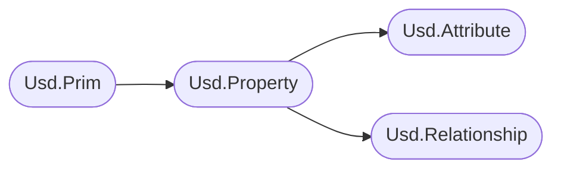
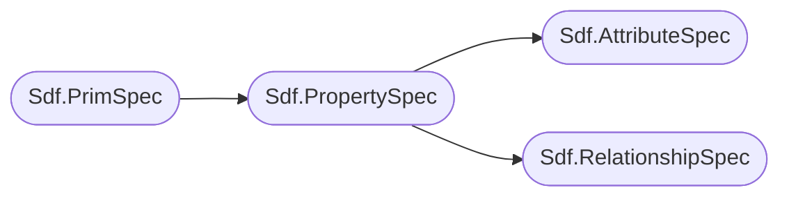

# Properties
For an overview and summary please see the parent [Data Containers](./data_container.md) section.

In the high level API it looks as follows:

In the low level API:


# Table of contents
1. [Properties](#propertyOverview)
2. [Attributes](#attributeOverview)
    1. [Attribute Types (Detail/Prim/Vertex/Point) (USD Speak: **Interpolation**)](#attributeInterpolation)
    2. [Attribute Data Types & Roles](#primTypeName)
    3. [Attribute R](#primKind)
    4. [Default Values vs Time Samples vs Value Blocking](#primMetadata)
        1. [Re-authoring a range of values]
    1. [Attribute To Attribute Connections (Node Graph Encoding)](#attributeConnections)
    1. [The **primvars:** namespace](#attributeConnections)
    1. [Common Attriubtes]:
        1. [Purpose]
        1. [Proxy Prim]
        1. [Visiblity]
        1. [Extents Hint vs Extent]
        1. [Xform Ops]
3. [Relationships](#primProperties)
    1. [Collections](#relationshipCollections)
    1. [Relationships Forwarding](#relationshipForwarding)
4. [Common Schemas]

## Resources
- [Usd.Property](https://openusd.org/dev/api/class_usd_property.html)
- [Usd.Attribute](https://openusd.org/dev/api/class_usd_attribute.html)
- [Usd.Relationship](https://openusd.org/dev/api/stitch_clips_8h.html#details)
- [Usd.GeomPrimvar](https://openusd.org/release/api/class_usd_geom_primvar.html)

## Properties <a name="propertyOverview"></a>
Let's first have a look at the shared base class `Usd.Property`. This inherits most its functionality from `Usd.Object`, which mainly exposes metadata data editing. We won't cover how metadata editing works for properties here, as it is extensively covered in our [metadata](./metadata.md#metadataSpecialProperty) section.

So let's inspect what else the class offers:
~~~admonish info title=""
```python
{{#include ../../../../code/core/elements.py:propertyOverview}}
```
~~~

As you can see, the `.GetProperty`/`.GetAttribute`/`.GetRelationship` methods return an object instead of just returning `None`. This way we can still check for `.IsDefined()`. We can also use them  as "truthy"/"falsy" objects, e.g. `if not attr` which makes it nicely readable.

For a practical of the `.GetPropertyStack()` method see our [Houdini](../../dcc/houdini/hda/timedependency.md) section, where we use it to debug if time varying data actually exists.

## Attributes <a name="attributeOverview"></a>
Attributes in USD are the main data containers to hold all of you geometry related data. They are the only element in USD that can be [animateable](./animation.md).


### Attribute Types (Detail/Prim/Vertex/Point) (USD Speak: **Interpolation**) <a name="attributeInterpolation"></a>
To determine on what geo prim element an attribute applies to, attributes are marked with `interpolation` metadata.
We'll use Houdini's naming conventions as a frame of reference here:

You can read up more info in the [Usd.GeomPrimvar](https://openusd.org/release/api/class_usd_geom_primvar.html#Usd_InterpolationVals) docs page.

- `UsdGeom.Tokens.constant` (Same as Houdini's `detail`attributes): Global attributes (per prim in the hierarchy).
- `UsdGeom.Tokens.uniform` (Same as Houdini's `prim` attributes): Per prim attributes (e.g. groups of polygons).
- `UsdGeom.Tokens.faceVarying` (Same as Houdini's `vertex` attributes): Per vertex attributes (e.g. UVs).
- `UsdGeom.Tokens.varying` (Same as Houdini's `vertex` attributes): This the same as face varying, except for nurbs surfaces.
- `UsdGeom.Tokens.vertex` (Same as Houdini's `point` attributes): Per point attributes (e.g. point positions).


