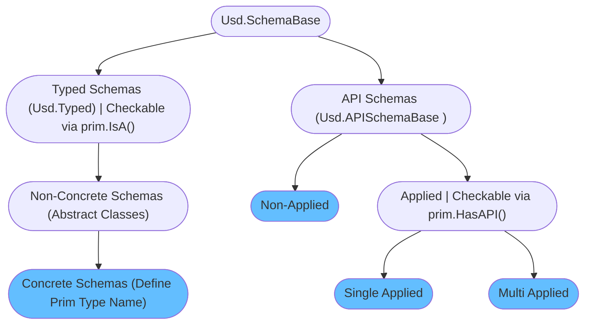

# Schemas
Schemas are to USD what classes are to object orient programming. Let's explain schemas with that analogy in mind:

- Schemas are templates that define default attributes and methods. You can think of each prim in your hierarchy being an instance of a class. 
- Each prim must (or rather should, technically it is not enforced) have a type name set (see our [prim](./prim.md) section). The type name defines the primary class your prim is an instance of. To dynamically subclass your primary classes with additional classes, USD has the concept of API schemas. These then provide extra metadata/properties or methods that can manipulate your prim data.

Here is a flow chart of how the schema inheritance is setup:

All the blue colored endpoints are the ones you'll set/apply/use via code.
- `Typed Schemas (Usd.Typed)`:
    - The base class for all schemas that define prim types, hence the name `Typed Schemas`
    - We can check if it is applied to a prim via `prim.IsA(<className>)`
    - Defines properties and metadata that is attached to prims that have this type.
    - Code: Applied via `SchemaClass(prim)` e.g. `UsdGeom.Imageable(prim)` (Non-concrete), `UsdGeom.Xform(prim)`(concrete)
- `Typed Schemas (Usd.Typed)` -> `Non-Concrete Schemas`:
    - The non-concrete schemas are like abstract classes in OOP. They are schemas that concrete schemas can inherit from. The purpose of these is to define common properties/metadata that a certain type of typed schemas need. (For example lights all share a non-concrete schema for the essential properties.) 
    - Do not define a type name (hence non-concrete).
- `Typed Schemas (Usd.Typed)` -> `Non-Concrete Schemas` -> `Concrete Schemas`:
    - Defines a type name
    - In OOP terms you can think of it as the primary base class that your prim is instancing.
    - Code: Applied via `Prim.SetTypeName(<typeName>)`/`PrimSpec.typeName="<typeName>"`

Here is an example of the inheritance graph of the [Usd.GeomImageable](https://openusd.org/dev/api/class_usd_geom_imageable.html) typed non-concrete schema:
~~~admonish note title="Click to expand content" collapsible=true

~~~

- `API Schemas (Usd.APISchemaBase)`
    - The base class for all API Schemas, subclasses must end with `API`
    - In OOP terms, API schemas are classes that your primary (typed) class can inherit from to gain access to convenience methods, but also additional properties.
- `API Schemas (Usd.APISchemaBase)` -> `Non-Applied API Schemas`:
    - Provide only methods to manipulate prim data like attribute connections or core metadata (like `kind`/`clips`)
    - They do not define any properties. 
    - The schema name is not written to the `apiSchemas` metadata.
    - Code: Applied via `SchemaClassAPI(prim)` e.g. `Usd.ClipsAPI(prim)(prim)`
- `API Schemas (Usd.APISchemaBase)` -> `Applied API Schemas`:
    - Can additional properties to prim and provides methods to manipulate these.
    - The schema name is added to the `apiSchemas` metadata
    - We can check if it is applied to a prim via `prim.HasAPI(<APISchemaType>)`
    - Code: Applied via `SchemaClassAPI.Apply(prim)` e.g. `UsdGeom.ModelAPI.Apply(prim)`/`prim_spec.SetInfo("apiSchemas", Sdf.TokenListOp.Create(prependedItems=["UsdGeomModelAPI"]))`
- `API Schemas (Usd.APISchemaBase)` -> `Applied API Schemas` -> `Single Apply API Schemas`:
    - Can only be applied once per prim
- `API Schemas (Usd.APISchemaBase)` -> `Applied API Schemas` -> `Multi Apply API Schemas`:
    - Can be applied multiple times with a different instance name, properties are namespaced with the instance name.

If you want to see a list of off the schema classes that ship with USD by default check out the [Usd.SchemaBase API docs](
https://openusd.org/dev/api/class_usd_schema_base.html) page, it has a full inheritance diagram.

~~~admonish tip
As covered in our [prim](./prim.md#schemas) section, Usd has a PrimDefinition class we can use to inspect all properties and metadata given through applied and typed schemas on a given prim. This prim definition is full type signature of a given prim.
~~~

# Table of contents
1. [API Overview In-A-Nutshell](#summary)
2. [What should I use it for?](#usage)
3. [Resources](#resources)
4. [Overview](#overview)
6. [Example A](#exampleA)
    1. [Subexample A](#subexampleA)
    2. [Subexample B](#subexampleB)

## TL;DR - Metadata In-A-Nutshell 
- Main points to know

## What should I use it for? 
~~~admonish tip
Summarize actual production relevance.
~~~

## Resources 
- [API Docs](https://openusd.org/release/api/_usd__page__generating_schemas.html)
- [Schema Registry](https://openusd.org/dev/api/class_usd_schema_registry.html)
- [Generating a schema](https://openusd.org/release/tut_generating_new_schema.html)

## Overview 
Chart example

~~~admonish tip
Example tip
~~~

## Example A 
Example A

### Subexample A 
Example A

### Subexample B 
Example A

