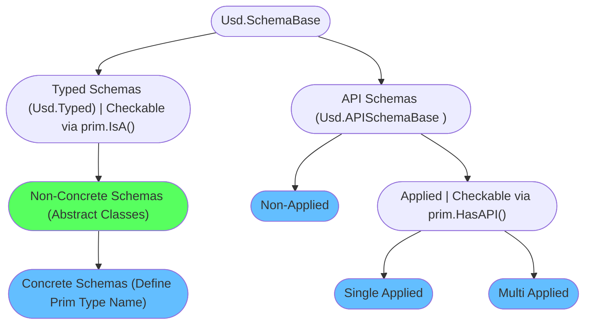

# Schemas
Schemas are to USD what classes are to object orient programming. Let's explain schemas with that analogy in mind:

- Schemas are templates that define default properties and methods. You can think of each prim in your hierarchy being an instance of a class. 
- Each prim must (or rather should, technically it is not enforced) have a type name set (see our [prim](./prim.md) section). The type name defines the primary class your prim is an instance of. To dynamically subclass your primary classes with additional classes, USD has the concept of API schemas. These then provide extra metadata/properties or methods that can manipulate your prim data.

~~~admonish warning title=""
The examples on this page only talk about how to apply/remove schemas and how to inspect them. In our [production](../../production/overview.md) and [Houdini](../../dcc/houdini/overview.md) section we'll look into the most used ones and run through some production examples.
~~~

# Table of contents
1. [API Overview In-A-Nutshell](#summary)
2. [What should I use it for?](#usage)
3. [Resources](#resources)
4. [Overview](#overview)
6. [Creating/Using schemas in your code](#schemasPracticalGuide)
7. [Prim Definition](#schemasPrimDefinition)
8. [Prim Type Info](#schemasPrimDefinition)
9. [Schema Classes](#schemasClasses)
    1. [Schema Registry](#schemasRegistry)
    2. [Schema Kind](#schemasKind) 

## TL;DR - Metadata In-A-Nutshell <a name="summary"></a>
- Schemas are like classes in OOP that each prim in your hierarchy then instances. They provide properties (with fallback values) and metadata as well as methods (`Get<PropertName>`/`Set<PropertName>`/Utility functions) to manipulate your prim data.
- There are two different base schema types (See the [overview](#overview) section for more info):
    - Typed Schemas:
        - Define prim type name (OOP: The main class of your prim), like `Cube`/`Mesh`/`Xform`
        - Provide metadata/properties and methods to edit these
        - Checkable via `prim.IsA(<SchemaClassName>)`
    - API Schemas (Class Naming Convention `<SchemaClassName>API`):
        - Do not define prim type name (OOP: A subclass that inherits to your main class)
        - Is divided in:
            - Non-Applied API schemas:
                - Add convenience methods to manipulate common prim data like properties and core metadata (like `kind`/`clips`).
            - Applied API schemas:
                - Supplement typed schemas by adding additional metadata/properties and methods to edit these
                - Checkable via `prim.HasAPI(<SchemaClassName>)`
- A prims composed schema definition can be accessed via `prim.GetPrimDefinition()`. This defines a prim's full type signature, similar to how you can inherit from multiple classes in OOP `class (<TypedSchemaClass>, <AppliedAPISchemaA>, <AppliedAPISchemaA>)`.
- You can generate your own as described in our [plugin schemas](../plugins/schemas.md) section.

## What should I use it for? <a name="usage"></a>
~~~admonish tip
We'll be using schema classes a lot in production, so we recommend familiarizing yourself with the below examples.

They are the main interface for your prims in the high level API that gives you getters/setters for all the standard properties that ship with Usd.

```python
{{#include ../../../../code/core/elements.py:schemasOverview}}
```

The schema classes then give you access to all of the schemas Get/Set methods and utility functions.
~~~

## Resources <a name="resources"></a>
- [API Docs](https://openusd.org/release/api/_usd__page__generating_schemas.html)
- [Schema Registry](https://openusd.org/dev/api/class_usd_schema_registry.html)
- [Generating a schema](https://openusd.org/release/tut_generating_new_schema.html)
- [Prim Definition](https://openusd.org/dev/api/class_usd_prim_definition.html)
- [Prim Type Info](https://openusd.org/dev/api/class_usd_prim_type_info.html)

## Overview <a name="overview"></a>

Here is a flow chart of how the schema inheritance is setup:



All the blue colored endpoints are the ones you'll set/apply/use via code, the green one you won't instantiate directly, but you can use it to check for inheritance.

- `Typed Schemas (Usd.Typed)`:
    - The base class for all schemas that define prim types, hence the name `Typed Schemas`
    - Defines properties and metadata that is attached to prims that have this type.
    - We can check if it is applied to a prim via `prim.IsA(<className>)`
    - Accessible via `SchemaClass(prim)` e.g. `UsdGeom.Imageable(prim)` (Non-concrete), `UsdGeom.Xform(prim)`(concrete), to get access to the methods. To actually apply the schema, we have to set the type name as described below. Accessing a typed schema on a prim with a different type name will result in errors once you try to get/set data. To actually not guess what the typed Python class is we can run `prim.GetPrimTypeInfo().GetSchemaType().pythonClass(prim)`.
- `Typed Schemas (Usd.Typed)` -> `Non-Concrete Schemas`:
    - The non-concrete schemas are like abstract classes in OOP. They are schemas that concrete schemas can inherit from. The purpose of these is to define common properties/metadata that a certain type of typed schemas need. (For example lights all share a non-concrete schema for the essential properties.) 
    - Do not define a type name (hence non-concrete).
- `Typed Schemas (Usd.Typed)` -> `Non-Concrete Schemas` -> `Concrete Schemas`:
    - Defines a type name
    - In OOP terms you can think of it as the primary base class that your prim is instancing.
    - Applied via `Prim.SetTypeName(<typeName>)`/`PrimSpec.typeName="<typeName>"`/`SchemaClass.Define(stage, Sdf.Path("/path"))`

Here is an example of the inheritance graph of the [Usd.GeomImageable](https://openusd.org/dev/api/class_usd_geom_imageable.html) typed non-concrete schema:
~~~admonish note title="Click to expand content" collapsible=true

~~~

- `API Schemas (Usd.APISchemaBase)`
    - The base class for all API Schemas, subclasses must end with `API`
    - In OOP terms, API schemas are classes that your primary (typed) class can inherit from to gain access to convenience methods, but also additional metadata/properties.
- `API Schemas (Usd.APISchemaBase)` -> `Non-Applied API Schemas`:
    - Provide only methods to manipulate existing prim data like properties and core metadata (like `kind`/`clips`). Their common usage is to add convenience methods to manipulate common prim data.
    - They do not define any metadata/properties. 
    - The schema name is not written to the `apiSchemas` metadata, it therefore does not contribute to the prim definition.
    - Code: Applied via `SchemaClassAPI(prim)` e.g. `Usd.ClipsAPI(prim)`
- `API Schemas (Usd.APISchemaBase)` -> `Applied API Schemas`:
    - Adds additional metadata/properties to prim and provides methods to manipulate these.
    - The schema name is added to the `apiSchemas` metadata, it contributes to the prim definition.
    - We can check if it is applied to a prim via `prim.HasAPI(<APISchemaType>)`
    - Applied via `SchemaClassAPI.Apply(prim)` e.g. `UsdGeom.ModelAPI.Apply(prim)`/`prim_spec.SetInfo("apiSchemas", Sdf.TokenListOp.Create(prependedItems=["UsdGeomModelAPI"]))`
- `API Schemas (Usd.APISchemaBase)` -> `Applied API Schemas` -> `Single Apply API Schemas`:
    - Can only be applied once per prim
- `API Schemas (Usd.APISchemaBase)` -> `Applied API Schemas` -> `Multi Apply API Schemas`:
    - Can be applied multiple times with a different instance name, properties are namespaced with the instance name.

If you want to see a list of off the schema classes that ship with USD by default check out the [Usd.SchemaBase API docs](
https://openusd.org/dev/api/class_usd_schema_base.html) page, it has a full inheritance diagram.

~~~admonish tip
As covered in our [prim](./prim.md#schemas) section, Usd has a PrimDefinition/PrimTypeInfo classes we can use to inspect all properties and metadata given through applied and typed schemas on a given prim. This prim definition/type info carry the full type signature of a given prim.
~~~


## Creating/Using schemas in production <a name="schemasPracticalGuide"></a>

Let's first look at typed schemas:

~~~admonish tip title="Pro Tip | Find class from type name"
To get the class from the prim, we can run:
```python
# From type name
prim_type_name = prim.GetTypeName()
prim_typed_schema = Usd.SchemaRegistry.GetTypeFromName(prim_type_name).pythonClass(prim)
# From prim type info
prim_typed_schema = prim.GetPrimTypeInfo().GetSchemaType().pythonClass(prim)
```
This way we don't have to find and import the right class ourselves.
~~~

To summarize the below code:

~~~admonish tip title="Pro Tip | Best practices how to apply schemas"
```python
{{#include ../../../../code/core/elements.py:schemasOverview}}
```
~~~

~~~admonish info title=""
```python
{{#include ../../../../code/core/elements.py:schemasTyped}}
```
~~~

~~~admonish important
The 'IsA' check is a very valuable check to see if something is an instance of a (base) class. It is similar to Python's isinstance method.
~~~

And the API schemas:

~~~admonish info title=""
```python
{{#include ../../../../code/core/elements.py:schemasAPI}}
```
~~~

## Prim Definition <a name="schemasPrimDefinition"></a>
With the [prim definition](https://openusd.org/dev/api/class_usd_prim_definition.html) we can inspect what the schemas provide. Basically you are inspecting the class (as to the prim being the instance, if we compare it to OOP paradigms).
In production, you won't be using this a lot, it is good to be aware of it though. If you change things here, you are actually on run-time modifying the base class, which might cause some weird issues.

~~~admonish info title=""
```python
{{#include ../../../../code/core/elements.py:dataContainerPrimTypeDefinition}}
```
~~~

## Prim Type Info <a name="schemasPrimTypeInfo"></a>
The [prim type info](https://openusd.org/dev/api/class_usd_prim_type_info.html) holds the composed type info of a prim. You can think of it as as the class that answers Python `type()` like queries for Usd. It caches the results of type name and applied API schema names, so that `prim.IsA(<typeName>)` checks can be used to see if the prim matches a given type.

~~~admonish info title=""
```python
{{#include ../../../../code/core/elements.py:dataContainerPrimTypeInfo}}
```
~~~

## Schema Classes <a name="schemasClasses"></a>
We can lookup all registered schemas via the plugin registry as well as find out what plugin provided a schema.

Before we do that let's clarify some terminology:
- `Schema Type Name`: The name of the schema class, e.g. `Cube`, `Imageable`, `SkelBindingAPI`
- `Tf.Type.typeName` registry name: The full registered type name `UsdGeomCube`, `UsdGeomImageable`, `UsdSkelBindingAPI`

We can map from `schema type name` to `Tf.Type.typeName` via:
```python
registry = Usd.SchemaRegistry()
registry.GetTypeFromName("Cube").typeName # Returns: "UsdGeomCube"
```
We can map from `Tf.Type.typeName` to `schema type name` via:
```python
registry = Usd.SchemaRegistry()
registry.GetSchemaTypeName("UsdGeomCube") # Returns: "Cube"
```

### Schema Registry <a name="schemasRegistry"></a>

Let's list all the schemas:
~~~admonish info title=""
```python
{{#include ../../../../code/core/elements.py:schemasPluginRegistry}}
```
~~~

This allows us to also look up the Tf.Type from schema (type) names, 
which we can then use in `IsA()` checks.

~~~admonish info title=""
```python
{{#include ../../../../code/core/elements.py:schemasRegistry}}
```
~~~

A practical use case of looking thru the registry, is that we can grab the prim definitions. We can use these to inspect what properties a schema creates. We can use this to for example builds UIs that list all the schema attributes.

~~~admonish info title=""
```python
{{#include ../../../../code/core/elements.py:schemasRegistryToPrimDefinition}}
```
~~~

### Schema Kind <a name="schemasKind"></a>

We can also inspect the schema kind. The kind defines (if we look at our inheritance tree in [overview](#overview)) what kind of schema it is.

The kind can be one of:
- Usd.SchemaKind.AbstractBase
- Usd.SchemaKind.AbstractTyped
- Usd.SchemaKind.ConcreteTyped
- Usd.SchemaKind.NonAppliedAPI
- Usd.SchemaKind.SingleApplyAPI
- Usd.SchemaKind.MultipleApplyAPI

~~~admonish info title=""
```python
{{#include ../../../../code/core/elements.py:schemasKind}}
```
~~~
