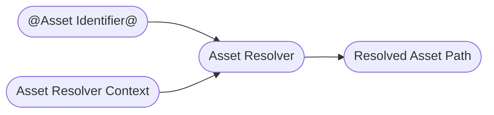

# Asset Resolver

The [Asset Resolver](https://openusd.org/dev/api/ar_page_front.html) is one of those core Usd topics you have to face eventually and can't get around if you plan on using Usd in production. To summarize its functionality in a simple diagram:
~~~admonish tip title=""

~~~
You can kind of think of your asset resolver as a little black box that takes an input path, processes it and spits out a file path/URI that can be opened as a file/streamed data from. It allows you to hook into Usd's file path lookups in order to redirect where the actual file is or to pin an asset identifier to an older version. This is probably the most common use case in VFX pipelines, as when rendering on the farm, you want your Usd stage to be in the exact same state as in your live scene.

In Usd itself, asset paths are separated from normal strings so that they can be identified as something that has to run through the resolver. In the Usd file, you'll see the `@assset_identifier@` syntax: 
```python
def "pig" (
    assetInfo = {
        dictionary UsdSurvivalGuide = {
            asset Asset = @assetMetadata@
            asset[] AssetDependencyPaths = [@dependencyPathA@, @dependencyPathB@]
        }
    }
    prepend references = @/opt/hfs19.5/houdini/usd/assets/pig/pig.usd@
){
    custom asset Asset = @someAsset@
    custom asset[] AssetArray = [@someAssetA@, @someAssetB@]
}

```
All composition arcs use [asset paths](https://www.sidefx.com/docs/hdk/class_sdf_asset_path.html) as well as any metadata (especially `assetInfo`) and any (custom) attributes of type `Asset`/`AssetArray`. In Usd files the naming convention for asset paths is `Asset`, in the API it is `pxr.Sdf.AssetPath`. So any time you see the `@...@` syntax, just remember it is an asset path.

An important thing to note is that asset resolvers only go in one direction (at least in the Usd API): From asset identifier to resolved asset path. I assume this is because you can have multiple asset identifiers that point the the same resolved asset path. Depending on your asset resolver implementation, you can also make it bidirectional.


## TL;DR - Asset Resolvers In-A-Nutshell
Asset resolvers resolve asset identifiers (encoded in Usd with the `@...@` syntax) to loadable file paths/URIs.
~~~admonish tip title=""

~~~
It is Usd's abstraction of where to pull the actual data from and offers you the possibility to add custom pinning or data source redirection mechanisms. To guide the resolver, Usd adds the option of passing in an `Asset Resolver Context`, which is just a very simple class (with pretty much no methods you need to re-implement), that your resolver can use to aid resolution.

Contexts are handled per stage: They are optionally be given on stage open and can also be shared between stages. If you do not provide a context, your resolver will provide a default fallback context.

To soften the blow on the steep asset resolver implementation learning curve we provide production ready asset resolvers here in our [GitHub Repository](https://github.com/LucaScheller/VFX-UsdAssetResolver).
These include:
- A fully functional file based resolver with pinning support and on runtime modification.
- A fully functional python based resolver with feature parity to the file resolver, that you can use to debug/prototype your resolver. This might be enough for very small studios, who don't access thousands of assets.
- A hybrid pre-cached python resolver is in the works, keep an eye on this repo for updates.

This should help you get up and running (or at least protoype easily and possibly outsource the C++ implementation if you need a lot of customization).

~~~admonish danger
Currently the asset resolvers only ship with instructions for compiling against Houdini on Linux. It is on the roadmap to include Windows instructions as well as to create a build pipeline via GitHub, so that you don't necessarily have to self compile it. We'll keep you posted :)
~~~

All the implementation details and examples can be found in the below resources links. We separated it from these docs, as it is a big enough topic on its own.

## Resources
- [GitHub Repository](https://github.com/LucaScheller/VFX-UsdAssetResolver)
- [Documentation](https://lucascheller.github.io/VFX-UsdAssetResolver/)

## Overview

Add examples
### Asset Resolver Contexts

### Remapping Asset Paths