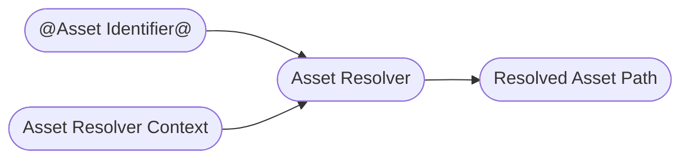

# Asset Resolver
The [Asset Resolver](https://openusd.org/dev/api/ar_page_front.html) is one of those core Usd topics you have to face eventually and can't get around if you plan on using Usd in production. To summarize its functionality in a simple diagram:
~~~admonish tip title=""

~~~
You can kind of think of your asset resolver as a little black box that takes an input path, processes it and spits out a file path/URI that can be opened as a file/streamed data from. It allows you to hook into Usd's file path lookups in order to redirect where the actual file is or to pin an asset identifier to an older version. This is probably the most common use case in VFX pipelines, as when rendering on the farm, you want your Usd stage to be in the exact same state as in your live scene.

In Usd itself, asset paths are separated from normal strings so that they can be identified as something that has to run through the resolver. In the Usd file, you'll see the `@assset_identifier@` syntax: 
```python
def "bicycle" (
    assetInfo = {
        dictionary UsdSurvivalGuide = {
            asset Asset = @assetMetadata@
            asset[] AssetDependencyPaths = [@dependencyPathA@, @dependencyPathB@]
        }
    }
    prepend references = @/opt/hfs19.5/houdini/usd/assets/pig/pig.usd@
){
    custom asset Asset = @someAsset@
    custom asset[] AssetArray = [@someAssetA@, @someAssetB@]
}

```
All composition arcs use [asset paths](https://www.sidefx.com/docs/hdk/class_sdf_asset_path.html) as well as any metadata (especially `assetInfo`) and any (custom) attributes of type `Asset`/`AssetArray`. In Usd files the naming convention for asset paths is `Asset`, in the API it is `pxr.Sdf.AssetPath`. So any time you see the `@...@` syntax, just remember it is an asset path.

An important thing to note is that asset resolvers only go in one direction (at least in the Usd API): From asset identifier to resolved asset path. I assume this is because you can have multiple asset identifiers that point the the same resolved asset path. Depending on your asset resolver implementation, you can also make it bidirectional.

## TL;DR - Asset Resolvers In-A-Nutshell
Asset resolvers resolve asset identifiers (encoded in Usd with the `@...@` syntax) to loadable file paths/URIs.
~~~admonish tip title=""

~~~
It is Usd's abstraction of where to pull the actual data from and offers you the possibility to add custom pinning or data source redirection mechanisms. To guide the resolver, Usd adds the option of passing in an `Asset Resolver Context`, which is just a very simple class (with pretty much no methods you need to re-implement), that your resolver can use to aid resolution.

Contexts are handled per stage: They are optionally given on stage open and can also be shared between stages. If you do not provide a context, your resolver will provide a default fallback context.

To resolve an asset identifier you can call:
~~~admonish tip title=""
```python
{{#include ../../../../code/core/elements.py:assetResolverStageContextResolve}}
```
~~~
If you don't want to use any context you can call:
~~~admonish tip title=""
```python
{{#include ../../../../code/core/elements.py:assetResolverResolve}}
```
~~~

One important thing to not confuse is the `Ar.ResolvedPath` and the `Sdf.AssetPath` classes.
The `Sdf.AssetPath` is the class you instantiate when you set any asset path related field/property/composition arc when writing to your layer/stage. It does not resolve anything, it only has dummy properties which just reflect what you pass to the constructor.

~~~admonish tip title=""
```python
{{#include ../../../../code/core/elements.py:assetResolverAssetPath}}
```
~~~

To soften the blow on the steep asset resolver implementation learning curve we provide production ready asset resolvers here in our [GitHub Repository](https://github.com/LucaScheller/VFX-UsdAssetResolver).
These include:
- A fully functional file based resolver with pinning support and on runtime modification.
- A fully functional python based resolver with feature parity to the file resolver, that you can use to debug/prototype your resolver. This might be enough for very small studios, who don't access thousands of assets.
- A hybrid pre-cached python resolver is in the works, keep an eye on this repo for updates.

This should help you get up and running (or at least protoype easily and possibly outsource the C++ implementation if you need a lot of customization).

~~~admonish danger
Currently the asset resolvers only ship with instructions for compiling against Houdini on Linux. It is on the roadmap to include Windows instructions as well as to create a build pipeline via GitHub, so that you don't necessarily have to self compile it. We'll keep you posted :)
~~~

All the implementation details and examples can be found in the below resources links. We separated it from these docs, as it is a big enough topic on its own.

## Resources
- [Asset Resolver API Docs](https://openusd.org/dev/api/class_ar_resolver.html)
- [Asset Resolver Context API Docs](https://openusd.org/dev/api/class_ar_resolver_context.html)
- [GitHub Repository](https://github.com/LucaScheller/VFX-UsdAssetResolver)
- [Documentation](https://lucascheller.github.io/VFX-UsdAssetResolver/)

## Asset Resolver
You can register multiple asset resolvers via the plugin system:
- There must be one primary resolver that is not URI based. As a fallback the default resolver will be used
- Any number of URI based resolvers: These resolvers will be called when they find a path prefixed with the scheme name syntax `"<scheme>:..."` for example `http://usdSurvivalGuide/assets/bicycle.usd`)

Here is an example for a primary resolver plugin .json file:
~~~admonish note title="To see the file click here" collapsible=true
```json
{
    "Plugins": [
        {
            "Info": {
                "Types": {
                    "MyPrimaryResolver": {
                        "bases": ["ArResolver"],
                        "implementsContexts" : true
                    }
                }
            },
            "LibraryPath": "../lib/myPrimaryResolver.so",
            "Name": "myPrimaryResolver",
            "Root": ".",
            "Type": "library"
        }
    ]
}
```
~~~

And an example for a URI resolver plugin .json file:
~~~admonish note title="To see the file click here" collapsible=true
```json
{
    "Plugins": [
        {
            "Info": {
                "Types": {
                    "HybridResolver": {
                        "bases": ["MyUriResolver"],
                        "implementsContexts" : true
                    }
                }
            },
            "LibraryPath": "../lib/myUriResolver.so",
            "Name": "myUriResolver",
            "Root": ".",
            "Type": "library"
        }
    ]
}
```
~~~

The Usd files save the asset identifiers with the `@someString@` syntax. Depending on the resolver context, these identifiers might resolve to different 
paths. This allows us to save the pinned state of a Usd file. For example if we have an asset path `@assets/bicycle@` we might resolve it to  `@/server/assets/bicycle/bicycle_latest.usd@` which points to a symlink of the latest bicycle USD file. Once we submit a rendering, we usually want to pin the whole Usd file to the state it is actively being viewed in. To do that we collect all asset paths and then store their current mapping. This way we can then map the bicycle to the active version by storing `@assets/bicycle@` -> `@/server/assets/bicycle/bicycle_v003.usd@` in our resolver context.
~~~admonish danger
An asset identifier can be a string with any characters except `[]` brackets, as these are used for reading .usdz package files.
~~~

## Asset Resolver Contexts
To assist the resolver with processing asset paths, Usd adds the option of passing in an `Asset Resolver Context`. The context is just a very simple class, that your resolver can use to aid path resolution. A simple context only needs to implement:
```
- Default and copy constructors
- < and == operators
- hash_value
```
The rest is up to you to implement and Python expose. 

Contexts are handled per stage: They are optionally given on stage open and can also be shared between stages. If you do not provide a context, your resolver will provide a default fallback context. You can not change the context without re-opening the stage, but you can implement methods to modify the active stages and then signal a change notification to the stages. The resolvers listed above implement different methods to modify the mapping pairs. Are refresh can be called as follows:
~~~admonish tip title=""
```python
{{#include ../../../../code/core/elements.py:assetResolverContextRefresh}}
```
~~~

As you can see the ```stage.GetPathResolverContext()``` actually returns a list and not a single resolver context. This is because there can be multiple resolvers running at the same time. As stated above a single primary resolver and multiple URI-resolvers, you therefore have a resolver context per resolver.
~~~admonish tip title=""
```python
{{#include ../../../../code/core/elements.py:assetResolverContextAccess}}
```
~~~

~~~admonish warning title="Resolver Contexts Per Resolver in C++"
There can only be a single resolver context object instance of the same class in the resolver context. Usually each resolver ships with its own context class, if the resolver tries to create another instance of the resolver context, it will be ignored when trying to add it the the bound context list.
This is nothing you have to worry about in Python, we'd just thought we'd mention it here 
for completeness, as it can cause some head-scratching when coding a resolver.
~~~

~~~admonish warning title="Refresh Resolver Contexts in Python"
When implementing the context in C++, make sure that the internal data is accessed via a shared pointer as Usd currently creates resolver context copies when exposed via Python
instead of passing thru the pointer. Otherwise calling ```ArNotice::ResolverChanged(*ctx).Send();``` won't work!
See for more info: [Usd Interest Forum Thread](https://groups.google.com/g/usd-interest/c/9JrXGGbzBnQ/m/_f3oaqBdAwAJ)
~~~


## Common Resolver Code Examples
Let's look at some practical examples that you'll use in the day to day work, we'll discuss Houdini specifics in the Houdini section of this guide:

#### Initialization
To see if your resolver is being loaded you can set the `TF_DEBUG` environment variable to `AR_RESOLVER_INIT`:
~~~admonish tip title=""
```bash
export TF_DEBUG=AR_RESOLVER_INIT
```
~~~
This will log the following to stdout if you use our FileResolver:

~~~admonish tip title=""
```
ArGetResolver(): Using asset resolver FileResolver from plugin ../dist/fileResolver/lib/fileResolver.so for primary resolver
ArGetResolver(): Found URI resolver ArDefaultResolver
ArGetResolver(): Found URI resolver FS_ArResolver
ArGetResolver(): Using FS_ArResolver for URI scheme(s) ["op", "opdef", "oplib", "opdatablock"]
ArGetResolver(): Found URI resolver FileResolver
ArGetResolver(): Found package resolver USD_NcPackageResolver
ArGetResolver(): Using package resolver USD_NcPackageResolver for usdlc from plugin usdNc
ArGetResolver(): Using package resolver USD_NcPackageResolver for usdnc from plugin usdNc
ArGetResolver(): Found package resolver Usd_UsdzResolver
ArGetResolver(): Using package resolver Usd_UsdzResolver for usdz from plugin usd
```
~~~

For more information about debugging, check out our [Debugging & Performance Profiling](../profiling/overview.md) section.

To check what the active primary resolver is, you can also run:
~~~admonish tip title=""
```python
{{#include ../../../../code/core/elements.py:assetResolverBound}}
```
~~~
It is important that you import the Python module of your resolver first, otherwise you won't get your Python object when calling `Ar.GetUnderlyingResolver()`.

#### Scoped resolver caches
To ensure that we always get the same resolved paths, you can use a scoped resolver cache. When working in DCCs, you don't have to worry about this as the DCC should handle this for you.
~~~admonish tip title=""
```python
{{#include ../../../../code/core/elements.py:assetResolverScopedCache}}
```
~~~

#### Creating/Opening a stage with a resolver context
~~~admonish tip title=""
```python
{{#include ../../../../code/core/elements.py:assetResolverContextCreation}}
```
~~~

#### Resolving a path with a given bound context.
This is probably most used resolved method you'll use. It resolves the asset identifier using the active stage's context.
~~~admonish tip title=""
```python
{{#include ../../../../code/core/elements.py:assetResolverStageContextResolve}}
```
~~~

If you don't want to use any context you can call:
~~~admonish tip title=""
```python
{{#include ../../../../code/core/elements.py:assetResolverResolve}}
```
~~~

#### Asset Paths vs Resolved Paths
One important thing to not confuse is the `Ar.ResolvedPath` and the `Sdf.AssetPath` classes.
The `Sdf.AssetPath` is the class you instantiate when you set any asset path related field/property/composition arc when writing to your layer/stage. It does not resolve anything, it only has dummy properties which just reflect what you pass to the constructor.

~~~admonish tip title=""
```python
{{#include ../../../../code/core/elements.py:assetResolverAssetPath}}
```
~~~


