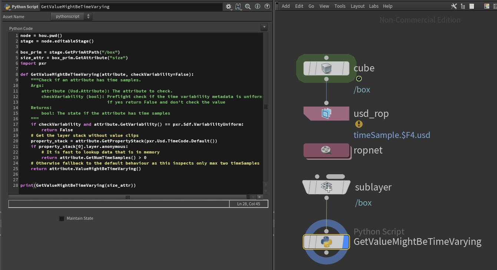
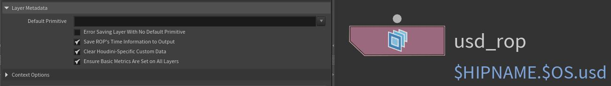

# Tips & Tricks
You can find all the .hip files of our shown examples in our [USD Survival Guide - GitHub Repo](https://github.com/LucaScheller/VFX-UsdSurvivalGuide/tree/main/files/dcc/houdini).

# Table of contents
1. [Composition](#compositionOverview)
    1. [Extracting payloads and references from an existing layer stack with anonymous layers](#compositionReferencePayloadLayerStack)
    1. [Efficiently re-writing existing hierarchies as variants](#compositionArcVariantReauthor)
    1. [Adding overrides via inherits](#compositionArcInherit)
1. [How do I check if an attribute has time samples (if there is only a single time sample)?](#timeSampleValueMightBeTimeVarying)
1. [Where are Houdini's internal lop utils stored?](#houLopUtils)
1. [How do I get the LOPs node that last edited a prim?](#houLastEditedPrim)
1. [How do I store side car data from node to node?](#houSidecarData)

## Composition <a name="compositionOverview"></a>
Now we've kind of covered these topics in our [A practical guide to composition](../../../production/composition.md) and [Composition - LIVRPS](../../../core/composition/livrps.md) sections.

We strongly recommend reading these pages before this one, as they cover the concepts in a broader perspective. 

### Extracting payloads and references from an existing layer stack with anonymous layers <a name="compositionReferencePayloadLayerStack"></a>
When building our composition in USD, we always have to make sure that layers that were generated in-memory are loaded via the same arc as layers loaded from disk.
If we don't do this, our composition would be unreliable in live preview vs cache preview mode.

Composition arcs always reference a specific prim in a layer, therefore we usually attach our caches to some sort of predefined root prim (per asset).
This means that if we import SOP geometry, with multiple of these root hierarchies, we should also create multiple references/payloads so that each root prim can be unloaded/loaded via the payload mechanism.

Instead of having a single SOP import or multiple SOP imports that are flattened to a single layer, we can put a SOP import within a for loop. Each loop iteration will then carry only the data of the current loop index (in our example box/sphere/tube) its own layer, because we filter the sop level by loop iteration.

The very cool thing then is that in a Python node, we can then find the layers from the layer stack of the for loop and individually payload them in. 

Again you can also do this with a single layer, this is just to demonstrate that we can pull individual layers from another node.

<video width="100%" height="100%" controls autoplay muted loop>
  <source src="./houdiniCompositionReferencePayloadForLoop.mp4" type="video/mp4" alt="Houdini Reference/Payload For Loop">
</video>

You can find this example in the composition.hipnc file in our [USD Survival Guide - GitHub Repo](https://github.com/LucaScheller/VFX-UsdSurvivalGuide/tree/main/files/dcc/houdini).

## Efficiently re-writing existing hierarchies as variants <a name="compositionArcVariantReauthor"></a>
Via the low level API we can also copy or move content on a layer into a variant. This is super powerful to easily create variants from caches.

Here is how it can be setup in Houdini:

<video width="100%" height="100%" controls autoplay muted loop>
  <source src="../../../core/composition/houdiniCompositionVariantCopyMove.mp4" type="video/mp4" alt="Houdini Composition Variant Copy/Move">
</video>

Here is the code for moving variants:
~~~admonish tip title=""
```python
{{#include ../../../../../code/core/composition.py:compositionArcVariantMoveHoudini}}
```
~~~

And for copying:
~~~admonish tip title=""
```python
{{#include ../../../../../code/core/composition.py:compositionArcVariantCopyHoudini}}
```
~~~

## Adding overrides via inherits <a name="compositionArcInherit"></a>
We can add inherits as explained in detail in our [composition - LIVRPS](../../../core/composition/livrps.md#inherits) section.

We typically drive the prim selection through a user defined [prim pattern/lop selection rule](../performance/overview.md#houLopSelectionRule). In the example below, for simplicity, we instead iterate over all instances of the prototype of the first pig prim.

~~~admonish tip title=""
```python
{{#include ../../../../../code/dcc/houdini.py:houdiniCompositionInheritInstanceable}}
```
~~~

<video width="100%" height="100%" controls autoplay muted loop>
  <source src="./houdiniCompositionInheritInstanceable.mp4" type="video/mp4" alt="Houdini Composition Inherit">
</video>

## How do I check if an attribute has time samples (if there is only a single time sample)? <a name="timeSampleValueMightBeTimeVarying"></a>
We often need to check if an attribute has animation or not. Since time samples can come through many files when using value clips, USD ships with the `Usd.Attribute.ValueMightBeTimeVarying()` method. This checks for any time samples and exists as soon as it has found some as to opening every file like `Usd.Attribute.GetTimeSamples` does.

The issue is that if there is only a single time sample (not default value) it still returns False, as the value is not animated per se. (By the way, this is also how the .abc file did it). Now that kind of makes sense, the problem is when working with live geometry in Houdini, we don't have multiple time samples, as we are just looking at the active frame.
So unless we add a "Cache" LOP node afterwards that gives us multiple time samples, the `GetTimeSamples` will return a "wrong" value.

Here is how we get a correct value:

~~~admonish tip title=""
```python
{{#include ../../../../../code/dcc/houdini.py:houdiniTimeDependency}}
```
~~~

The logic is relatively simple: When looking at in-memory layers, use the usual command of `GetNumTimeSamples` as in-memory layers are instant when querying data.
When looking at on disk files, use the `ValueMightBeTimeVarying`, as it is the fastest solution.

You can find the shown file here: [UsdSurvivalGuide - GitHub](https://github.com/LucaScheller/VFX-UsdSurvivalGuide/tree/main/files/dcc/houdini/timeSamples)




## Where are Houdini's internal lop utils stored? <a name="houLopUtils"></a>
You can find Houdini's internal loputils under the following path:
~~~admonish tip title=""
$HFS/houdini/python3.9libs/loputils.py
~~~
It is not an official API module, so use it with care, it may be subject to change.

You can simply import via `import loputils`. It is a good point of reference for UI related functions, for example action buttons on parms use it at lot.

Here you can find the [loputils.py - Sphinx Docs](https://ikrima.github.io/houdini_additional_python_docs/loputils.html) online.

## How do I get the LOPs node that last edited a prim? <a name="houLastEditedPrim"></a>
When creating data on your layers, Houdini attaches some custom data to the `customData` prim metadata. Among the data is the `HoudiniPrimEditorNodes`. This stores the internal [hou.Node.sessionId](https://www.sidefx.com/docs/houdini/hom/hou/nodeBySessionId.html) and allows you to get the last node that edited a prim.

This value is not necessarily reliable, for example if you do custom Python node edits, this won't tag the prim (unless you do it yourself). Most Houdini nodes track it correctly though, so it can be useful for UI related node selections.

~~~admonish tip title=""
```Python
...
def Xform "pig" (
    customData = {
        int[] HoudiniPrimEditorNodes = [227]
    }
    kind = "component"
)
...
```
~~~
Here is how you retrieve it:
~~~admonish tip title=""
```Python
import hou
from pxr import Sdf
stage = node.stage()
prim = stage.GetPrimAtPath(Sdf.Path("/pig"))
houdini_prim_editor_nodes = prim.GetCustomDataByKey("HoudiniPrimEditorNodes")
edit_node = None
if houdini_prim_editor_nodes:
    edit_node = hou.nodeBySessionId(houdini_prim_editor_nodes[-1])
```
~~~

You can also set it:
~~~admonish tip title=""
```Python
import hou
from pxr import Sdf, Vt
node = hou.pwd()
stage = node.editableStage()
prim = stage.GetPrimAtPath(Sdf.Path("/pig"))
houdini_prim_editor_nodes = prim.GetCustomDataByKey("HoudiniPrimEditorNodes") or []
houdini_prim_editor_nodes = [i for i in houdini_prim_editor_nodes]
houdini_prim_editor_nodes.append(node.sessionId())
prim.SetCustomDataByKey("HoudiniPrimEditorNodes", Vt.IntArray(houdini_prim_editor_nodes))
```
~~~

The Houdini custom data gets stripped from the file, if you enable it on the USD rop (by default it gets removed).


## How do I store side car data from node to node? <a name="houSidecarData"></a>
To have a similar mechanism like SOPs detail attributes to track data through your network, we can write our data to the `/HoudiniLayerInfo` prim. This is a special prim that Houdini creates (and strips before USD file write) to track Houdini internal data. It is hidden by default, you have to enable "Show Layer Info Primitives" in your scene graph tree under the sunglasses icon to see it. We can't track data on the root or session layer customData as Houdini handles these different than with bare bone USD to enable efficient node based stage workflows.

You can either do it via Python:
~~~admonish tip title=""
```Python
import hou
import json
from pxr import Sdf
node = hou.pwd()
stage = node.editableStage()
prim = stage.GetPrimAtPath(Sdf.Path("/HoudiniLayerInfo"))
custom_data_key = "usdSurvivalGuide:coolDemo"
my_custom_data = json.loads(prim.GetCustomDataByKey(custom_data_key) or "{}")
print(my_custom_data)
prim.SetCustomDataByKey(custom_data_key, json.dumps(my_custom_data))
```
~~~

Or with Houdini's [Store Parameters Values](https://www.sidefx.com/docs/houdini/nodes/lop/storeparametervalues.html) node. See the docs for more info (It also uses the loputils module to pull the data).
