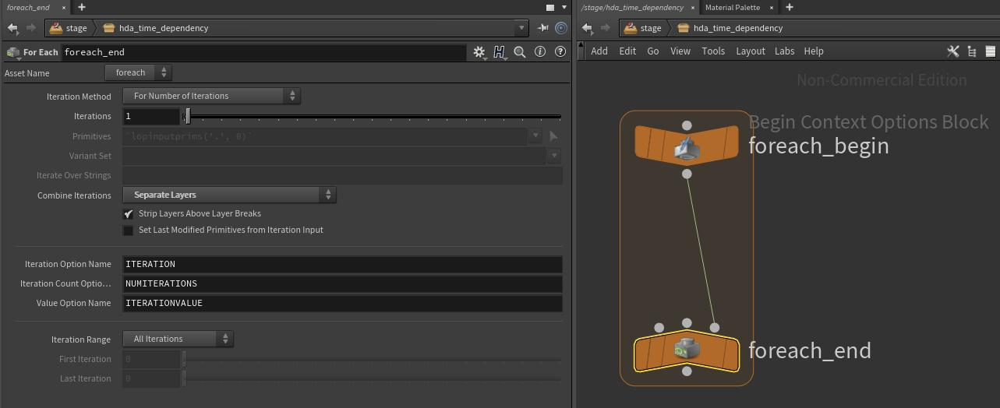

# Creating efficient LOPs HDAs
As with any other network in Houdini, we can also create HDAs in LOPs.

This page will focus on the most important performance related aspects of LOP HDAs, we will be referencing some of the points mentioned in the [performance optimizations](./performance/overview.md) section with a more practical view.

# Table of contents
1. [LOP HDAs In-A-Nutshell](#summary)
1. [What should I use it for?](#usage)
1. [Resources](#resources)
1. [Overview](#overview)
1. [HDA Template Setup](#hdaTemplate)
    1. [Order of operations](#hdaOrderOfOperations)
    1. [Dealing with time dependencies](#hdaTimeDependencies)
    1. [Layer Size/Count](#hdaLayerSizeCount)
1. [Composition](#hdaComposition)
    1. [Reference/Payload](#hdaCompositionReferencePayload)
    1. [Variants](#hdaCompositionVariant)

## TL;DR - <Topic> In-A-Nutshell 
- Main points to know

## What should I use it for? 
~~~admonish tip
Summarize actual production relevance.
~~~

## Resources 
- [API Docs]()

## Overview 
When building LOP HDAs with USD, the big question is:

~~~admonish question
What should we do in Python and would should we do with HDAs/nodes that Houdini ships with?
~~~

The answer depends on your knowledge level of USD and the pipeline resources you have.

If you want to go the "expert" route, this is the minimal working set of nodes you'll be using:

Technically we won't be needing more, because everything else can be done in Python. 
(There are also the standard control flow related nodes, we skipped those in the above image).
It is also faster to run operations in Python, because we can batch edits, where as with nodes, Houdini
has to evaluate the node tree.

So does this mean we shouldn't use the Houdini nodes at all? Definitely not! Houdini's LOPs tool set offers a lot of useful nodes, especially when your are prototyping, we definitely recommend using these first. A common workflow for developers is therefore:

~~~admonish tip title=""
Build everything with LOP HDAs first, then rebuild it, where possible, with Python LOPs when we notice performance hits.
~~~

We'll always use the "Material Library" and "SOP Import" nodes as these pull data from non LOP networks.

There are also a lot of UI related nodes, which are simply awesome. We won't be putting these in our HDAs, but they should be used by artists to complement our workflows.

## HDA Template Setup 
Let's take a look at how we can typically structure HDAs:

<video width="100%" height="100%" controls autoplay muted loop>
  <source src="./hdaTemplateStructure.mp4" type="video/mp4" alt="Houdini Hda Template Structure">
</video>

The structure we recommend is:
1. Create a new layer
2. Perform your edits (best-case only a single Python node) or merge in content from other inputs.
3. Create a new layer

Why should we spawn the new layers? See our [layer size and content](#hdaLayerSizeCount) section below for the answer.

When merging other layers via the merge node we recommend first flattening your input layers and then using the "Separate Layers" mode. That way we also avoid the layer size problem and keep our network fast.

### Order of Operations 
The same as within SOPs, we have to pay attention to how we build our node network to have it perform well.

Let's look at a wrong example and how to fix it:

~~~admonish danger title="Important | Merging a layer stack with itself"
USD is also very "forgiving", if we create content in a layer, that is already there from another layer (or layer stack via a reference or payload). The result is the same (due to composition), but the layer stack is "doubled". This is particularly risky and can lead to strange crashes, e.g. when we start to duplicate references on the same prim.

Now if we do this in the same layer stack, everything is fine as our [list-editable ops](../../../core/composition/fundamentals.md#compositionFundamentalsListEditableOps) are merged in the active layer stack. So you'll only have the reference being loaded once, even though it occurs twice in the same layer stack.

Now if we load a reference that is itself referenced, it is another story due to [encapsulation](../../../core/composition/fundamentals.md#compositionFundamentalsEncapsulation). We now have the layer twice, which gives us the same output visually/hierarchy wise, but our layers that are used by composition now has really doubled.

Check out this video for comparison:

<video width="100%" height="100%" controls autoplay muted loop>
  <source src="./hdaOrderOfOperationsLayerStackDuplication.mp4" type="video/mp4" alt="Houdini Layer Stack Duplication">
</video>

~~~

### Dealing with time dependencies 
As with SOPs, we should also follow the design principle of keeping everything non-time dependent where possible.

When we have time dependencies, we should always isolate them, cache them and then merge them into our "main" node stream.

~~~admonish important title="Pro Tip | Writing Time Samples Via Python"
When writing Python code, we can write time samples for the full range too. See our [animation section](../../../core/elements/animation.md) for more info. We recommend using the lower level API, as it is a lot faster when writing a large time sample count. A typical example would be to write the per image output file or texture sequences via Python, as this is highly performant.
~~~

The very cool thing with USD is that anything that comes from a cached file does not cause a Houdini time dependency, because the time samples are stored in the file/layer itself. This is very different to how SOPs works and can be confusing in the beginning.

Essentially the goal with LOPs is to have no time dependency (at least when not loading live caches).

Starting with H19.5 most LOP nodes can also whole frame range cache their edits. This does mean that a node can cook longer for very long frame ranges, but overall your network will not have a time dependency, which means when writing your node network to disk (for example for rendering), we only have to write a single frame and still have all the animation data. How cool is that! 

<video width="100%" height="100%" controls autoplay muted loop>
  <source src="./hdaTimeDependencyPerNode.mp4" type="video/mp4" alt="Houdini Time Sample Per Node">
</video>

If a node doesn't have that option, we can almost always isolate that part of the network and pre cache it, that way we have the same effect but for a group of nodes.

<video width="100%" height="100%" controls autoplay muted loop>
  <source src="./hdaTimeDependencyCache.mp4" type="video/mp4" alt="Houdini Time Sample Per Node">
</video>

~~~admonish danger title="Important | Previewing Xform/Deformation Motionblur"
If we want to preview xform/deformation motionblur that is not based on the `velocities`/`accelerations` attribute, then we have to pre-cache the time samples in interactive sessions. This is as simple as adding a LOPs cache node as shown above.
~~~

### Layer Size/Count 
As mentioned in the [overview](#overview), layer content size can become an issue.

We therefore recommend starting of with a new layer and ending with a new layer. That way our HDA can create any amount of data and not affect downstream nodes.

~~~admonish danger title="Important | LOP 'For Each Loops'"
LOPs "for each loops" work a bit different: Each iteration of the loop is either merged with the active layer or kept as a separate layer, depending on the set merge style.
When we want to spawn a large hierarchy, we recommend doing it via Python, as it is a lot faster. We mainly use the node "for each loop" for doing stuff we can Python code. For example for each looping a sop import.

~~~

For a full explanation see our [performance section](../performance/overview.md).