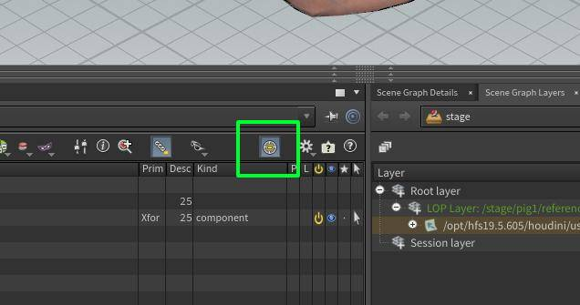

# Performance Optimizations
You can find all the .hip files of our shown examples in our [USD Survival Guide - GitHub Repo](https://github.com/LucaScheller/VFX-UsdSurvivalGuide/tree/main/files/dcc/houdini).

# Table of contents
1. [Selection Rules](#houLopSelectionRule)
1. [How to get your stage to load and open fast](#loadingMechanisms)
1. [Write full time sample ranges (with subsamples)](#timeSample) 
1. [Layer Content Size](#layerContentSize)
1. [Layer Count](#layerCount)
1. [AOV Count](#renderAOVCount)

## Selection Rules <a name="houLopSelectionRule"></a>
Houdini's [LOPs Selection Rule/Prim Pattern Matching](https://www.sidefx.com/docs/houdini/solaris/pattern.html) syntax is a artist friendly wrapper around stage traversals.

Pretty much any artist selectable prim pattern parm is/should be run through the selection rules. Now we won't cover how they work here, because Houdini's documentation is really detailed on this topic.

Instead we'll compare it to our own [traversal section](../../../core/elements/loading_mechanisms.md#traverseData).
~~~admonish tip title=""
```python
import hou
rule = hou.LopSelectionRule()
# Set traversal demand, this is similar to USD's traversal predicate
# https://openusd.org/dev/api/prim_flags_8h.html#Usd_PrimFlags
hou.lopTraversalDemands.Active
hou.lopTraversalDemands.AllowInstanceProxies
hou.lopTraversalDemands.Default
hou.lopTraversalDemands.Defined
hou.lopTraversalDemands.Loaded
hou.lopTraversalDemands.NoDemands
hou.lopTraversalDemands.NonAbstract
rule.setTraversalDemands(hou.lopTraversalDemands.Default)
# Set rule pattern
rule.setPathPattern("%type:Boundable")
# Evaluate rule
prim_paths = rule.expandedPaths(lopnode=None, stage=stage)
for prim_path in prim_paths:
    print(prim_path) # Returns: Sdf.Path
```
~~~

As you can see we have a similar syntax, the predicate is "replaced" by hou.lopTraversalDemands.

Now the same rules apply for fast traversals:
- Fast traversals mean not going into the hierarchies we are not interested in. The equivalent to `iterator.PruneChildren` is the `~` tilde symbol (e.g. `%type:Xform ~ %kind:component`)
- We should aim to pre-filter by type `%type:<ConcreteTypedSchemaName>` and kind `%kind:component`, before querying other data as this is fast
- Attributes lookups (via vex in the expression) are heavy to compute

## How to get your stage to load and open fast <a name="loadingMechanisms"></a>
As discussed in our [Loading/Traversing section](../../../core/elements/loading_mechanisms.md), we can limit how stages are opened via our three loading mechanisms (ordered from lowest to highest granularity):
- **Layer Muting**: This controls what layers are allowed to contribute to the composition result.
- **Prim Population Mask**: This controls what prim paths to consider for loading at all.
- **Payload Loading**: This controls what prim paths, that have payloads, to load.

Before we proceed, it is important to note, that USD is highly performant in loading hierarchies. When USD loads .usd/.usdc binary crate files, it sparsely loads the content: It can read in the hierarchy without loading in the attributes. This allows it to, instead of loading terabytes of data, to only read the important bits in the file and lazy load on demand the heavy data when requested by API queries or a hydra delegate.

What does this mean for Houdini? It can often be enough to pause the scene viewer when opening the file. It can be done via this snippet:
~~~admonish tip title=""
```python
for pane in hou.ui.paneTabs():
    if pane.type == hou.paneTabType.SceneViewer:
        pane.setSceneGraphStageLocked(False)
```
~~~

Houdini exposes these three loading mechanisms in two different ways:
- **Configue Stage** LOP node: This is the same as setting it per code via the stage.
- **Scene Graph Tree** panel: In Houdini, that stage that gets rendered, is actually not the stage of your node (at least what we gather from reverse engineering). Instead it is a duplicate, that has overrides in the session layer and loading mechanisms listed above.

~~~admonish danger title="Scene Graph Tree vs Configure Stage"
Everything you set in your scene graph tree panel is a viewport **only** override to your stage. This can be very confusing when first starting out in Houdini.
If we want to apply it to the actual stage, we have to use the configure stage node. This will then also affect our scene graph tree panel.

Why does Houdini do this? As mentioned hierarchy loading is fast, streaming the data to Hydra is not. This way we can still see the full hierarchy, but separately limit what the viewer sees, which is actually a pretty cool mechanism.
~~~

Let's have a look at the differences, as you can see anything we do with the configure stage node actually affects our hierarchy, whereas scene graph tree panel edits are only for the viewport:

<video width="100%" height="100%" controls autoplay muted loop>
  <source src="./loadingMechanisms.mp4" type="video/mp4" alt="Scene Graph Tree vs Configure Stage">
</video>

Another great tip is to disable tieing the scene graph panel to the active selected node:



Instead it is then tied to you active display flag, which makes things a lot faster when clicking through your network.

## Write full time sample ranges (with subsamples) <a name="timeSample"></a>
In Houdini we always want to avoid time dependencies where possible, because that way the network doesn't have to recook the tree per frame.

We cover this in more detail for HDAs in our [HDA section](../hda/hda.md) as it is very important when building tools, but here is the short version.

We have two ways of caching the animation, so that the node itself loses its time dependency.

Starting with H19.5 most LOP nodes can whole frame range cache their edits. This does mean that a node can cook longer for very long frame ranges, but overall your network will not have a time dependency, which means when writing your node network to disk (for example for rendering), we only have to write a single frame and still have all the animation data. How cool is that! 

<video width="100%" height="100%" controls autoplay muted loop>
  <source src="../hda/hdaTimeDependencyPerNode.mp4" type="video/mp4" alt="Houdini Time Sample Per Node">
</video>

If a node doesn't have that option, we can almost always isolate that part of the network and pre cache it, that way we have the same effect but for a group of nodes.

The common workflow is to link the shutter samples count to your camera/scene xform sample count and cache out the frames you need.

<video width="100%" height="100%" controls autoplay muted loop>
  <source src="./timeSample.mp4" type="video/mp4" alt="Houdini Time Sample Subframes">
</video>

We recommend driving the parms through global variables or functions, that you can attach to any node via the node [onLoaded](https://www.sidefx.com/docs/houdini/hom/locations.html#scene_events) scripts.

This is also how you can write out SOP geometry with deform/xform subsamples, simply put the cache node after a "SOP Import" and set the mode to "Sample Current Frame".
We usually do this in combination with enabling "Flush Data After Each Frame" on the USD render rop plus adding "$F4" to your file path.
This way we stay memory efficient and dump the layer from memory to disk every frame. After that we stitch it via [value clips](../../../core/elements/animation.md#animationValueClips) or the "UsdStitch" commandline tool/rop node. 


## Layer Content Size <a name="layerContentSize"></a>
In Houdini the size of the active layer can impact performance.

To quote from the docs:
~~~admonish tip
As LOP layers have more and more opinions and values added, there can be slow-downs in the viewport. If you notice simple transforms are very slow in the viewport, try using a Configure Layer to start a new layer above where you're working, and see if that improves interactivity.
~~~
Let's build a test setup, where we provoke the problem on purpose:

~~~admonish tip title=""
```python
from pxr import Sdf
node = hou.pwd()
layer = node.editableLayer()
with Sdf.ChangeBlock():
    root_grp_prim_path = Sdf.Path(f"/root_grp")
    root_grp_prim_spec = Sdf.CreatePrimInLayer(layer, root_grp_prim_path)
    root_grp_prim_spec.typeName = "Xform"
    root_grp_prim_spec.specifier = Sdf.SpecifierDef
    
    prim_count = 1000 * 100
    for idx in range(prim_count):
        prim_path = Sdf.Path(f"/root_grp/prim_{idx}")
        prim_spec = Sdf.CreatePrimInLayer(layer, prim_path)
        prim_spec.typeName = "Cube"
        prim_spec.specifier = Sdf.SpecifierDef
        attr_spec = Sdf.AttributeSpec(prim_spec, "debug", Sdf.ValueTypeNames.Float)
        attr_spec.default = float(idx)
        if idx != 0:
            prim_spec.SetInfo(prim_spec.ActiveKey, False)
```
~~~

~~~admonish danger
Now if we add an edit property node and tweak the "debug" attribute on prim "/root_grp/prim_0", it will take around 600 milliseconds!
~~~

The simple solution as stated above is to simply add a "Configure Layer" LOP node and enable "Start New Layer". Now all edits are fast again.

So why is this slow? It is actually due to how Houdini makes node based editing of layers possible. Houdini tries to efficiently cache only the active layer, where all the edits go, per node (if a node did write operations). The active layer in Houdini speak is the same as the stage's edit target layer. This means every node creates a duplicate of the active layer, so that we can jump around the network and display different nodes, without recalculating everything all the time. The down side is the copying of the data, which is causing the performance hit we are seeing.

The solution is simple: Just start a new layer and then everything is fast again (as it doesn't have to copy all the content). Houdini colors codes its nodes every time they start a new (active) layer, so you'll also see a visual indicator that the nodes after the "Configure Layer" LOP are on a new layer.

~~~admonish tip title="Pro Tip | Layer size in Hdas"
What does this mean for our .hda setups? The answer is simple: As there is no downside to having a large layer count (unless we start going into the thousands), each .hda can simply start of and end with creating a new layer. That way all the edits in the .hda are guaranteed to not be impacted by this caching issue.
~~~

Here is a comparison video:

<video width="100%" height="100%" controls autoplay muted loop>
  <source src="./layerContentSize.mp4" type="video/mp4" alt="Layer Size">
</video>

## Layer Count <a name="layerCount"></a>
Now as mentioned in the [layer content size](#layerContentSize) section, there is no down side to having thousands of layers. Houdini will merge these to a single (or multiple, depending on how you configured your save paths) layers on USD rop render. Since this is done on write, the described active layer stashing mechanism doesn't kick in and therefore it stays fast.

Does that mean we should write everything on a new layer? No, the sweet spot is somewhere in between. For example when grafting (moving a certain part of the hierarchy somewhere else) we also have to flatten the layer on purpose (Houdini's "Scene Restructure"/"Graft" nodes do this for us). At some layer count, you will encounter longer layer merging times, so don't over do it! This can be easily seen with the LOPs for loop.

~~~admonish tip title="Pro Tip | Layer count"
So as a rule of thumb: Encapsulate heavy layer edits with newly started layers, that way the next node downstream will run with optimal performance. Everything else is usually fine to be on the active input layer.
~~~

In LOPs we also often work with the principle of having a "main" node stream (the stream, where your shot layers are loaded from). A good workflow would be to always put anything you merge into the main node stream into a new layer, as often these "side" streams create heavy data.

~~~admonish danger title="Important | LOP 'For Each Loops'"
LOPs "for each loops" work a bit different: Each iteration of the loop is either merged with the active layer or kept as a separate layer, depending on the set merge style.
When we want to spawn a large hierarchy, we recommend doing it via Python, as it is a lot faster. We mainly use the "for each loop" nodes for stuff we can't do in Python code. For example for each looping a sop import.


~~~

## AOV Count <a name="renderAOVCount"></a>
Now this tip is kind of obvious, but we'd though we'd mention it anyway:

When rendering interactively in the viewport, deactivating render var prims that are connected to the render outputs you are rendering, can speed up interactivity. Why? We are rendering to fewer image buffers, so less memory consumption and less work for the renderer to output your rays to pixels.

Our AOVs are connected via the `orderedVars` relationship to the render product. That means we can just overwrite it to only contain render vars we need during interactive sessions. For farm submissions we can then just switch back to all.

The same goes for the `products` relationship on your render settings prim. Here you can also just connect the products you need.

~~~admonish tip title=""
```python
def Scope "Render"
{
    def Scope "Products"
    {
        def RenderProduct "beauty" (
        )
        {
            rel orderedVars = [
                </Render/Products/Vars/Beauty>,
                </Render/Products/Vars/CombinedDiffuse>,
                </Render/Products/Vars/DirectDiffuse>,
                </Render/Products/Vars/IndirectDiffuse>,
            ]
            token productType = "raster"
        }
    }

    def RenderSettings "rendersettings" (
        prepend apiSchemas = ["KarmaRendererSettingsAPI"]
    )
    {
        rel camera = </cameras/render_cam>
        rel products = </Render/Products/beauty>
        int2 resolution = (1280, 720)
    }
}
```
~~~

In Houdini this is as simple as editing the relationship and putting the edit behind a switch node with a context option switch. On our render USD rop we can then set the context option to 1 and there you go, it is now always on for the USD rop write.

<video width="100%" height="100%" controls autoplay muted loop>
  <source src="./houdiniRenderAOVCount.mp4" type="video/mp4" alt="Houdini Render AOV Count">
</video>

