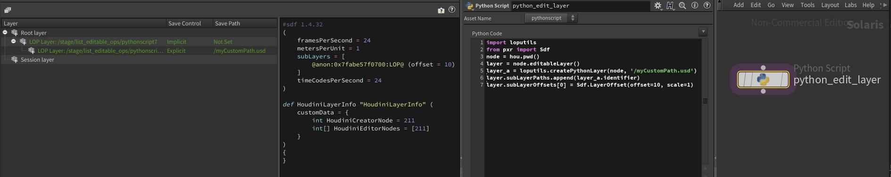

# Composition Arcs
In this section we'll cover how to create composition arcs via code. To check our how composition arcs interact with each other, check out our [Composition Strength Ordering (LIVRPS)](./livrps.md) section.

Please read out [fundamentals section](./fundamentals.md) as we often refer to it on this page. 


# Table of Contents
1. [Composition Arcs In-A-Nutshell](#summary)
1. [What should I use it for?](#usage)
1. [Resources](#resources)
1. [Overview](#overview)
1. [Composition Arcs](#compositionArcs)
    1. [Sublayers / Local Opinions](#compositionArcSublayer)
        1. [Value Clips](#compositionArcValueClips)
    1. [Inherits](#compositionArcInherit)
    1. [Variants](#compositionArcVariant)
    1. [References](#compositionArcReference)
        1. [References File](#compositionArcReferenceExternal)
        1. [References Internal](#compositionArcReferenceInternal)
    1. [Payloads](#compositionArcPayload)
    1. [Specializes](#compositionArcSpecialize)

## TL;DR - Composition Arcs In-A-Nutshell <a name="summary"></a>
- Creating composition arcs is straight forward, the high level API wraps the low level list editable ops with a thin wrappers. We can access the high level API via the `Usd.Prim.Get<ArcName>` syntax.
- Editing via the low level API is often just as easy, if not easier, especially when [creating (nested) variants](#compositionArcVariantCopySpec). The list editable ops can be set via `Sdf.PrimSpec.SetInfo(<arcType>, <listEditableOp>)` or via the properties e.g. `Sdf.PrimSpec.<arcType>List`.

## What should I use it for? <a name="usage"></a>
~~~admonish tip
We'll be using the below code, whenever we write composition arcs in USD.
~~~

## Resources <a name="resources"></a>
- [Sdf.Layer](https://openusd.org/dev/api/class_sdf_layer.html)
- [Sdf.LayerOffset](https://openusd.org/dev/api/class_sdf_layer_offset.html)
- [Sdf.\<Arc\>ListOp](https://www.sidefx.com/docs/hdk/list_op_8h.html)
- [Usd.Inherits](https://openusd.org/dev/api/class_usd_inherits.html)
- [Usd.VariantSets](https://openusd.org/dev/api/class_usd_variant_sets.html)
- [Usd.VariantSet](https://openusd.org/dev/api/class_usd_variant_set.html)
- [Usd.References](https://openusd.org/dev/api/class_usd_references.html)
- [Sdf.VariantSetSpec](https://openusd.org/dev/api/class_sdf_variant_set_spec.html)
- [Sdf.VariantSpec](https://openusd.org/dev/api/class_sdf_variant_spec.html)
- [Sdf.Reference](https://openusd.org/dev/api/class_sdf_reference.html)
- [Usd.Payloads](https://openusd.org/dev/api/class_usd_payloads.html)
- [Sdf.Reference](https://openusd.org/dev/api/class_sdf_payload.html)
- [Usd.Specializes](https://openusd.org/dev/api/class_usd_specializes.html)

## Overview <a name="overview"></a>
This section will focus on how to create each composition arc via the high and low level API.

## Composition Arcs
All arcs that make use of [list-editable ops](./fundamentals.md#list-editable-operations-ops), take of of these tokens as an optional `position` keyword argument via the high level API.

- `Usd.ListPositionFrontOfAppendList`: Prepend to append list, the same as `Sdf.<Type>ListOp`.appendedItems.insert(0, item)
- `Usd.ListPositionBackOfAppendList`: Append to append list, the same as `Sdf.<Type>ListOp`.appendedItems.append(item)
- `Usd.ListPositionFrontOfPrependList`: Prepend to prepend list, the same as `Sdf.<Type>ListOp`.appendedItems.insert(0, item)
- `Usd.ListPositionBackOfPrependList`: Append to prepend list, the same as `Sdf.<Type>ListOp`.appendedItems.append(item)

As we can see, all arc APIs, except for sublayers, in the high level API, are thin wrappers around the [list editable op](./fundamentals.md#list-editable-operations-ops) of the arc.


### Sublayers / Local Opinions <a name="compositionArcSublayer"></a>
~~~admonish tip title="Pro Tip | What do I use sublayer arcs for?"
In our [Composition Strength Ordering (LIVRPS)](./livrps.md#compositionArcSublayer) section we cover in detail, with production related examples, what the sublayer arc is used for.
~~~

~~~admonish tip title=""
```python
{{#include ../../../../code/core/composition.py:compositionArcSublayer}}
```
~~~

When working in Houdini, we can't directly sublayer onto the root layer as with native USD, due to Houdini's layer caching mechanism, that makes node based stage editing possible. Layering on the active layer works as usual though.

~~~admonish tip title=""
```python
{{#include ../../../../code/core/composition.py:compositionArcSublayerHoudini}}
```
~~~

Here is the result:



#### Value Clips <a name="compositionArcValueClips"></a>
~~~admonish tip title="Pro Tip | What do I use value clips for?"
In our [Composition Strength Ordering (LIVRPS)](./livrps.md#compositionArcValueClips) section we cover in detail, with production related examples, what value clips are used for.
~~~

We cover value clips in our [animation section](../elements/animation.md). Their opinion strength is lower than direct (sublayer) opinions, but higher than anything else.

The write them via metadata entries as covered here in our [value clips](../elements/animation.md#value-clips-loading-time-samples-from-multiple-files) section.

### Inherits <a name="compositionArcInherit"></a>
~~~admonish tip title="Pro Tip | What do I use inherit arcs for?"
In our [Composition Strength Ordering (LIVRPS)](./livrps.md#compositionArcInherit) section we cover in detail, with production related examples, what the inherit arc is used for.
~~~

Inherits, like specializes, don't have a object representation, they directly edit the list-editable op list.

~~~admonish tip title=""
```python
{{#include ../../../../code/core/composition.py:compositionArcInherit}}
```
~~~

### Variants <a name="compositionArcVariant"></a>
~~~admonish tip title="Pro Tip | What do I use variant arcs for?"
In our [Composition Strength Ordering (LIVRPS)](./livrps.md#compositionArcVariant) section we cover in detail, with production related examples, what the variant arc is used for.
~~~

Variant sets (the variant set->variant name mapping) are also managed via list editable ops.
The actual variant set data is not though. It is written "in-line" into the prim spec via the `Sdf.VariantSetSpec`/`Sdf.VariantSpec` specs, so that's why we have dedicated specs.

This means we can add variant data, but hide it by not adding the variant set name to the `variantSets`metadata.

For example here we added it:

~~~admonish tip title=""
```python
def Xform "car" (
    variants = {
        string color = "colorA"
    }
    prepend variantSets = "color"
)
{
    variantSet "color" = {
        "colorA" {
            def Cube "cube"
            {
            }
        }
        "colorB" {
            def Sphere "sphere"
            {
            }
        }
    }
}
```
~~~

Here we skipped it, by commenting out the:
`car_prim_spec.SetInfo("variantSetNames", Sdf.StringListOp.Create(prependedItems=["color"]))` line in the below code.
This will make it not appear in UIs for variant selections.

~~~admonish tip title=""
```python
def Xform "car" (
    variants = {
        string color = "colorA"
    }
)
{
    variantSet "color" = {
        "colorA" {
            def Cube "cube"
            {
            }
        }
        "colorB" {
            def Sphere "sphere"
            {
            }
        }
    }
}
```
~~~

~~~admonish tip title=""
```python
{{#include ../../../../code/core/composition.py:compositionArcVariant}}
```
~~~

<a name="compositionArcVariantCopySpec"></a>
~~~admonish tip title="Pro Tip | Copying layer content into a variant"
When editing variants, we can also move layer content into a (nested) variant very easily via the `Sdf.CopySpec` command. This is a very powerful feature!

```python
{{#include ../../../../code/core/composition.py:compositionArcVariantCopySpec}}
```
~~~

Here is how we can created nested variant sets via the high level and low level API. As you can see it is quite a bit easier with the low level API.

~~~admonish tip title=""
```python
{{#include ../../../../code/core/composition.py:compositionArcVariantNested}}
```
~~~


### References <a name="compositionArcReference"></a>
~~~admonish tip title="Pro Tip | What do I use reference arcs for?"
In our [Composition Strength Ordering (LIVRPS)](./livrps.md#compositionArcReference) section we cover in detail, with production related examples, what the reference arc is used for.
~~~

The `Sdf.Reference` class creates a read-only reference description object:
~~~admonish tip title=""
```python
{{#include ../../../../code/core/composition.py:compositionArcReferenceClass}}
```
~~~

#### References File <a name="compositionArcReferenceExternal"></a>
Here is how we add external references (references that load data from other files):
~~~admonish tip title=""
```python
{{#include ../../../../code/core/composition.py:compositionArcReferenceExternal}}
```
~~~


#### References Internal <a name="compositionArcReferenceInternal"></a>
Here is how we add internal references (references that load data from another part of the hierarchy) :
~~~admonish tip title=""
```python
{{#include ../../../../code/core/composition.py:compositionArcReferenceInternal}}
```
~~~

### Payloads <a name="compositionArcPayload"></a>
~~~admonish tip title="Pro Tip | What do I use payload arcs for?"
In our [Composition Strength Ordering (LIVRPS)](./livrps.md#compositionArcPayload) section we cover in detail, with production related examples, what the payload arc is used for.
~~~

The `Sdf.Payload` class creates a read-only payload description object:
~~~admonish tip title=""
```python
{{#include ../../../../code/core/composition.py:compositionArcPayloadClass}}
```
~~~

Here is how we add payloads. Payloads always load data from other files:
~~~admonish tip title=""
```python
{{#include ../../../../code/core/composition.py:compositionArcPayload}}
```
~~~

### Specializes <a name="compositionArcSpecialize"></a>
~~~admonish tip title="Pro Tip | What do I use specialize arcs for?"
In our [Composition Strength Ordering (LIVRPS)](./livrps.md#compositionArcSpecialize) section we cover in detail, with production related examples, what the specialize arc is used for.
~~~

Specializes, like inherits, don't have a object representation, they directly edit the list-editable op list.

~~~admonish tip title=""
```python
{{#include ../../../../code/core/composition.py:compositionArcSpecialize}}
```
~~~