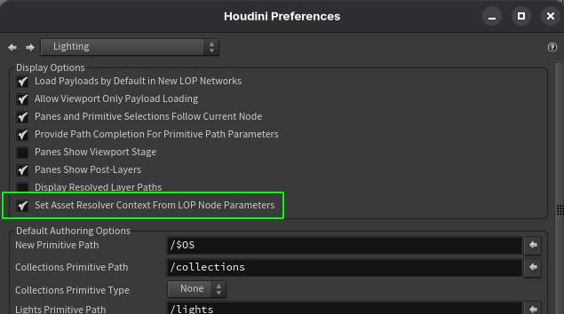

# General Approach
~~~admonish question title="Still under construction!"
We'll expand our Houdini section in the future with topics such as:
- lighting
- rendering (render products/render vars (USD speak for AOVs)/render procedurals)
- asset/shot templates
~~~

This page will focus on the basics of what you need to know before getting started in LOPs.

Currently this is limited to LOPs basics and SOP geometry importing/exporting, we'll expand this in the future to other topics.

# Table of Contents
1. [Houdini LOPs In-A-Nutshell](#summary)
1. [What should I use it for?](#usage)
1. [Resources](#resources)
1. [Overview](#overview)
1. [Artist Vs Pipeline](#artistVsPipeline)
1. [Path Structure](#path)
1. [How to convert between LOPs and SOPs](#IO)
    1. [Importing from LOPs to SOPs](#IOLopsToSops)
    1. [Exporting from SOPs to LOPs](#IOSopsToLops)
    1. [Stage/Layer Metrics](#IOLayerMetrics)
1. [Composition](#composition)
    1. [Asset Resolver](#compositionAssetResolver)
    1. [Creating Composition Arcs](#compositionAssetResolver)

## TL;DR - Approach In-A-Nutshell 
When working in Houdini, the basics our pipeline has to handle is USD import/export as well as setting up the correct composition.

As covered in our composition section, composition arcs are centered around loading a specific prim (and its children) in the hierarchy. We usually design our path structure around "root" prims. That way we can load/unload a specific hierarchy selection effectively. With value clips (USD speak for per frame/chunk file loading) we also need to target a specific root prim, so that we can keep the hierarchy reference/payloadable and instanceable.

To make it convenient for our artists to use USD, we should therefore make handling paths and composition as easy as possible. Our job is to abstract away composition, so that we use its benefits as best as possible without inconveniencing our artists.

~~~admonish tip title="Houdini | SOPs to LOPs Path | Evaluation Order"
As for paths, Houdini's SOPs to LOPs mechanism in a nutshell is:
1. Check what "path" attribute names to consult
1. Check (in order) if the attribute exists and has a non-empty value
1. If the value is relative (starts with "./some/Path", "some/Path", "somePath", so no `/`), prefix the path with the setting defined in "Import Path Prefix" (unless it is a point instance prototype/volume grid path, see exceptions below).
1. If no value is found, use a fallback value with the `<typeName>_<idx>` syntax.

There are two special path attributes, that cause a different behavior for the relative path anchoring.
- **usdvolumesavepath**: This defines the path of your "Volume" prim. 
- **usdinstancerpath**: This defines the path of your "PointInstancer" prim (when exporting packed prims as point instancers).
~~~

## What should I use it for? 
~~~admonish tip
We'll be using LOPs to create awesome VFX via USD!
~~~

## Resources 
- [Importing SOP geometry into USD](https://www.sidefx.com/docs/houdini/solaris/sop_import.html)
- [Solaris Performance](https://www.sidefx.com/docs/houdini/solaris/performance.html)
- [Houdini Configure Layer](https://www.sidefx.com/docs/houdini/nodes/lop/configurelayer.html)

## Overview 
<video width="100%" height="100%" controls autoplay muted loop>
  <source src="../../../media/dcc/houdini/houdiniNodeCategories.mp4" type="video/mp4" alt="Houdini Node Categories">
</video>

You can find all the examples we take a look at in our [USD Survival Guide - GitHub Repository](https://github.com/LucaScheller/VFX-UsdSurvivalGuide/blob/main/files/dcc/houdini)

We have a lot of really cool nodes available for us what ship natively with Houdini. Quite a few of them are actually bare-bone wrappers around USD API commands, so that we don't have to master the API to use them.

Now for pipeline developers, these are the nodes you'll primarily be interacting with:

You favorite node will be the Python LOP node, as we have exposure to the full USD API and can modify the stage to our needs.

Ready!?! Let's goooooooo!

## Artist Vs Pipeline 
When switching to a USD backed pipeline, an important thing to not gloss over, is how to market USD to artists.

Here are the most important things to keep in mind of what a pipeline should abstract away and what it should directly communicate to artists before getting started:
- As USD is its own data format, we will not have the native file IO speeds of .bgeo(.sc). The huge benefit is that we can use our caches in any DCC that offers a USD implementation. The downside is, that we have to be more "explicit" of what data we are exporting. For example for packed geometry we have to define how to map it to USD, e.g. as "PointInstancers", "Xforms" or flattened geometry. This means there is now an additional step, that has to be made aware of, before each export. 
- USD exposes other departments work to us directly through its layering mechanism. This a very positive aspect, but it also comes with more communication overhead. Make sure you have setup clear communication structures beforehand of who to contact should questions and issues arise.
- USD comes with its own terminology. While we do recommend teaching and learning it, when first transitioning to USD, we should try to keep in familiar waters where possible to soften the blow.

Here are a few things pipeline can/should cover to make things as easy going as possible:
- Provide learning material in the form of documentation, follow along workshops and template scenes. We recommend putting a strong focus on this before going "live" as once a show is running, it can cause a high demand in one-on-one artist support. The more you prepare in advance, the more things will flow smoothly. We also recommend tieing artists into your development process, as this keeps you on your toes and also helps ease the transition.
- A core element pipeline should always handle is data IO. We provide various tips on how to make exporting to LOPs similar to SOP workflows in this guide.
- We recommend being more restrictive in different workflow aspects rather than allowing to mix'n'match all different styles of geometry import/export and node tree flow "designs". What we mean with this is, that we should "lock" down specific use cases like "What geo am I exporting (characters/water/debris/RBD/etc.)" and build specific HDAs around these. This way there is no ambiguity to how to load in geometry to USD. It also makes pre-flight checks easy to implement, because we know in advance what to expect.
- In LOPs, we can often stick to building a "monolithic" node stream (as to SOPs where we often branch and merge). As order of operation in LOPs is important, there are fewer ways to merge data. This means we can/should pre-define how our node tree should be structured (model before material, material before lighting etc.). A good approach is to segment based on tasks and then merge their generated data into the "main" input stream. For example when creating lights, we can create a whole light rig and then merge it in.

These tips may sound like a lot of work, but the benefits of USD are well worth it!

~~~admonish question title="Still under construction!"
We'll likely expand on this sub-section in the future.
~~~

## Path Structure 
As covered in our [composition section](../../core/composition/overview.md), composition arcs are centered around loading a specific prim (and its children) in the hierarchy. We usually design our path structure around "root" prims. That way we can load/unload a specific hierarchy selection effectively. With value clips (USD speak for per frame/chunk file loading) we also need to target a specific root prim, so that we can keep the hierarchy reference/payloadable and instanceable.

As pipeline developers, we therefore should make it as convenient as possible for artists to not have to worry about these "root" prims.

We have two options:
- We give artists the option to not be specific about these "root" prims. Everything that doesn't have one in its name, will then be grouped under a generic "/root" prim (or whatever we define as a "Import Path Prefix" on our import configure nodes). This makes it hard for pipeline to re-target it into a specific (shot) hierarchy. It kind of breaks the USD principle of layering data together.
- We enforce to always have these root prims in our path. This looses the flexibility a bit, but makes our node network easier to read as we always deal with absolute(s, like the Sith) prim paths.

When working in SOPs, we don't have sidecar metadata per path segment (prim) as in LOPs, therefore we need to define a naming convention upfront, where we can detect just based on the path, if a root is defined or not. There is currently no industry standard (yet), but it might be coming sooner than we might think! Say goodbye to vendor specific asset structures, say hello to globally usable assets.

As also mentioned in our composition section, this means that only prims under the root prims can have data (as the structure above is not payloaded/referenced). Everything we do in SOPs, affects only the leaf prims in world space. So we are all good on that side.

## How to convert between LOPs and SOPs 
To handle the SOPs to LOPs conversion we can either configure the import settings on the LOPs sop import node or we can use the SOPs USD configure node, which sets the exact same settings, but as detail attributes. For pipeline tools, we recommend using the SOPs detail attributes, as we can dynamically change them depending on what we need.

| LOPs Sop Import                                  | SOPs USD Configure Name                            |
|--------------------------------------------------|----------------------------------------------------|
|  |  |

We strongly recommend reading the official docs [Importing SOP geometry into USD](https://www.sidefx.com/docs/houdini/solaris/sop_import.html) as supplementary reading material.

In our [Basic Building Blocks of Usd](../../core/elements/overview.md) section, the first thing we covered was how to handle paths.
Before we look at our import/export nodes let's do the same for Houdini.

In Houdini we can define what attributes Houdini consults for defining the `Sdf.Path` for our prims. By default it is the `path` and `name` attribute. When looking up the path, it looks through the path attributes in the order we define on the sop import/USD configure node. If the value is empty it moves onto the next attribute. If it doesn't find a valid value, it will fallback to defaults (`<typeName>_<idx>`, e.g. "mesh_0").

We can also specify relative paths. These are any paths, that don't start with `/`. These will be prefixed with the prefix defined via the "Import Path Prefix" parm on either ones of the configure nodes.

~~~admonish tip title="Houdini | SOPs to LOPs Path | Evaluation Order"
1. Check what "path" attribute names to consult
1. Check (in order) if the attribute exists and has a non-empty value
1. If the value is relative (starts with "./some/Path", "some/Path", "somePath", so no `/`), prefix the path with the setting defined in "Import Path Prefix" (unless it is a point instance prototype/volume grid path, see exceptions below).
1. If no value is found, use a fallback value with the `<typeName>_<idx>` syntax.
~~~

When working with packed prims (or nested levels of packed prims), the relative paths are anchored to the parent packed level for the nested levels. The top level packed prim is then anchored as usual against the import settings prefix.

For example:
1. Packed: "/level_0"
    1. Packed: "./level_1"
        1. Mesh: "myCoolMesh"

The resulting path will be "/level_0/level_1/myCoolMesh". Be careful, using "../../../myPath" works too, strongly **not** recommended as it breaks out of the path (like a `cd ../../path/to/other/folder``)!

~~~admonish danger title="Important | Paths and Packed Prims"
When working with paths in SOPs and packed prims, we have to set the path before we pack the geometry. We can't adjust it afterwards, without unpacking the geometry. If we define absolute paths within packed geometry, they will not be relative to the parent packed level. This can cause unwanted behaviours (as your hierarchy "breaks" out of its packed level). We therefore recommend not having absolute paths inside packed prims.

We can easily enforce this, by renaming our "outside" packed attributes to something else and using these as "path" import attributes. That way the inside get's the fallback behavior, unless explicitly set to our "outer" path attributes.
~~~

There are two special path attributes, that cause a different behavior for the relative path anchoring.
- **usdvolumesavepath**: This defines the path of your "Volume" prim. As for volumes we usually use the "name" attribute to drive the volume grid/field name, this gives us "/my/cool/explosionVolume/density", "/my/cool/explosionVolume/heat", etc, as long as we don't define another path attribute that starts with "/". So this gives us a convenient way to define volumes with (VDB) grids.
- **usdinstancerpath**: This defines the path of your "PointInstancer" prim (when exporting packed prims as point instancers). When we define a relative path, it is anchored under "/my/cool/debrisInstancer/Prototypes/ourRelativePathValue". Collecting our prototypes under the "/Prototypes" prim is a common USD practice, as it visually is clear where the data is coming as well as it make the hierarchy "transportable" as we don't point to random other prims, that might be unloaded.

When these two attributes are active, our path attributes that are relative, are anchored differently:
- **usdvolumesavepath**: "/my/cool/explosionVolume/**relativePathValue**".
- **usdinstancerpath**: "/my/cool/debrisInstancer/Prototypes/**relativePathValue**"

Here's a video showing all variations, you can find the file, as mentioned above, in our GitHub repo:

<video width="100%" height="100%" controls autoplay muted loop>
  <source src="../../../media/dcc/houdini/houdiniPathAbsoluteVsRelative.mp4" type="video/mp4" alt="Houdini Node Path">
</video>

### Importing from LOPs to SOPs 
Importing from LOPs is done via two nodes:
- **LOP Import**: This imports packed USD prims.
- **USD Unpack**: This unpacks the packed USD prims to polygons.

<video width="100%" height="100%" controls autoplay muted loop>
  <source src="../../../media/dcc/houdini/houdiniSOPsLOPImportTraversal.mp4" type="video/mp4" alt="Houdini LOP Import Traversal">
</video>

~~~admonish danger title="Selecting Parent & Child Prims"
If we select a parent and child prim at the same time, we will end up with duplicated geometry on import (and the import will take twice as long).

By default the "USD Unpack" node traverses to "GPrims" (Geometry Prims), so it only imports anything that is a geo prim. That means on LOP import, we don't have to select our leaf mesh prims ourselves, when we want the whole model.
~~~

As loading data takes time, we recommend being as picky as possible of what you want to import. We should not import our whole stage as a "USD Packed Prim" and then traverse/break it down, instead we should pick upfront what to load. This avoids accidentally creating doubled imports and keeps things fast.

~~~admonish tip title="Pro Tip | Import Xforms"
Our packed USD prims, carry the same transform information as standard packed geo. We can use this to parent something in SOPs by extracting the packed intrinsic transform to the usual point xform attributes.
~~~

If we want to import data from a LOPs PointInstancer prim, we can LOP import the packed PointInstancer prim and then unpack it polygons. This will give us a packed USD prim per PoinstInstancer prin (confusing right?). Be careful with displaying this in the viewport, we recommend extracting the xforms and then adding a add node that only keeps the points for better performance.

~~~admonish danger title="USD Packed Prims"
Displaying a lot of packed prims in SOPS can lead to Houdini being unstable. We're guessing because it has to draw via Hydra and HoudiniGL and because USD packed prims draw a stage partially, which is a weird intermediate filter level.

We recommend unpacking to polygons as "fast" as possible and/or pre-filtering the LOP import as best as possible.
~~~

<video width="100%" height="100%" controls autoplay muted loop>
  <source src="../../../media/dcc/houdini/houdiniSOPsLOPImportPointInstancer.mp4" type="video/mp4" alt="Houdini LOP Import PointInstancer">
</video>

### Exporting from SOPs to LOPs 
Export to LOPs is as simple as creating a SOP Import node and picking the SOP level geo.

As described above, we can drive the SOP import settings via the "USD Configure" SOPs level node or the "SOP Import" LOPs node.

We go into detail on how to handle the different (FX) geometry types in our [Geometry IO/FX section](../houdini/fx/overview.md).

We recommend building workflows for each geo type (points/deformed meshes/transforms/copy-to-points/RBD/crowds) as this makes it easy to pre-flight check as we know exactly what to export and we can optimize (the heck) out of it.

~~~admonish tip title="Pro Tip | Working Against Stages"
When working LOPs, we like to use the terminology: "We are working against a stage."

What do we mean with that? When importing from or editing our stage, we are always making the edits relative to our current stage.
When importing to SOPs, we can go out of sync, if our SOP network intermediate-caches geometry. For example if it writes SOP imported geometry to a .bgeo.sc cache and the hierarchy changes in LOPs, you SOPs network will not get the correct hierarchy until it is re-cached.

This can start being an issue, when you want to "over" the data from SOPs onto an existing hierarchy. Therefore we should always try to write our caches "against a stage". Instead of just caching our USD to disk and then composition arc-ing it into our "main" node stream.

This means that we can validate our hierarchy and read stage metrics like shutter sample count or local space transforms on USD export.
This ensures that the resulting cache is valid enough to work downstream in our pipeline.  Houdini's "SOP Import" node is also constructed to work against the input connected stage and does alot of this for you (e.g. material binding/local space correction ("Adjust Transforms for Input Hierarchy")).
~~~

Another thing we have to keep in mind is that SOPs only represents the active frame, where as a written USD cache file represents the whole frame range.

To emulate this we can add a cache LOPs node. If we have geometry "popping" in and out across the frame range, it will by default always be visible in the whole frame range cached file. When we write USD files on different machines (for example on a farm), each frame that is being cooked does not know of the other frames. 

To solve this USD has two solutions:
- If our output file is a single stitched USD file, then we have to manually check the layers before stitching them and author visibility values if we want to hide the prims on frames where they produced no data.
- With value clips we have to write an "inherited" visibility time sample per prim for every time sample. If the hierarchy does not exist, it will fallback to the manifest, where we have to write a value of "invisible".

Houdini has the option to track visibility for frame ranges (that are cooked in the same session) to prevent this. For large production scenes, we usually have to resort to the above to have better scalability.

<video width="100%" height="100%" controls autoplay muted loop>
  <source src="../../../media/dcc/houdini/houdiniLOPsSOPImportTimeVisibility.mp4" type="video/mp4" alt="Houdini SOP Import Time Visibility">
</video>

### Stage/Layer Metrics 
As mentioned in our [stage/layer](../../core/elements/layer.md#layerMetrics) and [animation](../../core/elements/animation.md#animationMetadata) sections, we can/should setup layer related metrics.

They work the same way in Houdini, the only difference is we have to use Houdini's [Configure Layer](https://www.sidefx.com/docs/houdini/nodes/lop/configurelayer.html) node to set them, if we want to set them on the root layer/stage (due to how Houdini manages stages).

## Composition 

### Asset Resolver 
In Houdini our asset resolver is loaded as usual via the plugin system. If we don't provide a context, the default context of the resolver is used.

We can pass in our [asset resolver context](../../core/plugins/assetresolver.md#assetResolverContext) in two ways:
- Via the the configure stage node. When set via the stage node, the left most node stream with a context "wins", when we start merging node trees.
- Globally via the scene graph tree panel settings.

| Node Tree                                               | Global Context                                               |
|---------------------------------------------------------|--------------------------------------------------------------|
|  |  |

If you are using the scene graph tree panel settings, be sure to turn off "Set Asset Resolver Context From LOP Node Parameters" in the preferences.

For more info about resolvers, check out our [asset resolver](../../core/plugins/assetresolver.md) section.
We provide reference resolver implementations that are ready to be used in production.

### Creating Composition Arcs 
Creating composition arcs in LOPs can be done via Houdini's sublayer, variant and reference (for inherit/payload/specializes) nodes.

We recommend using these for prototyping composition. Once we've figured out where we want to go, we should re-write it in Python, as it is easier and a lot faster when working on large hierarchies.

This guide comes with an extensive [composition fundamentals](../../core/composition/overview.md)/[composition in production](../../production/composition.md) section with a lot of code samples. 

We also cover advanced composition arc creation, specifically for Houdini, in our [Tips & Tricks](../houdini/faq/overview.md#compositionOverview) section.