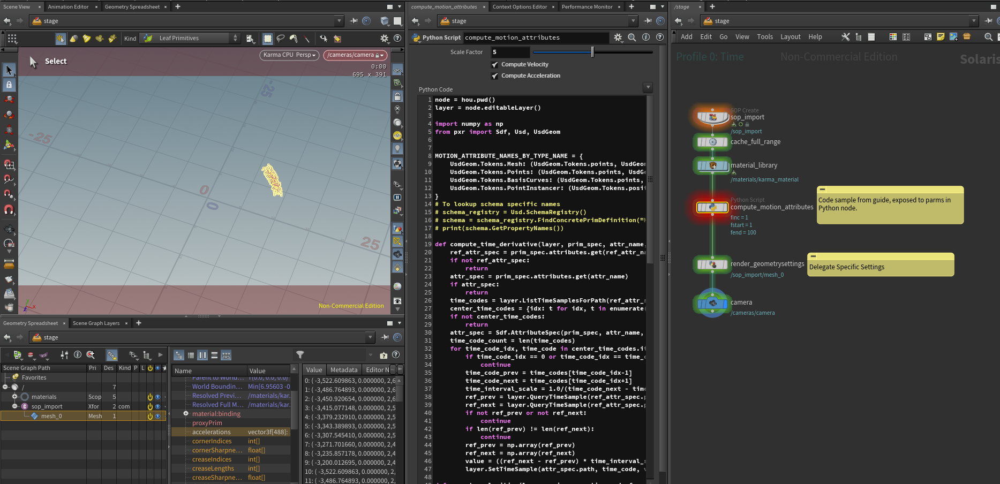

# Motion Blur
Motion blur is computed by the hydra delegate of your choice using either the interpolated position data(deformation/xforms) or by making use of velocity/acceleration data.

You can find all the .hip files of our shown examples in our [USD Survival Guide - GitHub Repo](https://github.com/LucaScheller/VFX-UsdSurvivalGuide/tree/main/files/dcc/houdini).

As noted in our [Motion Blur - Computing Velocities and Accelerations](../../../core/elements/animation.md#animationMotionVelocityAcceleration),
we can also easily derive the velocity and acceleration data from our position data, if the point count doesn't change.



~~~admonish warning
Depending on the delegate, you will likely have to set specific primvars that control the sample rate of the position/acceleration data.
~~~

We can also easily derive velocities/accelerations from position data, if our point count doesn't change:
~~~admonish tip title="Motionblur | Compute | Velocity/Acceleration | Click to expand" collapsible=true
```python
{{#include ../../../../../../code/core/elements.py:animationMotionVelocityAcceleration}}
```
~~~