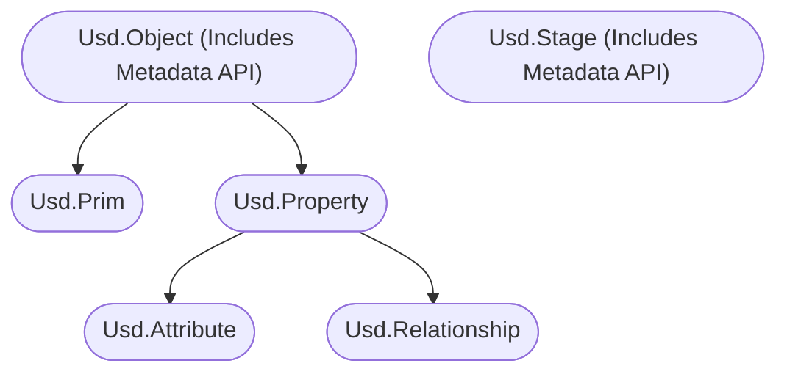
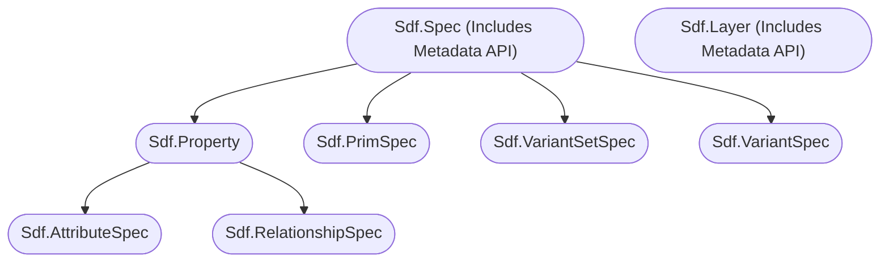

# Section Name
Enter example intro.

~~~admonish question title="Still under construction!"
This sub-section is still under development, it is subject to change and needs extra validation.
~~~

# Table of Contents
1. [<Topic> In-A-Nutshell](#summary)
1. [What should I use it for?](#usage)
1. [Resources](#resources)
1. [Overview](#overview)
1. [Example A](#exampleA)
    1. [Subexample A](#subexampleA)
    1. [Subexample B](#subexampleB)

## TL;DR - <Topic> In-A-Nutshell 
- Main points to know

## What should I use it for? 
~~~admonish tip
Summarize actual production relevance.
~~~

## Resources 
- [API Docs]()

## Overview 
Chart example

Low Level API

~~~admonish tip
Example tip
~~~

## Example A 
Example A

### Subexample A 
Example A

### Subexample B 
Example A